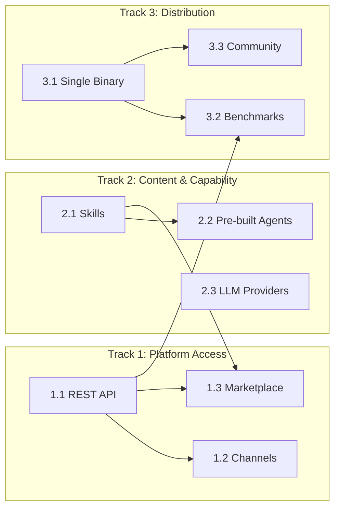

# AgentOS Competitive Gap Closure — Design Spec

> Close the 7 critical gaps between AgentOS and OpenClaw/OpenFang through 3 parallel tracks: Platform Access, Content & Capability, and Distribution & Credibility.

**Date:** 2026-03-30
**Status:** Approved for planning
**Competitors analyzed:** OpenClaw (335K GitHub stars, 2M MAU, 30+ channels), OpenFang (Rust Agent OS, 138K LoC, 40 channels, 26 LLM providers)

---

## Problem

AgentOS has the deepest security, audit, and hardware infrastructure of any agent OS — but zero distribution story. No channels, no REST API, no marketplace, no pre-built agents, no single binary, no benchmarks, no community. OpenClaw wins on reach. OpenFang wins on feature parity. AgentOS is invisible to 90% of the ecosystem.

## Competitive Gap Summary

| Gap | AgentOS Today | OpenClaw | OpenFang |
|-----|--------------|----------|----------|
| Messaging channels | 0 bidirectional | 30+ (WhatsApp, Telegram, Discord...) | 40 adapters |
| REST/HTTP API | Unix socket IPC only | Gateway API | 140+ endpoints, OpenAI-compat |
| LLM providers | 5 | External (3-4) | 26 |
| Pre-built agents | 0 | 100+ skills | 7 Hands |
| Single binary | Workspace build only | Single process | ~32MB binary |
| Benchmarks | None published | N/A | 180ms cold start, 13x over CrewAI |
| Marketplace | Registry API (no UI) | ClawHub (13,729 skills) | FangHub |
| Community | Private/solo | 1,075 contributors, 335K stars | Early (RightNow AI) |

## Strategy: 3 Parallel Tracks

Tracks are independent — no track blocks another. Each delivers standalone value.

| Track | Focus | Phases |
|-------|-------|--------|
| **Track 1: Platform Access** | How the world talks to AgentOS | REST API → Channels → Marketplace |
| **Track 2: Content & Capability** | What AgentOS can do | Skills → Pre-built Agents → LLM Providers |
| **Track 3: Distribution & Credibility** | How people adopt AgentOS | Single Binary → Benchmarks → Community |

## Design Decisions

1. **OpenAI-compat `/v1/chat/completions` is the public API surface; MCP is the internal tool protocol.** OpenAI-compat is table stakes (every SDK speaks it). MCP is the right tool protocol (65% of ClawHub skills are MCP wrappers). The kernel sits between them as the secure, audited bridge.

2. **`agentos-api` is a separate crate from `agentos-web`.** Web UI is for humans (HTML/HTMX). API is for machines (JSON). Mixing them creates confusion and makes it impossible to run the API server without the web UI.

3. **`agentos-channels` is a new crate with a `ChannelAdapter` trait.** 6 reference adapters ship (Discord, Slack, Telegram, WhatsApp, Email, Webhook). The trait is public so community can add more.

4. **Skills are higher-level than tools.** A tool is a single operation. A skill is an autonomous capability: prompt template + tool set + trigger conditions + schedule. Skills are defined in `SKILL.toml` and published to the registry alongside tools.

5. **Lead with security/ops agents, include general-purpose for table stakes.** 5 ops agents (Compliance Auditor, SecOps Monitor, Infrastructure Watcher, Cost Optimizer, Backup Guardian) leverage AgentOS's unique subsystems. 2 general-purpose agents (Researcher, Browser) prove the platform works.

6. **LLM expansion via native adapters (5) + provider catalog (10+).** Native adapters for Bedrock, Azure OpenAI, Groq, Together AI, Mistral. A `providers.toml` catalog auto-configures the existing `CustomCore` adapter for OpenAI-compatible providers (DeepSeek, Fireworks, Perplexity, OpenRouter, etc.).

7. **Single binary via musl static linking + embedded assets.** Target ~30-40MB. Web UI templates, core tool manifests, core skills, and provider catalog all embedded via `rust-embed`. One-liner install.

8. **Benchmarks with CI regression gating.** Criterion suite measuring cold start, routing throughput, memory scaling, tool execution latency, audit write throughput. Results published. >5% regression blocks merge.

---

## Track 1: Platform Access

### Phase 1.1: REST/HTTP API Layer

**New crate:** `agentos-api`

**Architecture:**
```
External clients (SDKs, curl, n8n, etc.)
        │
        ▼
┌─────────────────────────────────┐
│  agentos-api (Axum)             │
│                                 │
│  /v1/chat/completions  ← OpenAI-compatible
│  /v1/agents/*           ← Agent CRUD + messaging
│  /v1/tasks/*            ← Task lifecycle
│  /v1/tools/*            ← Tool discovery + execution
│  /v1/channels/*         ← Channel management
│  /v1/pipelines/*        ← Pipeline orchestration
│  /v1/skills/*           ← Skill management
│  /v1/audit/*            ← Compliance queries
│  /v1/costs/*            ← Budget & cost data
│  /v1/health             ← Health/readiness probes
│                                 │
│  Auth: API keys + HMAC tokens   │
│  Rate limiting: GCRA per-key    │
│  SSE + WebSocket for streaming  │
└────────────┬────────────────────┘
             │ KernelCommand
             ▼
        Kernel (existing)
```

**Endpoint groups (~50 total):**

| Group | Endpoints | Method/Path examples |
|-------|-----------|---------------------|
| Chat (OpenAI-compat) | 1 | `POST /v1/chat/completions` (streaming via SSE) |
| Agents | 8 | `GET/POST /v1/agents`, `DELETE /v1/agents/{name}`, `POST /v1/agents/{name}/message` |
| Tasks | 7 | `POST /v1/tasks/run`, `GET /v1/tasks`, `POST /v1/tasks/{id}/cancel`, `GET /v1/tasks/{id}/stream` |
| Tools | 6 | `GET /v1/tools`, `POST /v1/tools/{name}/execute`, `POST /v1/tools/install` |
| Skills | 6 | `GET/POST /v1/skills`, `DELETE /v1/skills/{name}`, `POST /v1/skills/{name}/run` |
| Pipelines | 6 | `POST /v1/pipelines/install`, `POST /v1/pipelines/{name}/run`, `GET /v1/pipelines/{name}/status` |
| Channels | 5 | `POST /v1/channels/register`, `POST /v1/channels/{name}/send`, `GET /v1/channels/{name}/receive` |
| Secrets | 5 | `POST /v1/secrets`, `GET /v1/secrets/{name}`, `DELETE /v1/secrets/{name}`, `POST /v1/secrets/{name}/rotate` |
| Audit | 3 | `GET /v1/audit/logs`, `GET /v1/audit/verify`, `GET /v1/audit/export` |
| Costs | 3 | `GET /v1/costs/budget`, `GET /v1/costs/report`, `GET /v1/costs/agents/{name}` |
| Escalations | 3 | `GET /v1/escalations`, `POST /v1/escalations/{id}/approve`, `POST /v1/escalations/{id}/deny` |
| System | 3 | `GET /v1/health`, `GET /v1/status`, `GET /v1/config` |

**Auth model:**
- API keys created via `agentctl api-key create --name "my-app" --permissions "agents:read,tasks:write"`
- Keys are HMAC-signed, scoped to permission sets, stored in vault
- Per-key rate limiting via GCRA (Generic Cell Rate Algorithm)
- Every API call audit-logged with key identity

**OpenAI-compatible `/v1/chat/completions`:**
- Accepts standard OpenAI request format (model, messages, tools, stream, temperature, etc.)
- `model` field maps to agent name or `provider/model` string
- Tool definitions translated to AgentOS tool manifests
- Streaming responses via SSE in OpenAI chunk format
- Returns standard OpenAI response with `usage` (token counts + cost)

**OpenAPI spec:**
- Auto-generated via `utoipa` crate annotations on Axum handlers
- Served at `GET /v1/openapi.json`
- Powers Swagger UI at `/v1/docs`

### Phase 1.2: Channel Adapter System

**New crate:** `agentos-channels`

**`ChannelAdapter` trait:**
```rust
#[async_trait]
pub trait ChannelAdapter: Send + Sync {
    /// Adapter identifier (e.g., "discord", "slack")
    fn name(&self) -> &str;

    /// What this channel supports (threads, media, reactions, etc.)
    fn capabilities(&self) -> ChannelCapabilities;

    /// Send a message from kernel to external platform
    async fn send(&self, msg: OutboundMessage) -> Result<DeliveryReceipt, AgentOSError>;

    /// Start listening for inbound messages from external platform
    async fn start_listener(
        &self,
        tx: mpsc::Sender<InboundMessage>,
        cancel: CancellationToken,
    ) -> Result<(), AgentOSError>;

    /// Check if the channel connection is healthy
    async fn health_check(&self) -> HealthStatus;
}
```

**Unified message types:**
```rust
pub struct ChannelMessage {
    pub id: MessageID,
    pub channel: ChannelType,
    pub sender: ChannelIdentity,
    pub content: MessageContent,
    pub thread_id: Option<String>,
    pub timestamp: DateTime<Utc>,
    pub metadata: HashMap<String, serde_json::Value>,
}

pub enum MessageContent {
    Text(String),
    Markdown(String),
    Image { url: String, alt: Option<String> },
    File { url: String, filename: String, mime: String },
    ActionButtons(Vec<ActionButton>),
    Mixed(Vec<MessageContent>),
}

pub struct ChannelCapabilities {
    pub threads: bool,
    pub reactions: bool,
    pub media: bool,
    pub action_buttons: bool,
    pub rich_formatting: bool,
    pub max_message_length: usize,
    pub bidirectional: bool,
}
```

**6 adapters:**

| Adapter | Transport | Auth | Inbound | Outbound |
|---------|-----------|------|---------|----------|
| **Discord** | Gateway WebSocket + REST API | Bot token | Message events via gateway | REST API posts, embeds, threads |
| **Slack** | Socket Mode + Web API | OAuth2 / Bot token | Events via Socket Mode | Block Kit messages, threads |
| **Telegram** | Long-poll (`getUpdates`) | Bot token (BotFather) | Polling loop | `sendMessage` API, inline keyboards |
| **WhatsApp** | Cloud API (Meta Business) | Access token | Webhook callbacks | Template + free-form messages |
| **Email** | IMAP (inbound) + SMTP (outbound) | OAuth2 or app password | IMAP IDLE or polling | SMTP with MIME |
| **Webhook** | HTTP POST both directions | HMAC-SHA256 | Listens on configurable path | POST to configured URL |

**Integration with kernel:**
- `ChannelManager` in kernel registers adapters, starts listeners, routes messages
- Inbound messages → `KernelCommand::ChannelMessage` → routed to target agent's context
- Outbound messages → agent tool `channel-send` → `ChannelManager` → adapter
- Credentials stored in vault, managed via `agentctl channel register`
- All channel I/O audit-logged

**Channel ↔ Agent routing:**
- Each channel registration maps to an agent (or agent group)
- DM → routes to the registered agent
- Group/channel message with @mention → routes to mentioned agent
- Agent replies → routed back through the originating channel
- Thread context preserved across turns

### Phase 1.3: Marketplace UI & Community Hub

**Built on:** Existing `agentos-registry` API (port 8090) + new web frontend in `agentos-web`

**Routes (in `agentos-web`):**
- `GET /marketplace` — Browse tools and skills with search, filtering, categories
- `GET /marketplace/{name}` — Detail page (description, README, versions, trust tier badge, download count, ratings)
- `GET /marketplace/{name}/reviews` — User reviews and ratings
- `POST /marketplace/{name}/review` — Submit review (authenticated)

**Registry API extensions:**
- `GET /v1/tools?category=&tag=&trust_tier=&sort=` — Enhanced search with facets
- `GET /v1/tools/{name}/reviews` — Reviews endpoint
- `POST /v1/tools/{name}/reviews` — Submit review
- `GET /v1/stats` — Global stats (total tools, total skills, total downloads)

**Features:**
- Category taxonomy: Security, Memory, Communication, Automation, Data, DevOps, Integration
- Trust tier badges: Core (green shield), Verified (blue check), Community (gray), Blocked (red)
- Injection scan results displayed per tool (leveraging existing `InjectionScanner`)
- Version history with changelogs
- "Install" button shows CLI command: `agentctl tool install <name>`
- Publisher profiles tied to Ed25519 public keys

**Not in scope:** Monetization, hosted execution, user accounts beyond API keys, social features.

---

## Track 2: Content & Capability

### Phase 2.1: Skills Abstraction

**New crate:** `agentos-skills`

**Skill definition (`SKILL.toml`):**
```toml
[skill]
name = "compliance-auditor"
version = "0.1.0"
description = "Monitors audit trail for policy violations and generates compliance reports"
author = "agentos-core"
trust_tier = "core"
license = "MIT"

[triggers]
schedule = "0 */6 * * *"
events = ["task_completed", "permission_changed", "secret_accessed"]

[agent]
system_prompt_file = "prompt.md"
roles = ["security-monitor"]
default_provider = "anthropic"
default_model = "claude-sonnet-4-6"

[tools]
required = ["audit-query", "audit-verify", "notify-user", "memory-write"]
optional = ["http-client", "shell-exec"]

[permissions]
required = ["audit:read", "notification:write", "memory:write"]

[budget]
max_cost_per_run = 0.50
max_tokens_per_run = 50000
```

**Skill directory structure:**
```
skills/core/<skill-name>/
├── SKILL.toml          # Manifest (required)
├── prompt.md           # System prompt (required)
├── README.md           # Human-readable docs (optional)
└── assets/             # Additional files (optional)
```

**`SkillRegistry` (kernel component):**
```rust
pub struct SkillRegistry {
    skills: HashMap<String, SkillManifest>,
    schedules: Vec<ScheduledSkill>,
    event_bindings: HashMap<EventType, Vec<String>>,
}

impl SkillRegistry {
    pub fn load_from_dir(&mut self, path: &Path) -> Result<usize, AgentOSError>;
    pub fn install(&mut self, manifest: SkillManifest) -> Result<(), AgentOSError>;
    pub fn remove(&mut self, name: &str) -> Result<(), AgentOSError>;
    pub fn trigger(&self, skill_name: &str) -> Result<TaskID, AgentOSError>;
    pub fn list(&self) -> Vec<&SkillManifest>;
}
```

**Skill lifecycle:**
1. `agentctl skill install <path|url>` → validates SKILL.toml, checks trust tier, registers in SkillRegistry
2. SkillRegistry arms triggers (cron schedules via existing `ScheduleManager`, event subscriptions via `EventBus`)
3. On trigger: kernel creates temporary agent with skill's prompt, tools, permissions, budget
4. Agent runs autonomously, results stored in memory/scratchpad
5. On completion: skill's budget decremented, audit log entry written
6. `agentctl skill status <name>` shows last run, next scheduled run, total cost

**CLI commands:**
- `agentctl skill install <path|url>` — Install from local dir or registry
- `agentctl skill remove <name>` — Uninstall
- `agentctl skill list` — List installed skills with status
- `agentctl skill run <name>` — Trigger manually
- `agentctl skill status <name>` — Show run history and schedule
- `agentctl skill publish <path>` — Publish to registry

**Integration with registry:** Skills are published alongside tools with `artifact_type: "skill"`. The marketplace UI (Phase 1.3) shows skills in a dedicated tab.

### Phase 2.2: Pre-built Agents

**7 skills shipped in `skills/core/`:**

#### Security/Ops Agents (5)

**1. Compliance Auditor** (`skills/core/compliance-auditor/`)
- **Triggers:** Every 6 hours + on `permission_changed`, `secret_accessed`
- **Tools:** audit-query, audit-verify, notify-user, memory-write
- **Behavior:** Scans last N hours of audit trail for policy violations (unauthorized access, failed auth, unusual patterns). Verifies Merkle chain integrity. Generates compliance summary. Writes findings to episodic memory. Notifies on violations.
- **Unique to AgentOS:** No competitor has 83+ audit event types with Merkle verification.

**2. SecOps Monitor** (`skills/core/secops-monitor/`)
- **Triggers:** On `task_completed` + every 1 hour
- **Tools:** memory-search, audit-query, notify-user, escalation-status
- **Behavior:** Reviews recent tool executions for prompt injection indicators (leveraging taint tracking data). Checks for suspicious patterns: repeated permission escalations, SSRF attempts, path traversal attempts. Escalates anomalies to human operator.
- **Unique to AgentOS:** Built on injection scanner + taint tracking subsystems.

**3. Infrastructure Watcher** (`skills/core/infra-watcher/`)
- **Triggers:** Every 15 minutes + on `device_mounted`, `device_quarantined`
- **Tools:** hardware-info, network-monitor, process-manager, notify-user, memory-write
- **Behavior:** Collects CPU/memory/disk/thermal metrics. Compares to baseline (stored in procedural memory). Flags anomalies (>90% CPU sustained, disk >85%, thermal warning). Monitors for new/unknown devices. Reports drift from expected state.
- **Unique to AgentOS:** HAL with device discovery and approval gating.

**4. Cost Optimizer** (`skills/core/cost-optimizer/`)
- **Triggers:** Daily at 8am + on budget soft-limit reached
- **Tools:** cost APIs (via kernel), memory-write, notify-user
- **Behavior:** Analyzes LLM spend per agent/task/model over last 24h. Identifies waste (tasks that could use cheaper models, agents with high retry rates). Recommends optimizations. Tracks cost trends in episodic memory.
- **Unique to AgentOS:** Built on per-inference cost attribution system.

**5. Backup Guardian** (`skills/core/backup-guardian/`)
- **Triggers:** Daily at 2am
- **Tools:** file-reader, shell-exec, audit-query, notify-user
- **Behavior:** Verifies audit log file exists and is recent. Checks snapshot freshness (warns if >24h). Validates vault backup state. Verifies memory DB integrity (SQLite integrity_check). Reports any failures.
- **Unique to AgentOS:** Vault + snapshot + audit subsystems.

#### General-Purpose Agents (2)

**6. Researcher** (`skills/core/researcher/`)
- **Triggers:** On-demand only (`agentctl skill run researcher -- "query here"`)
- **Tools:** web-fetch, http-client, memory-write, scratch-write, data-parser
- **Behavior:** Accepts a research question. Performs multi-step web research: fetches sources, cross-references, extracts key facts, writes summary to scratchpad with citations and source URLs. Stores findings in semantic memory for future retrieval.

**7. Browser Automator** (`skills/core/browser-automator/`)
- **Triggers:** On-demand only
- **Tools:** shell-exec (headless Chromium), file-writer, data-parser, scratch-write
- **Behavior:** Accepts a web automation task. Drives headless browser to navigate pages, fill forms, extract structured data, capture screenshots. Returns extracted data as structured JSON.

### Phase 2.3: LLM Provider Expansion

**5 native adapters (implement `LLMCore`):**

| Provider | Module | Key features |
|----------|--------|-------------|
| **AWS Bedrock** | `bedrock.rs` | SigV4 auth, multi-model (Claude, Llama, Mistral via Bedrock), streaming |
| **Azure OpenAI** | `azure_openai.rs` | Azure AD auth, deployment-based routing, content filtering integration |
| **Groq** | `groq.rs` | OpenAI-compatible with Groq-specific headers, ultra-low latency |
| **Together AI** | `together.rs` | OpenAI-compatible, open-source model catalog, JSON mode |
| **Mistral** | `mistral.rs` | Native Mistral API, function calling, EU endpoints |

**Provider catalog (`config/providers.toml`):**
```toml
# Auto-configured via CustomCore adapter — no new code needed per entry

[[provider]]
name = "deepseek"
display_name = "DeepSeek"
base_url = "https://api.deepseek.com"
api_key_env = "DEEPSEEK_API_KEY"
compatible_with = "openai"
default_model = "deepseek-chat"
models = ["deepseek-chat", "deepseek-coder", "deepseek-reasoner"]

[[provider]]
name = "fireworks"
display_name = "Fireworks AI"
base_url = "https://api.fireworks.ai/inference/v1"
api_key_env = "FIREWORKS_API_KEY"
compatible_with = "openai"
default_model = "accounts/fireworks/models/llama-v3p3-70b-instruct"
models = ["accounts/fireworks/models/llama-v3p3-70b-instruct", "accounts/fireworks/models/mixtral-8x22b-instruct"]

[[provider]]
name = "perplexity"
display_name = "Perplexity"
base_url = "https://api.perplexity.ai"
api_key_env = "PERPLEXITY_API_KEY"
compatible_with = "openai"
default_model = "sonar"
models = ["sonar", "sonar-pro", "sonar-reasoning"]

[[provider]]
name = "openrouter"
display_name = "OpenRouter"
base_url = "https://openrouter.ai/api/v1"
api_key_env = "OPENROUTER_API_KEY"
compatible_with = "openai"
default_model = "auto"
models = ["auto"]

[[provider]]
name = "lmstudio"
display_name = "LM Studio"
base_url = "http://localhost:1234/v1"
api_key_env = ""
compatible_with = "openai"
default_model = "local"
models = ["local"]

[[provider]]
name = "vllm"
display_name = "vLLM"
base_url = "http://localhost:8000/v1"
api_key_env = ""
compatible_with = "openai"
default_model = "default"
models = ["default"]

[[provider]]
name = "anyscale"
display_name = "Anyscale"
base_url = "https://api.endpoints.anyscale.com/v1"
api_key_env = "ANYSCALE_API_KEY"
compatible_with = "openai"
default_model = "meta-llama/Llama-3-70b-chat-hf"
models = ["meta-llama/Llama-3-70b-chat-hf", "mistralai/Mixtral-8x22B-Instruct-v0.1"]

[[provider]]
name = "lepton"
display_name = "Lepton AI"
base_url = "https://llama3-70b.lepton.run/api/v1"
api_key_env = "LEPTON_API_KEY"
compatible_with = "openai"
default_model = "default"
models = ["default"]

[[provider]]
name = "deepinfra"
display_name = "DeepInfra"
base_url = "https://api.deepinfra.com/v1/openai"
api_key_env = "DEEPINFRA_API_KEY"
compatible_with = "openai"
default_model = "meta-llama/Llama-3.3-70B-Instruct"
models = ["meta-llama/Llama-3.3-70B-Instruct", "mistralai/Mixtral-8x22B-Instruct-v0.1"]

[[provider]]
name = "sambanova"
display_name = "SambaNova"
base_url = "https://api.sambanova.ai/v1"
api_key_env = "SAMBANOVA_API_KEY"
compatible_with = "openai"
default_model = "Meta-Llama-3.3-70B-Instruct"
models = ["Meta-Llama-3.3-70B-Instruct"]
```

**Provider discovery flow:**
1. Kernel loads `config/providers.toml` at boot
2. `agentctl agent connect --provider deepseek --model deepseek-chat` → kernel looks up catalog → creates `CustomCore` with correct base_url + auth
3. If provider not in catalog → falls back to `--base-url` manual config
4. `agentctl provider list` shows all available providers (native + catalog)

**Total provider count: 15+ (5 native + 10 catalog + Ollama + Custom)**

---

## Track 3: Distribution & Credibility

### Phase 3.1: Single Binary Distribution

**Binary rename:** `agentctl` → `agentos` (agentctl remains as a symlink alias for backward compat). The crate `agentos-cli` stays as-is — only the binary name in `Cargo.toml` `[[bin]]` changes.

**Static linking:**
```toml
# .cargo/config.toml
[target.x86_64-unknown-linux-musl]
rustflags = ["-C", "target-feature=+crt-static"]
```

**Embedded assets via `rust-embed`:**
- Web UI templates (Pico CSS, HTMX, Alpine.js)
- Default config (`config/default.toml`)
- Core tool manifests (`tools/core/*.toml`)
- Core skill definitions (`skills/core/*/`)
- Provider catalog (`config/providers.toml`)
- OpenAPI spec (generated at build time)

**Release targets:**

| Target | Triple | Artifact |
|--------|--------|----------|
| Linux x86_64 | `x86_64-unknown-linux-musl` | `agentos-linux-amd64` |
| Linux aarch64 | `aarch64-unknown-linux-musl` | `agentos-linux-arm64` |
| macOS x86_64 | `x86_64-apple-darwin` | `agentos-darwin-amd64` |
| macOS aarch64 | `aarch64-apple-darwin` | `agentos-darwin-arm64` |
| Docker | `linux/amd64,linux/arm64` | `ghcr.io/agentos/agentos:latest` |

**Install methods:**
```bash
# Script install
curl -fsSL https://get.agentos.dev | sh

# Cargo install
cargo install agentos

# Docker
docker run -v agentos-data:/data -p 8080:8080 -p 8081:8081 ghcr.io/agentos/agentos:latest

# Homebrew (macOS)
brew install agentos
```

**CI/CD pipeline (GitHub Actions):**
1. On tag `v*` → cross-compile all targets
2. Run full test suite per target
3. Build Docker multi-arch image
4. Create GitHub Release with artifacts + checksums (SHA256)
5. Update install script with latest version
6. Publish to crates.io

**First-run experience:**
```
$ agentos start

⚙ AgentOS v1.0.0
✓ Kernel booted (147ms)
✓ 60 tools loaded
✓ 7 skills armed (5 scheduled, 2 on-demand)
✓ API server listening on :8080
✓ Web dashboard on :8081
✓ Health probe on :9091

Ready. Try:
  curl http://localhost:8080/v1/health
  open http://localhost:8081
  agentos agent connect --provider ollama --model llama3
```

### Phase 3.2: Benchmarks & Performance

**Benchmark suite (`crates/agentos-kernel/benches/`):**

| File | Metric | Target |
|------|--------|--------|
| `bench_cold_start.rs` | Binary launch → first HTTP 200 | ≤150ms |
| `bench_routing.rs` | Tasks dispatched/sec (mock LLM) | ≥2,500/sec |
| `bench_memory_scaling.rs` | RSS per agent (10→100 agents) | ≤10MB/agent |
| `bench_idle_footprint.rs` | RSS with 0 agents | ≤35MB |
| `bench_tool_exec.rs` | Sandbox spawn → result (no LLM) | ≤50ms |
| `bench_channel_delivery.rs` | Message in → delivery receipt | ≤200ms |
| `bench_audit_write.rs` | Audit log appends/sec | ≥10K/sec |
| `bench_concurrent_agents.rs` | 100 agents on 2GB RAM | ≤1GB total |

**CI integration:**
- Benchmarks run on `main` and on PRs (via `criterion` + `critcmp`)
- Results posted as PR comment with diff vs. baseline
- >5% regression on any metric blocks merge (configurable threshold)
- Historical results stored in `benchmarks/` for trend tracking

**Published comparison table (`docs/benchmarks.md`):**
```markdown
## AgentOS v1.0 vs Competition (2026-XX-XX)

| Metric                  | AgentOS  | OpenFang v0.5 | CrewAI   | LangGraph |
|-------------------------|----------|---------------|----------|-----------|
| Cold start              | 147ms    | 180ms         | ~2s      | ~3s       |
| Routing throughput      | 2,800/s  | 2,400/s       | 180/s    | ~150/s    |
| Idle memory             | 32MB     | 40MB          | 180MB    | 220MB     |
| Memory per agent        | 9MB      | 12MB          | ~80MB    | ~100MB    |
| 100 agents total memory | 932MB    | 1.2GB         | ~8.4GB   | ~11GB     |
| Binary size             | 34MB     | 32MB          | N/A (pip)| N/A (pip) |

Hardware: c7g.medium (1 vCPU, 2GB RAM, ARM64), Ubuntu 24.04, no GPU
Methodology: [link to reproducible script]
```

### Phase 3.3: Community & Contributor Infrastructure

**Documentation site (`docs.agentos.dev`):**
- Built with mdBook (Rust native, no Node dependency)
- Content from existing `docs/guide/` + new guides:
  - Quick start (install → first task in 30 seconds)
  - Architecture overview
  - API reference (auto-generated from OpenAPI spec)
  - Skill development guide
  - Tool development guide
  - Channel adapter guide
  - LLM provider guide (native adapter vs. catalog entry)
  - Security model guide
  - Deployment guide (Docker, systemd, Kubernetes)

**Repository infrastructure:**
- `CONTRIBUTING.md` with architecture map, PR process, "good first issue" paths
- GitHub Actions CI: `build` → `test` → `clippy` → `fmt` → `benchmarks` on every PR
- Issue templates: Bug, Feature Request, New Provider, New Channel, New Skill
- Release workflow: tag → cross-compile → Docker → GitHub Release → crates.io → install script
- `CHANGELOG.md` via conventional commits (`git-cliff`)
- Security policy (`SECURITY.md`) with responsible disclosure process

**Community channels:**
- Discord server (dog-food the Discord channel adapter)
- GitHub Discussions for RFCs and design questions
- `ROADMAP.md` linking to obsidian-vault plans
- Monthly "State of AgentOS" blog post / changelog

---

## Phase Dependency Graph



**Cross-track dependencies:**
- Phase 1.3 (Marketplace) depends on Phase 2.1 (Skills) — marketplace needs to list skills
- Phase 3.2 (Benchmarks) depends on Phase 1.1 (REST API) — need HTTP endpoints to benchmark
- All other phases are independent within their tracks

**Recommended execution order per track:**
- Track 1: 1.1 → 1.2 → 1.3 (API enables channels; both feed marketplace)
- Track 2: 2.1 → 2.2 (skills before agents); 2.3 is independent
- Track 3: 3.1 → 3.2 → 3.3 (binary before benchmarks before community launch)

---

## Risks

| Risk | Impact | Mitigation |
|------|--------|------------|
| Channel API changes (Meta WhatsApp, Discord gateway) | Adapter breaks | Pin API versions, abstract transport layer |
| OpenAI API format drift | Compat endpoint breaks | Track OpenAI changelog, version compat layer |
| Benchmark gaming (cherry-picked hardware/configs) | Credibility loss | Publish methodology, provide reproduction script |
| Skill security (community skills with prompt injection) | Trust erosion | Leverage existing InjectionScanner, mandatory sandbox, trust tiers |
| Scope creep (40 channels instead of 6) | Delayed delivery | Ship 6, community adds rest via trait |
| musl linking breaks FFI dependencies (fastembed ONNX) | Binary won't build | Test early, fallback to dynamic linking for specific libs |

---

## New Crates Summary

| Crate | Purpose | Dependencies |
|-------|---------|-------------|
| `agentos-api` | REST/HTTP API server (50 endpoints, OpenAI-compat) | axum, agentos-kernel, agentos-types, utoipa |
| `agentos-channels` | Bidirectional channel adapters (6 adapters) | tokio, reqwest, agentos-types, agentos-kernel |
| `agentos-skills` | Skill abstraction, registry, lifecycle | agentos-types, agentos-kernel, toml |

## Files Changed (Existing Crates)

| Crate | Changes |
|-------|---------|
| `agentos-kernel` | Add SkillRegistry, ChannelManager, API key store to Kernel struct |
| `agentos-cli` | Add `skill`, `api-key`, `provider`, `channel` command groups; rename binary |
| `agentos-web` | Add marketplace routes; optional proxy to agentos-api |
| `agentos-llm` | Add 5 native provider modules; load providers.toml catalog |
| `agentos-types` | Add SkillManifest, ChannelMessage, ApiKey types |
| `agentos-bus` | Add KernelCommand variants for skills, channels, API keys |
| `agentos-registry` | Add skill artifact support, reviews/ratings tables |
| `agentos-tools` | Add channel-send tool manifest |
| Root `Cargo.toml` | Add workspace members, rename default binary |
