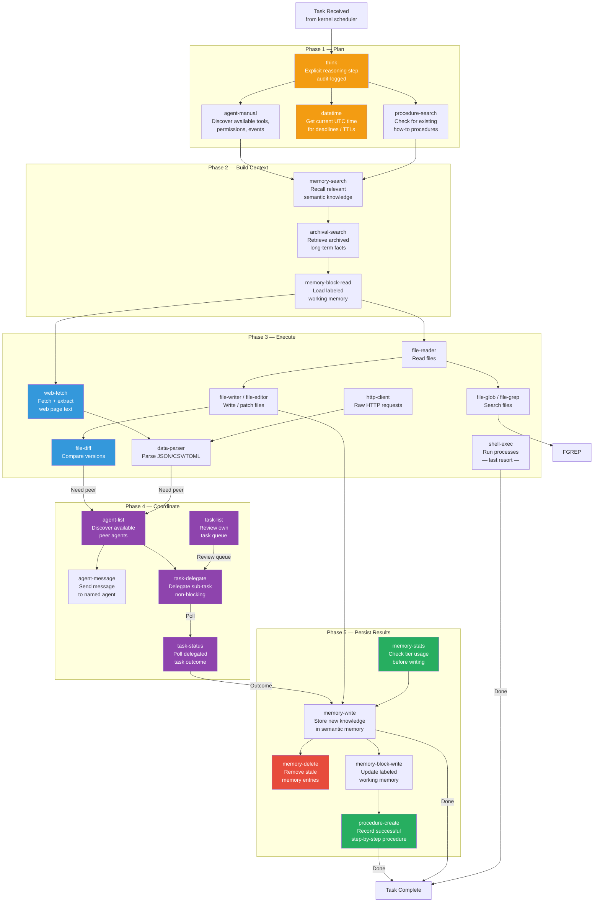

# Agentic Tool Loop Flow

> Data and control flow through a complete pure agentic loop — from task receipt to completion — using the full post-plan tool inventory.

---

## Diagram

**Legend:**
- Orange — cognitive scaffolding (think, datetime)
- Purple — coordination tier (new)
- Blue — content processing (new)
- Red — corrective memory operations (previously hidden)
- Green — memory persistence (previously hidden)

---

## Steps Walkthrough

### 1. Plan Phase

Every task begins with `think` — an explicit reasoning step that records intent in the audit log. Then `agent-manual` is queried to confirm tool availability, `datetime` anchors time-sensitive decisions, and `procedure-search` checks if a known procedure already exists for the task type.

### 2. Context Phase

The agent loads relevant memories: semantic facts via `memory-search`, archived long-term knowledge via `archival-search`, and labeled working state via `memory-block-read`. This builds the information base before any writes.

### 3. Execute Phase

The agent acts: reads/writes/searches files, fetches web content as text (not raw HTML), diffs versions to verify changes, and parses structured data. `shell-exec` is reserved for capabilities not covered by first-class tools (compilers, interpreters, etc.).

### 4. Coordinate Phase

If the task requires peers, the agent calls `agent-list` to discover who is available, sends messages or delegates sub-tasks, and polls `task-status` until sub-tasks resolve. `task-list` allows review of the current queue before creating new tasks.

### 5. Persist Phase

On completion, the agent stores new knowledge (`memory-write`), removes outdated entries (`memory-delete`), updates working state (`memory-block-write`), and — if the procedure was non-trivial and reusable — records it in `procedure-create`. `memory-stats` is checked first to avoid bloating memory tiers.

---

## Related

- [[Agentic Workflow Compatibility Plan]] — design rationale
- [[30-Pure Agentic Workflow Compatibility]] — implementation checklist
