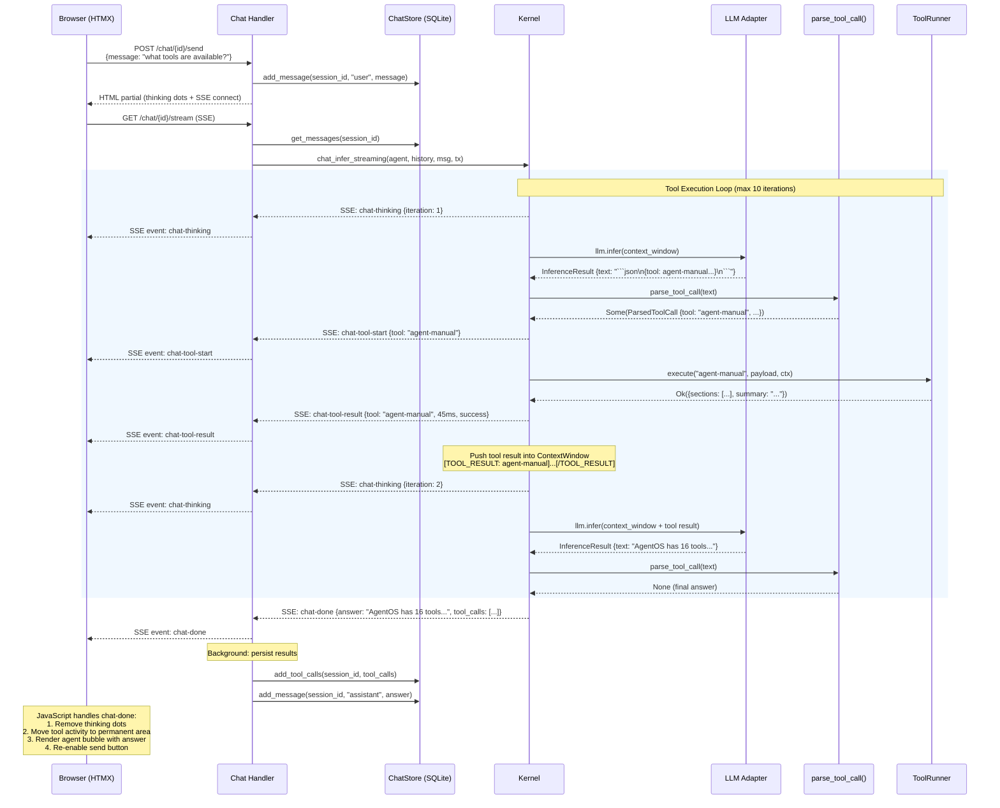

# Chat Tool Execution Flow

> How a user's chat message flows through the web handler, kernel tool loop, LLM adapter, and tool runner, with SSE events streamed back to the browser at each step.

---

## Diagram

---

## Steps

1. **User submits message.** The HTMX form sends a POST to `/chat/{session_id}/send`. The handler saves the user message to SQLite and returns an HTML fragment containing a thinking indicator and an SSE connection directive.

2. **SSE stream opens.** The browser connects to `GET /chat/{session_id}/stream`. The handler loads message history, spawns an async task that calls `Kernel::chat_infer_streaming()`, and converts the `mpsc::Receiver<ChatStreamEvent>` into an SSE `Stream`.

3. **Inference begins.** The kernel sends a `Thinking` event, then calls `llm.infer(ctx)` with the context window containing the system prompt, conversation history, and the new user message.

4. **Tool call detected.** `parse_tool_call()` finds a JSON block in the LLM's response. The kernel sends a `ToolStart` event, then calls `ToolRunner::execute()` with the tool name, payload, and a chat-scoped `ToolExecutionContext` (read-only permissions, synthetic TaskID).

5. **Tool result injected.** The tool's JSON result is truncated to 4KB, formatted as `[TOOL_RESULT: tool-name]\n...\n[/TOOL_RESULT]`, and pushed into the context window as a System entry. The kernel sends a `ToolResult` event.

6. **Re-inference.** The kernel loops back to step 3 with the updated context window. The LLM now sees the tool result and can either call another tool or produce a final answer.

7. **Final answer.** When `parse_tool_call()` returns `None`, the text is the final answer. The kernel sends a `Done` event containing the answer and the full list of tool calls.

8. **Persistence.** The spawned task saves tool call records and the assistant message to SQLite via `ChatStore::add_tool_calls()` and `ChatStore::add_message()`.

9. **Rendering.** The browser JavaScript handles the `chat-done` SSE event: removes the thinking indicator, moves tool activity entries to the permanent message area, renders the agent's answer as a chat bubble, and re-enables the send button.

---

## Error Paths

- **LLM inference fails:** Kernel sends `ChatStreamEvent::Error`. Browser renders an error banner. Send button re-enables.
- **Tool not found:** `ToolRunner::execute()` returns `AgentOSError::ToolNotFound`. Error is wrapped in `{"error": "..."}` and injected into the context. LLM sees the error and can respond accordingly.
- **Tool execution fails:** Same as tool not found -- error JSON injected, LLM gets another chance.
- **Max iterations (10) reached:** Kernel appends a warning note to the answer and sends `Done`. No infinite loops.
- **SSE connection drops:** HTMX automatically reconnects. The persisted messages are available on page refresh regardless.

---

## Related

- [[Chat Interface Plan]] -- master plan with all phases
- [[28-Chat Interface]] -- next-steps index
