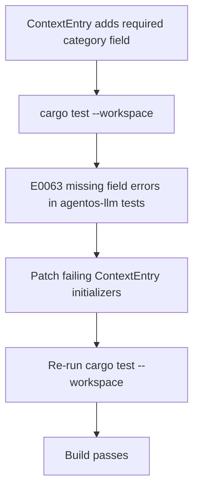

# ContextEntry Category Backfill Flow

> Compile-time enforcement catches missing struct fields, then targeted test fixture updates restore build continuity.

---

## Diagram

## Steps

1. `agentos-types` enforces `ContextEntry.category` at compile time.
2. Workspace test compilation identifies stale initializers in `agentos-llm`.
3. Add explicit `ContextCategory::History` for those historical test messages.
4. Re-run tests to verify all adapters compile and execute.

## Related

- [[agentos-contextentry-category-backfill]]
- [[Context Entry Categories]]
