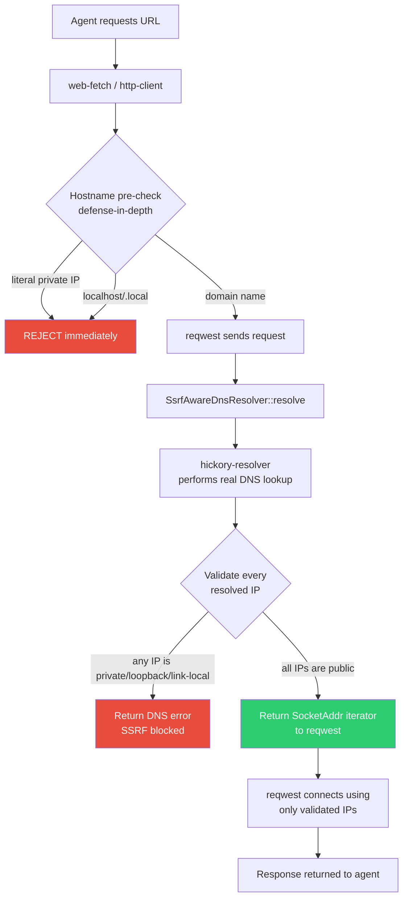
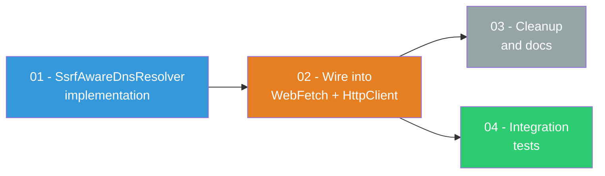

# DNS Rebinding SSRF Fix Plan

> Close the DNS rebinding SSRF vulnerability in `web-fetch` and `http-client` tools by implementing a custom reqwest DNS resolver that validates all resolved IP addresses against private/loopback ranges before any connection is made.

---

## Why This Matters

AgentOS tools fetch arbitrary URLs on behalf of AI agents. In a pure agentic workflow, agents browse URLs autonomously based on task goals or received messages. A compromised agent (via prompt injection) could be instructed to fetch a DNS-rebinding URL to exfiltrate cloud metadata tokens, access internal services, or pivot into private networks.

The current SSRF protection validates hostnames and IP literals at the URL-parsing stage but does **not** validate the IP address that DNS resolves the hostname to. This is a textbook DNS rebinding vulnerability that bypasses all existing checks.

---

## Current State

| Aspect | Status |
|--------|--------|
| IP literal blocking (`127.0.0.1`, `192.168.x.x`, `169.254.169.254`) | Working |
| Hostname blocking (`localhost`, `.local`) | Working |
| Redirect hop IP validation | Working (custom redirect policy) |
| Resolved IP validation on initial request | **Missing** -- DNS rebinding bypasses all checks |
| `is_private_ip()` function | Duplicated in `web_fetch.rs` and `http_client.rs` |
| `AGENTOS_TEST_ALLOW_LOCAL` env var | Used in both tools to bypass SSRF for tests |

### The Vulnerability

The SSRF check in both `web_fetch.rs` (lines 137-176) and `http_client.rs` (lines 152-191) follows this pattern:

1. Parse the URL hostname
2. If it is a literal IP, check against private/loopback ranges and block if private
3. If it is a domain name, check if it is `localhost` / `.local` and block if so
4. Otherwise, pass the check and make the HTTP request
5. reqwest resolves the hostname to an IP internally -- **this resolved IP is never validated**

An attacker who controls DNS for a domain (e.g., `evil.example.com`) can point it at `127.0.0.1`, `169.254.169.254` (cloud metadata), `192.168.x.x`, or any other private IP. The hostname passes all current checks because it is not a literal IP and not `localhost`.

---

## Threat Model

| Attacker | Attack Vector | Impact |
|----------|--------------|--------|
| External attacker via prompt injection | Agent fetches `evil.example.com` (resolves to `169.254.169.254`) | Cloud IAM credentials exfiltrated |
| External attacker via prompt injection | Agent fetches domain resolving to `127.0.0.1:8080` | Access to local API servers, dev tools |
| Malicious task input | URL in task payload points to `10.x.x.x` service | Internal network reconnaissance |
| DNS rebinding race | Domain alternates between public and private IPs | Bypasses TOCTOU pre-resolve checks |

---

## Options Considered

| Option | Approach | TOCTOU Safe | In-Process | Dependencies | Complexity |
|--------|----------|-------------|------------|--------------|------------|
| **A: Pre-resolve with tokio DNS** | `tokio::net::lookup_host()` before request; validate IPs; make request with original URL | No -- DNS can return different IPs between lookup and reqwest's internal resolution | Yes | None | Low |
| **B: Custom reqwest DNS resolver** | Implement `reqwest::dns::Resolve` trait; resolver does real DNS lookup, validates IPs, returns results or errors | **Yes** -- reqwest uses only our resolver for all connections | Yes | `hickory-resolver` | Medium |
| **C: External SSRF proxy** | Route all requests through a local SSRF-aware proxy (Smokescreen/Squid) | Yes | No -- requires sidecar process | External binary | High |

---

## Decision: Option B -- Custom DNS Resolver

Option B is the correct choice for AgentOS because:

1. **Fully closes the TOCTOU gap.** reqwest uses our resolver for all connections including the initial request. There is no window between validation and connection.
2. **In-process.** No external sidecar, no infrastructure dependency, no deployment complexity.
3. **Shared across both tools.** A single `SsrfAwareDnsResolver` struct is used by `WebFetch`, `HttpClientTool`, and any future HTTP-making tools.
4. **`hickory-resolver` is mature.** It is the standard async DNS library for the Rust ecosystem (formerly `trust-dns-resolver`), async-native, and actively maintained.
5. **Defense in depth.** The existing hostname pre-check remains as a fast-path rejection for obvious cases (`localhost`, IP literals). The DNS resolver is the authoritative enforcement layer.

---

## Target Architecture

---

## Phase Overview

| # | Phase | Effort | Dependencies | Status | Link |
|---|-------|--------|--------------|--------|------|
| 01 | Implement `SsrfAwareDnsResolver` | 4h | None | planned | [[01-ssrf-resolver-impl]] |
| 02 | Wire resolver into `WebFetch` and `HttpClientTool` | 2h | Phase 01 | planned | [[02-wire-resolver-into-clients]] |
| 03 | Cleanup and documentation | 1h | Phase 02 | planned | [[03-cleanup-and-docs]] |
| 04 | Integration tests | 3h | Phase 02 | planned | [[04-integration-tests]] |

---

## Phase Dependency Graph

---

## Key Design Decisions

1. **Use `hickory-resolver` (not `tokio::net::lookup_host`)** -- `hickory-resolver` gives us full control over DNS configuration (cache TTL, DNSSEC, recursion), while `tokio::net::lookup_host` is a thin wrapper over `getaddrinfo` with no configurability. The resolver is created once and shared via `Arc`.

2. **Validate ALL resolved IPs, not just the first** -- DNS may return multiple A/AAAA records. If any resolved IP is private, the entire resolution is rejected. An attacker could mix public and private IPs to hope reqwest picks the private one.

3. **Keep the hostname pre-check as defense-in-depth** -- The existing `localhost` / `.local` / IP-literal checks remain as a fast-path rejection. They are cheap, synchronous, and catch the obvious cases without a DNS lookup. The resolver is the authoritative layer.

4. **Single shared module `ssrf_resolver.rs`** -- Both `web_fetch.rs` and `http_client.rs` currently have their own copy of `is_private_ip()`. The new module consolidates all SSRF IP validation into one place, eliminating duplication and ensuring consistent enforcement.

5. **Respect `AGENTOS_TEST_ALLOW_LOCAL` in the resolver** -- Tests that need to hit `127.0.0.1` (e.g., `wiremock` servers) must still work. The resolver accepts a constructor flag `allow_private: bool` that bypasses IP validation when set. This flag is controlled by the existing env var, keeping test infrastructure unchanged.

6. **Block the cloud metadata IP range explicitly** -- `169.254.169.254` is the standard cloud metadata endpoint across AWS, GCP, and Azure. While `is_link_local()` covers this for IPv4, we add an explicit check and log message for auditability.

---

## Risks

| Risk | Likelihood | Impact | Mitigation |
|------|-----------|--------|------------|
| `hickory-resolver` adds significant compile time | Medium | Low | It is already widely used in the Rust ecosystem; pinned to a specific version |
| DNS resolution behavior differs from system resolver | Low | Medium | Default config uses system nameservers; tests verify resolution works for public domains |
| `AGENTOS_TEST_ALLOW_LOCAL` misused in production | Low | Critical | Resolver logs a `warn!` when `allow_private` is set; documented as test-only |
| Dual-stack (IPv4+IPv6) resolution returns mixed results | Low | Low | All IPs validated regardless of address family; both `is_private_ip` branches handle v4 and v6 |
| reqwest version upgrade changes `Resolve` trait | Low | Medium | Trait is stable since reqwest 0.12; pinned in workspace `Cargo.toml` |

---

## Related

- [[01-ssrf-resolver-impl]]
- [[02-wire-resolver-into-clients]]
- [[03-cleanup-and-docs]]
- [[04-integration-tests]]
- [[Issues and Fixes]]
- [[11-Spec Enforcement Hardening]]
