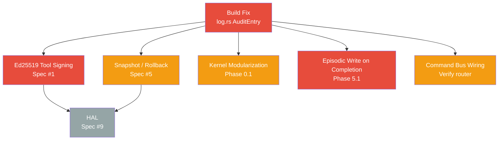

# AgentOS — Next Steps Master Dashboard

> Comprehensive implementation status as of **2026-03-18**, cross-referenced against [[agos-implementation-spec]] (12-item spec) and [[Feedback Implementation Plan]] (Phases 0--7).

---

## Build Status

> [!success] Build Passing
> All spec gaps addressed. `cargo build --workspace` and `cargo test --workspace` pass clean.
> `cargo fmt` passes. `cargo clippy` has 4 errors -- fix tracked in [[18-Bug Fixes and Deployment Readiness]].

---

## Implementation Status at a Glance

| Item | Spec Ref | Status | Notes |
|---|---|---|---|
| Capability-Signed Tool Registry | Spec #1 | Done | Ed25519 signing, trust tiers, kernel enforcement |
| Kernel Permission Matrix | Spec #2 | Done | Per-agent rwx, CapabilityToken enforcement |
| Encrypted Secrets Vault | Spec #3 | Done | AES-256-GCM, Argon2id, proxy token API added |
| Cost-Aware Scheduler | Spec #4 | Done | Pre-inference check + auto-checkpoint on HardLimit |
| Merkle Audit Trail | Spec #5 (audit trail) | Done | reversible + rollback_ref now stored in SQLite |
| Checkpoint / Rollback | Spec #5 (rollback) | Done | Auto-snapshot before write ops + budget exhaustion |
| Prompt Injection Scanner | Spec #6 | Done | 23 patterns, taint tagging, High-threat escalation |
| Agent Identity & IAM | Spec #7 | Done | Ed25519 identity, vault-backed, A2A signing |
| Concurrent Resource Arbitration | Spec #8 | Done | FIFO locks, DFS deadlock detection, TTL sweep |
| Hardware Abstraction Layer | Spec #9 | Done | HardwareRegistry with quarantine/approve/deny workflow |
| Multi-Agent Coordination | Spec #10 | Done | Pipeline + DFS deadlock; A2A TTL expiry enforced |
| Context / Memory Architecture | Spec #11 | Done | All 8 phases complete: ContextCompiler, ProceduralStore, RetrievalGate, ExtractionEngine, ConsolidationEngine, MemoryBlockStore all implemented and wired -- see [[Memory Context Architecture Plan]] |
| Approval Gates | Spec #12 | Done | Risk taxonomy + blocking escalation + CLI |
| Split `kernel.rs` | Phase 0.1 | Done | commands/ directory fully modularized |
| Tool Output Sanitization | Phase 0.2 | Done | taint_wrap in injection_scanner |
| Intent Coherence Checker | Phase 1 | Done | intent_validator.rs |
| Escalate Intent Type | Phase 2 | Done | escalation.rs |
| Context Window Intelligence | Phase 3 | Done | SemanticEviction |
| Task Deadlock Prevention | Phase 4 | Done | TaskDependencyGraph |
| Memory Auto-Inject | Phase 5.2 | Done | episodic recall at task start |
| Memory Auto-Write on Completion | Phase 5.1 | Done | TaskResult struct, EpisodeType::ToolCall recording, and tool result metadata all implemented in task_executor.rs |
| Uncertainty & Reasoning Hints | Phase 6 | Done | parse_uncertainty + infer_reasoning_hints implemented |
| Scratchpad Context Partition | Phase 7 | Done | active_entries() used by all adapters |
| Spec Enforcement Hardening | Spec #2,4,5,6,8,12 | Done | [[11-Spec Enforcement Hardening]] |
| HAL Device Registry Enforcement | V3 Gap | **Planned** | `HardwareAbstractionLayer::query()` never calls `check_access()` — see [[01-hal-registry-enforcement]] |
| MCP Adapter Crate | V3 Gap | **Planned** | No MCP protocol implementation — see [[02-mcp-adapter]] |
| User-Agent Communication (UNIS) | V3 Gap | **Planned** | Unified Notification & Interaction System — ask-user tool, task completion notifications, SSE/web inbox, pluggable adapters — see [[User-Agent Communication Plan]] |

---

## Priority Order

| # | Task | Effort | Priority |
|---|---|---|---|
| 1 | [[01-Critical Build Fix\|Fix AuditEntry initializers]] | ~30 min | **Blocker** |
| 2 | [[05-Episodic Memory Completion\|Episodic write on task completion]] | ~1h | **High** |
| 3 | [[06-Command Bus Wiring\|Verify command bus/router coverage]] | ~2h | **High** |
| 4 | [[02-Ed25519 Tool Signing\|Ed25519 tool manifest signing]] | ~6h | **High** |
| 5 | [[03-Snapshot Rollback\|Checkpoint/Snapshot/Rollback system]] | ~8h | **Medium** |
| 6 | [[04-Kernel Modularization\|Kernel.rs modularization]] | ~4h | **Medium** |
| 7 | [[07-Hardware Abstraction Layer\|Hardware Abstraction Layer]] | ~10h | **Low** |
| 8 | [[11-Spec Enforcement Hardening\|Escalation expiry, snapshot cleanup, path perms, SSRF, cost audit]] | ~4h | **Done** |
| 9 | [[12-Production Readiness Audit\|Full 12-spec production readiness audit]] | 4-6 weeks | **Critical** |
| 10 | [[13-Event Trigger System\|Event-driven agent triggering system]] | ~3d | **High** |
| 11 | [[14-Spec Gap Fixes\|Wire missing integrations + absent CLI commands (18 gaps)]] | ~3d | **Critical** |
| 12 | [[Memory Context Architecture Plan\|Memory & Context Architecture (8 phases)]] | ~14d | **Critical** |
| 13 | [[15-ContextEntry Category Build Fix\|Backfill required ContextEntry category field in LLM tests]] | ~30m | **High** |
| 14 | [[16-First Deployment Readiness Program\|First deployment readiness (code safety, quality gates, config, containerization, security closure, release cutover)]] | ~7d | **Critical** |
| 15 | [[16-Full Codebase Review\|Full codebase review (60 steps, 10 phases, all 17 crates)]] | ~5d | **Critical** |
| 16 | [[17-Memory Context Architecture Completion Sprint\|Memory context architecture completion sprint (kernel wiring + phases 5-8 implementation)]] | ~3d | **Critical** |
| 17 | [[17-05-Context Freshness and Procedural Min Score\|Context freshness refresh + procedural min_score restore]] | ~4h | **High** |
| 18 | [[17-06-Memory Runtime Efficiency Hardening\|Shared embedder + retrieval dirty-flag optimization]] | ~6h | **High** |
| 19 | [[17-07-Retrieval Refresh Metrics\|Retrieval refresh/reuse observability counters and latency]] | ~2h | **High** |
| 20 | [[Event Trigger Completion Plan\|Event trigger system completion (10 phases: emission points, prompts, filters, dynamic subs)]] | ~5d | **High** |
| 21 | [[18-Bug Fixes and Deployment Readiness\|Bug fixes and deployment readiness (clippy CI, event HMAC, test harness, Docker)]] | ~5d | **Complete** |
| 22 | [[19-User Handbook\|Comprehensive user handbook (19 chapters, all CLI commands, all subsystems)]] | ~5d | **High** |
| 23 | [[20-V1-Release-Fix-Plan\|V1 Release Fix Plan (15 critical fixes across 5 phases)]] | ~10d | **Critical** |
| 24 | [[21-Future-Improvements\|Future Improvements (18 post-v1 items across 5 categories)]] | ~17d | **Backlog** |
| 25 | [[22-Unwired Features\|Unwired features: 31 missing event emissions, pipeline security, web UI, stale docs]] | ~5d | **Critical** |
| 26 | [[23-WebUI Security Fixes\|WebUI security fixes: 6 critical vulns, 8 bugs, 5 arch issues across 8 phases]] | ~5d | **Critical** |
| 27 | [[audit_report\|Plan Audit Report -- gap classification, completion percentages, spec drift analysis]] | -- | **Reference** |
| 28 | [[TODO-consolidation-background-loop\|Wire consolidation engine background loop (30-min periodic run)]] | ~2h | **High** |
| 29 | [[TODO-template-deduplication\|Deduplicate web templates using MiniJinja include directives]] | ~1h | **Low** |
| 30 | [[TODO-execute-review\|Execute full codebase review phases 1-2 and 4-10 (60 steps)]] | ~5d | **Critical** |
| 31 | [[TODO-complete-handbook-chapters\|Complete user handbook chapters 07-19 (13 chapters + index)]] | ~3d | **High** |
| 32 | [[TODO-release-cutover\|Execute release process: cut v0.1.0 tag from validated commit]] | ~4h | **High** |
| 33 | [[TODO-update-stale-plan-statuses\|Update stale plan doc status fields (20+ files saying planned when code is done)]] | ~30m | **Medium** |
| 34 | [[TODO-ci-automation\|Create GitHub Actions CI workflow for fmt/clippy/test gates]] | ~2h | **High** |
| 35 | [[TODO-update-stale-plan-statuses (memory)\|Update memory context architecture plan statuses (phases 3-8 all complete)]] | ~15m | **Medium** |
| 36 | [[TODO-update-stale-plan-statuses (webui)\|Update WebUI security fixes plan statuses (all 8 phases complete)]] | ~15m | **Medium** |
| 37 | [[TODO-update-plan-statuses (unwired)\|Update unwired features plan statuses (phases 01 and 03 complete)]] | ~10m | **Medium** |
| 38 | [[TODO-close-remaining-gaps\|Close first deployment readiness gaps: fmt fix, status updates, security gate sign-off, v0.1.0 tag]] | ~4h | **High** |
| 39 | [[TODO-reconcile-review-status\|Reconcile full codebase review status contradiction and execute remaining 9 phases]] | ~5d | **Critical** |
| 40 | [[24-Production Stability Fixes\|Production stability fixes: memory retrieval resilience, health monitor consolidation, graceful shutdown, agent identity persistence, boot pre-flight, restart hardening, systemd deployment (7 phases, 9 subtasks)]] | ~8d | **Critical** |
| 41 | [[25-WebUI Redesign\|WebUI redesign: sidebar layout, enhanced dashboard, task management, audit viewer, SSE real-time updates, UX polish (6 phases)]] | ~12d | **High** |
| 42 | [[26-LLM Agent Testing\|LLM agent testing harness: real LLM drives AgentOS, 10 scenarios, structured feedback, markdown/JSON reports (5 phases, 5 subtasks)]] | ~12d | **High** |
| 43 | [[27-Agent Manual Tool\|Agent manual tool: queryable OS documentation for agents (9 sections, 5 subtasks)]] | ~2d | **Complete** |
| 44 | [[28-Chat Interface\|Chat interface: tool call execution fix, SSE streaming, inline tool activity, task assignment, agent selection (7 phases, 7 subtasks)]] | ~10d | **High** |
| 45 | [[29-File Operations Expansion\|File operations expansion: file-editor, file-glob, file-grep, file-delete, file-move (5 tools)]] | ~3d | **High** |
| 46 | [[30-Network Tool Hardening\|Network tool hardening: redirect control, SSE streaming, network-monitor manifest, multipart upload, download-to-file (5 subtasks)]] | ~4h | **Complete** |
| 47 | [[30-Pure Agentic Workflow Compatibility\|Pure agentic workflow: 9 hidden manifests, 7 new tools (think, datetime, web-fetch, file-diff, agent-list, task-status, task-list), 3 new agent-manual sections (7 subtasks)]] | ~5d | **Complete** |
| 48 | [[31-Agentic Readiness Fixes\|Agentic readiness fixes: 25 subtasks across 5 phases — autonomy (iterations, parallel tools, schemas, OpenAI), reliability (persistence, async mutex, output limits), security (pubkey, pipeline injection, vault rotation, audit chain), ergonomics (types, events, introspection), polish (scanner, workspace, backoff, cancellation)]] | ~6w | **Critical** |
| 49 | [[32-Logging Observability\|Logging & observability: #[instrument] spans, tools logging, silent failure elimination, JSON output + correlation IDs (4 phases)]] | ~5d | **High** |
| 50 | [[33-Sandbox Lightweight Execution\|Sandbox lightweight execution: single-tool factory, lazy sandbox init, per-category RLIMIT_AS, tool weight classification (4 phases)]] | ~10d | **Critical** |
| 51 | [[34-Sandbox Execution Policy\|Sandbox execution policy: trust-aware dispatch (Core=in-process, Community=sandboxed), concurrency semaphore, RAYON_NUM_THREADS=1, execution mode audit (4 phases, 4 subtasks)]] | ~5d | **Critical** |
| 52 | [[LLM Adapter Redesign Plan|LLM adapter redesign: native tool protocols, StopReason, real streaming, retry/circuit breaker, cost attribution, provider failover, legacy cleanup (9 phases)]] | ~14d | **Critical** |

---

## What Was Completed in the Last Session

The following were designed and implemented from scratch:

- **`cost_tracker.rs`** -- Per-agent token/USD/tool-call budgets, `BudgetCheckResult` enum, model downgrade path (`ModelDowngradeRecommended` variant)
- **`resource_arbiter.rs`** -- Shared/exclusive locks, FIFO waiters with tokio oneshot channels, TTL expiry, `release_all_for_agent`
- **`injection_scanner.rs`** -- Regex taint detection, `taint_wrap()`, `InjectionScanResult`
- **`intent_validator.rs`** -- Two-layer validation (structural capability + semantic: loop detection, write-without-read, scope escalation)
- **`identity.rs`** -- Ed25519 keypair generation/signing/verification for agents
- **`risk_classifier.rs`** -- `ActionRiskLevel` taxonomy (Level 0--4) matching Spec #12
- **`escalation.rs`** -- `EscalationManager` with SQLite backing, blocking/non-blocking escalations
- **`scheduler.rs` update** -- `TaskDependencyGraph` with DFS cycle detection
- **`context.rs` update** -- `SemanticEviction`, `importance`, `pinned`, `partition` fields on `ContextEntry`
- **`task_executor.rs` updates** -- episodic auto-inject, uncertainty parsing, taint wrapping, model downgrade handling
- **AuditEntry** -- added `reversible: bool` and `rollback_ref: Option<String>` fields
- **CLI + kernel commands** -- `resource`, `cost`, `escalation` subcommands wired end-to-end

---

## Issues and Fixes Cross-Reference (updated 2026-03-17)

All 9 documented issues are now resolved. 3 new production stability issues discovered via audit log analysis:

| # | Issue | Status |
|---|---|---|
| 1 | Integration test hang / cancellation token | **Resolved** -- 6 tests un-ignored, pass in ~6s with shared model cache |
| 2 | Partition persistence bug | **Resolved** (`set_partition_for_task`) |
| 3 | LLM adapters `as_entries()` | **Resolved** (all use `active_entries()`) |
| 4 | Escalation CLI missing | **Resolved** (list/get/resolve wired) |
| 5 | Uncertainty parsing stub | **Resolved** (`parse_uncertainty` called post-inference) |
| 6 | Reasoning hints `None` | **Resolved** (`infer_reasoning_hints` auto-infers) |
| 7 | Episodic memory `.ok()` | **Resolved** (all use `tracing::warn`) |
| 8 | Dead code / clippy errors | **Resolved** (dead code removed, 4 clippy errors fixed) |
| 9 | Event HMAC/audit bypass | **Resolved** (notification channel pattern implemented) |
| 10 | MemorySearchFailed spam on bootstrap | **Planned** -- [[24-Production Stability Fixes]] |
| 11 | DiskSpaceLow event flood | **Planned** -- [[24-Production Stability Fixes]] |
| 12 | Kernel restart instability | **Planned** -- [[24-Production Stability Fixes]] |

Additional deliverables: Dockerfile, docker-compose.yml, config/docker.toml, .dockerignore, env var passphrase fallback.

Full details: [[Bug Fixes and Deployment Readiness Plan]], [[Production Stability Fixes Plan]]

---

## Notes

- All implemented modules have unit tests
- The HAL (Spec #9) is the only major spec item with zero implementation
- All changes are on `main` branch, uncommitted

![[Feedback Implementation Plan]]
