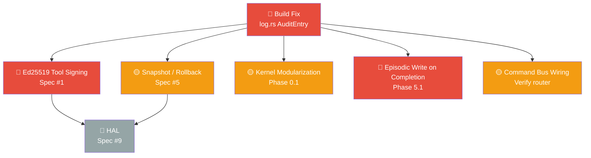

# AgentOS — Next Steps Master Dashboard

> Comprehensive implementation status as of **2026-03-11**, cross-referenced against [[agos-implementation-spec]] (12-item spec) and [[Feedback Implementation Plan]] (Phases 0–7).

---

## Build Status

> [!success] Build Passing
> All spec gaps addressed. `cargo build --workspace` and `cargo test --workspace` pass clean.

---

## Implementation Status at a Glance

| Item | Spec Ref | Status | Notes |
|---|---|---|---|
| Capability-Signed Tool Registry | Spec #1 | ✅ Done | Ed25519 signing, trust tiers, kernel enforcement |
| Kernel Permission Matrix | Spec #2 | ✅ Done | Per-agent rwx, CapabilityToken enforcement |
| Encrypted Secrets Vault | Spec #3 | ✅ Done | AES-256-GCM, Argon2id, proxy token API added |
| Cost-Aware Scheduler | Spec #4 | ✅ Done | Pre-inference check + auto-checkpoint on HardLimit |
| Merkle Audit Trail | Spec #5 (audit trail) | ✅ Done | reversible + rollback_ref now stored in SQLite |
| Checkpoint / Rollback | Spec #5 (rollback) | ✅ Done | Auto-snapshot before write ops + budget exhaustion |
| Prompt Injection Scanner | Spec #6 | ✅ Done | 23 patterns, taint tagging, High-threat → escalation |
| Agent Identity & IAM | Spec #7 | ✅ Done | Ed25519 identity, vault-backed, A2A signing |
| Concurrent Resource Arbitration | Spec #8 | ✅ Done | FIFO locks, DFS deadlock detection, TTL sweep |
| Hardware Abstraction Layer | Spec #9 | ✅ Done | HardwareRegistry with quarantine/approve/deny workflow |
| Multi-Agent Coordination | Spec #10 | ✅ Done | Pipeline + DFS deadlock; A2A TTL expiry enforced |
| Context / Memory Architecture | Spec #11 | 🟡 Partial | Token budget + semantic/episodic done; tool discovery, procedural tier, context compilation, retrieval gate pending → [[Memory Context Architecture Plan]] |
| Approval Gates | Spec #12 | ✅ Done | Risk taxonomy + blocking escalation + CLI |
| Split `kernel.rs` | Phase 0.1 | ✅ Done | commands/ directory fully modularized |
| Tool Output Sanitization | Phase 0.2 | ✅ Done | taint_wrap in injection_scanner |
| Intent Coherence Checker | Phase 1 | ✅ Done | intent_validator.rs |
| Escalate Intent Type | Phase 2 | ✅ Done | escalation.rs |
| Context Window Intelligence | Phase 3 | ✅ Done | SemanticEviction |
| Task Deadlock Prevention | Phase 4 | ✅ Done | TaskDependencyGraph |
| Memory Auto-Inject | Phase 5.2 | ✅ Done | episodic recall at task start |
| Memory Auto-Write on Completion | Phase 5.1 | 🔴 Not started | [[05-Episodic Memory Completion]] |
| Uncertainty & Reasoning Hints | Phase 6 | ✅ Done | — |
| Scratchpad Context Partition | Phase 7 | ✅ Done | — |
| Spec Enforcement Hardening | Spec #2,4,5,6,8,12 | ✅ Done | [[11-Spec Enforcement Hardening]] |

**Legend:** ✅ Done · 🟡 Partial · 🔴 Not started

---

## Priority Order

| # | Task | Effort | Priority |
|---|---|---|---|
| 1 | [[01-Critical Build Fix\|Fix AuditEntry initializers]] | ~30 min | **Blocker** |
| 2 | [[05-Episodic Memory Completion\|Episodic write on task completion]] | ~1h | **High** |
| 3 | [[06-Command Bus Wiring\|Verify command bus/router coverage]] | ~2h | **High** |
| 4 | [[02-Ed25519 Tool Signing\|Ed25519 tool manifest signing]] | ~6h | **High** |
| 5 | [[03-Snapshot Rollback\|Checkpoint/Snapshot/Rollback system]] | ~8h | **Medium** |
| 6 | [[04-Kernel Modularization\|Kernel.rs modularization]] | ~4h | **Medium** |
| 7 | [[07-Hardware Abstraction Layer\|Hardware Abstraction Layer]] | ~10h | **Low** |
| 8 | [[11-Spec Enforcement Hardening\|Escalation expiry, snapshot cleanup, path perms, SSRF, cost audit]] | ~4h | **Done** |
| 9 | [[12-Production Readiness Audit\|Full 12-spec production readiness audit]] | 4-6 weeks | **Critical** |
| 10 | [[13-Event Trigger System\|Event-driven agent triggering system]] | ~3d | **High** |
| 11 | [[14-Spec Gap Fixes\|Wire missing integrations + absent CLI commands (18 gaps)]] | ~3d | **Critical** |
| 12 | [[Memory Context Architecture Plan\|Memory & Context Architecture (8 phases)]] | ~14d | **Critical** |
| 13 | [[15-ContextEntry Category Build Fix\|Backfill required ContextEntry category field in LLM tests]] | ~30m | **High** |
| 14 | [[16-First Deployment Readiness Program\|First deployment readiness (code safety, quality gates, config, containerization, security closure, release cutover)]] | ~7d | **Critical** |
| 15 | [[16-Full Codebase Review\|Full codebase review (60 steps, 10 phases, all 17 crates)]] | ~5d | **Critical** |
| 16 | [[17-Memory Context Architecture Completion Sprint\|Memory context architecture completion sprint (kernel wiring + phases 5-8 implementation)]] | ~3d | **Critical** |
| 17 | [[17-05-Context Freshness and Procedural Min Score\|Context freshness refresh + procedural min_score restore]] | ~4h | **High** |

---

## What Was Completed in the Last Session

The following were designed and implemented from scratch:

- **`cost_tracker.rs`** — Per-agent token/USD/tool-call budgets, `BudgetCheckResult` enum, model downgrade path (`ModelDowngradeRecommended` variant)
- **`resource_arbiter.rs`** — Shared/exclusive locks, FIFO waiters with tokio oneshot channels, TTL expiry, `release_all_for_agent`
- **`injection_scanner.rs`** — Regex taint detection, `taint_wrap()`, `InjectionScanResult`
- **`intent_validator.rs`** — Two-layer validation (structural capability + semantic: loop detection, write-without-read, scope escalation)
- **`identity.rs`** — Ed25519 keypair generation/signing/verification for agents
- **`risk_classifier.rs`** — `ActionRiskLevel` taxonomy (Level 0–4) matching Spec #12
- **`escalation.rs`** — `EscalationManager` with SQLite backing, blocking/non-blocking escalations
- **`scheduler.rs` update** — `TaskDependencyGraph` with DFS cycle detection
- **`context.rs` update** — `SemanticEviction`, `importance`, `pinned`, `partition` fields on `ContextEntry`
- **`task_executor.rs` updates** — episodic auto-inject, uncertainty parsing, taint wrapping, model downgrade handling
- **AuditEntry** — added `reversible: bool` and `rollback_ref: Option<String>` fields
- **CLI + kernel commands** — `resource`, `cost`, `escalation` subcommands wired end-to-end

---

## Notes

- All implemented modules have unit tests
- The `agentos-audit` tests are the only currently-broken compilation unit
- The HAL (Spec #9) is the only major spec item with zero implementation
- All changes are on `main` branch, uncommitted

![[Feedback Implementation Plan]]