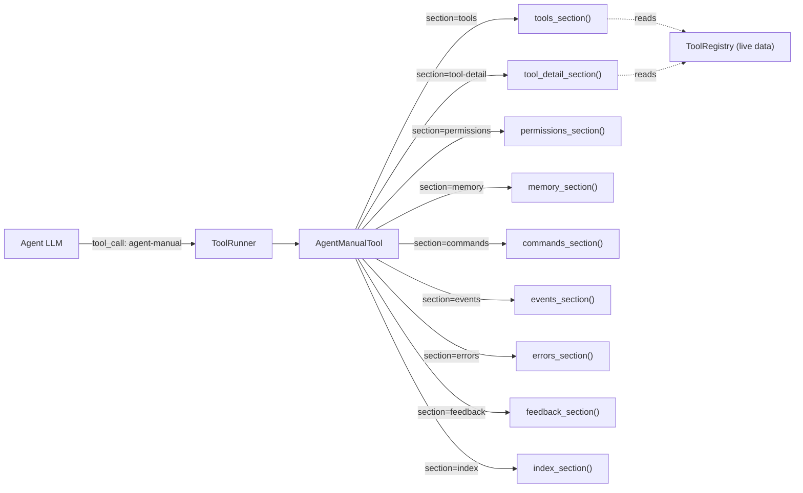
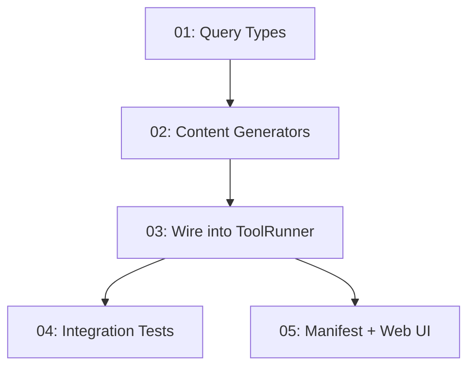

# Agent Manual Tool — Design Plan

> A queryable, token-efficient built-in tool that lets any agent discover what the OS offers — tools, permissions, kernel commands, memory tiers, events, error patterns — without bloating its context window.

---

## Why This Matters

Today, agents running on AgentOS have no programmatic way to discover the system's capabilities at runtime. The system prompt includes a flat tool list (`ToolRegistry::tools_for_prompt()`) but nothing about permissions, memory tiers, kernel commands, events, or error recovery patterns. When an agent encounters an unknown error or needs to use a tool it has not been told about, it has no recourse except to guess or hallucinate.

A structured, queryable manual tool solves this by:
1. **Reducing system prompt size** — move the bulk of OS documentation out of the prompt and into an on-demand tool.
2. **Improving agent accuracy** — agents look up exact schemas, permissions, and error codes instead of guessing.
3. **Staying accurate** — content is generated from live registry data and type definitions, not hand-written prose.
4. **Enabling self-directed exploration** — `{"section": "index"}` lets agents discover what they can learn about.

---

## Current State

| Aspect | What Exists Today |
|--------|-------------------|
| Tool discovery | `ToolRegistry::tools_for_prompt()` returns `- name : description` lines |
| Permission discovery | None at runtime; agents must be told in system prompt |
| Kernel command docs | None; agents discover commands only from prompt injection or guessing |
| Memory tier docs | None |
| Event type docs | None |
| Error recovery docs | None |
| Tool input schemas | `input_schema` field exists on `ToolManifest` but is not exposed to agents |

---

## Target Architecture

The tool lives in `crates/agentos-tools/src/agent_manual.rs` and is registered in `ToolRunner::register_memory_tools()` alongside all other built-in tools. It requires **no permissions** (read-only, operates on its own knowledge).

---

## Phase Overview

| # | Phase | Effort | Dependencies | Detail |
|---|-------|--------|--------------|--------|
| 01 | Define `ManualSection` enum and query types | 2h | None | [[27-01-Define ManualSection Enum and Query Types]] |
| 02 | Implement section content generators | 4h | 01 | [[27-02-Implement Section Content Generators]] |
| 03 | Wire into ToolRunner and registry | 1h | 02 | [[27-03-Wire AgentManual into ToolRunner and Registry]] |
| 04 | Integration tests | 3h | 03 | [[27-04-Agent Manual Integration Tests]] |
| 05 | Tool manifest and Web UI link | 1h | 03 | [[27-05-Add Tool Manifest and Web UI Link]] |

**Total estimated effort: ~11h (2d)**

---

## Phase Dependency Graph

---

## Key Design Decisions

1. **Tool lives in `agentos-tools`, not `agentos-kernel`** — it follows the same `AgentTool` trait pattern as every other tool. It does not need kernel access; the ToolRegistry data it needs is injected at construction time via a snapshot (Vec of tool summaries), not a live Arc reference.

2. **Static content + dynamic tool list** — most sections (permissions, memory, commands, events, errors, feedback) contain static content compiled into the binary. The `tools` and `tool-detail` sections are dynamic and generated from a snapshot of `ToolRegistry::list_all()` taken at construction time. This avoids holding an `Arc<RwLock<ToolRegistry>>` in the tool.

3. **Response format is JSON** — all responses are `serde_json::Value` objects with a consistent envelope: `{"section": "...", "content": {...}}`. This is parseable by any LLM and avoids markdown rendering ambiguity.

4. **No permissions required** — the manual is read-only public documentation. Any agent can query it. This matches the design of `data-parser` which also requires no permissions.

5. **Token budget target: ~500 tokens per response** — each section returns compact, structured data. The `tools` section returns a table (name + description + permissions), not full schemas. The `tool-detail` section returns the full schema for exactly one tool.

6. **Injected tool summaries, not live registry reference** — `AgentManualTool` accepts a `Vec<ToolSummary>` at construction. The kernel builds this from `ToolRegistry::list_all()` when constructing the ToolRunner. This keeps the tool decoupled from kernel internals.

7. **`ToolSummary` is a lightweight struct** — defined in the tool module, not in `agentos-types`, since it is internal to the tool's implementation. It contains `name`, `description`, `version`, `permissions`, `input_schema`, `trust_tier`.

---

## Risks

| Risk | Impact | Mitigation |
|------|--------|------------|
| Tool summaries become stale if tools are installed/removed after boot | Low — tools rarely change at runtime | Rebuild summaries on tool install/remove, or accept staleness with a note in the index section |
| Section content drifts from actual code | Medium | Static sections reference enum variant names and struct fields; tests assert key content is present |
| Agents over-query the manual, wasting inference tokens | Low | Each response is <500 tokens; the LLM learns after 1-2 queries |
| New kernel commands added without updating the manual | Medium | Add a test that compares `KernelCommand` variant count to the commands section entry count |

---

## Related

- [[27-Agent Manual Tool]] — implementation checklist
- [[AgentOS Handbook Index]] — human-facing handbook (different audience)
