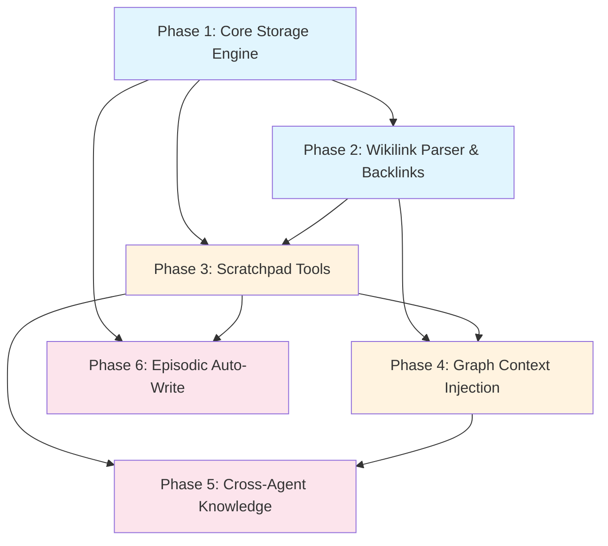

# Agent Scratchpad Plan

> A lightweight, Obsidian-inspired knowledge graph for agent working memory — markdown pages with wikilinks, backlink indexing, and graph-aware context injection.

---

## Why This Matters

Agents currently have three memory tiers (episodic, semantic, procedural) optimized for **retrieval** — structured queries against indexed stores. But agents lack a space for **thinking**: drafting plans, linking concepts, revisiting half-formed ideas across tasks, and building associative knowledge organically.

The existing `MemoryBlockStore` is a flat key-value store with a 2KB limit per block — it's a post-it note, not a notebook. Agents need something closer to a personal wiki where they can:

1. **Draft and iterate** — write pages without schema constraints
2. **Link ideas associatively** — `[[wikilinks]]` create a knowledge graph naturally
3. **Discover connections** — backlink traversal surfaces related context the agent didn't explicitly query
4. **Share knowledge** — agents can read each other's scratchpads (with capability tokens)

This is the difference between a database and a thinking tool.

---

## Current State

| Component | What Exists | Limitation |
|-----------|------------|------------|
| `MemoryBlockStore` | Flat key-value, SQLite, agent-scoped | 2KB max, no linking, no search beyond exact label |
| `SemanticStore` | Embedding-based knowledge base | Structured entries, not freeform; no associative linking |
| `EpisodicStore` | Timeline of events per task/agent | Append-only log, not editable working memory |
| `ProceduralStore` | Learned skills/SOPs | Rigid schema (preconditions, steps, postconditions) |

None of these support **freeform markdown**, **wikilinks**, **backlink graphs**, or **graph-aware context injection**.

---

## Target Architecture

```
┌─────────────────────────────────────────────────────────┐
│                    Agent Scratchpad                       │
│                                                           │
│  ┌──────────────┐    ┌──────────────┐    ┌────────────┐  │
│  │  PageStore    │    │  LinkIndex   │    │  SearchIdx │  │
│  │  (SQLite)     │◄──►│  (adjacency) │    │  (FTS5)    │  │
│  │              │    │              │    │            │  │
│  │ - id         │    │ - source_id  │    │ - page_id  │  │
│  │ - agent_id   │    │ - target_id  │    │ - content  │  │
│  │ - title      │    │ - link_text  │    │ - title    │  │
│  │ - content    │    │              │    │ - tags     │  │
│  │ - tags       │    └──────────────┘    └────────────┘  │
│  │ - frontmatter│                                         │
│  │ - created_at │    ┌──────────────┐                    │
│  │ - updated_at │    │ GraphWalker  │                    │
│  └──────────────┘    │              │                    │
│                      │ - neighbors  │                    │
│                      │ - bfs(depth) │                    │
│                      │ - subgraph   │                    │
│                      └──────────────┘                    │
│                                                           │
│  ┌──────────────────────────────────────────────────────┐ │
│  │              Scratchpad Tools (AgentTool)             │ │
│  │  scratch-write  scratch-read  scratch-search          │ │
│  │  scratch-links  scratch-graph  scratch-delete         │ │
│  └──────────────────────────────────────────────────────┘ │
└─────────────────────────────────────────────────────────┘
         │                                    ▲
         │  context injection                 │ capability check
         ▼                                    │
┌─────────────────┐                 ┌─────────────────┐
│  ContextManager  │                 │  CapabilityToken │
│  (graph-aware    │                 │  (scratchpad     │
│   note injection)│                 │   permissions)   │
└─────────────────┘                 └─────────────────┘
```

---

## Phase Overview

| Phase | Name | Effort | Dependencies | Detail Doc |
|-------|------|--------|-------------|------------|
| 1 | Core storage engine | 2d | None | [[01-core-storage-engine]] |
| 2 | Wikilink parser & backlink index | 1.5d | Phase 1 | [[02-wikilink-parser-and-backlinks]] |
| 3 | Scratchpad tools | 2d | Phase 1, 2 | [[03-scratchpad-tools]] |
| 4 | Graph traversal & context injection | 2d | Phase 2, 3 | [[04-graph-context-injection]] |
| 5 | Cross-agent knowledge sharing | 1.5d | Phase 3, 4 | [[05-cross-agent-knowledge]] |
| 6 | Episodic auto-write integration | 1d | Phase 1, 3 | [[06-episodic-auto-write]] |

---

## Phase Dependency Graph



**Legend:** Blue = foundation, Orange = core functionality, Pink = integration

---

## Key Design Decisions

1. **New crate `agentos-scratch` vs extending `agentos-memory`** — New crate. The scratchpad is conceptually different from structured memory retrieval. It has its own storage schema, its own link index, and its own graph traversal logic. Keeping it separate follows the "single responsibility per crate" convention and avoids bloating `agentos-memory`.

2. **SQLite storage vs filesystem** — SQLite. Consistent with every other persistence layer in AgentOS (audit, episodic, semantic, procedural, memory blocks). Gives us FTS5 for free, ACID transactions, and easy agent-scoping via WHERE clauses. Filesystem would need manual indexing and is harder to scope per-agent.

3. **Wikilink resolution: title-based vs ID-based** — Title-based, matching Obsidian convention. Titles must be unique within an agent's namespace. This makes links human-readable in markdown and agent-readable in content. The `LinkIndex` maps titles to page IDs internally.

4. **Backlink index: eager (on-write) vs lazy (on-read)** — Eager. Parse `[[links]]` on every write and update the adjacency table. Backlink queries are O(1) lookups instead of full-content scans. The write overhead is negligible since wikilink parsing is simple regex.

5. **Graph depth for context injection** — Default depth 2 (neighbors of neighbors). Configurable via kernel config `[scratchpad] context_depth = 2`. Depth 1 is too narrow (misses transitive connections); depth 3+ risks injecting too much irrelevant context.

6. **Replace or coexist with MemoryBlockStore** — Coexist initially, deprecate later. MemoryBlockStore is already wired into kernel dispatch and tools. We'll add the scratchpad as a parallel system and migrate agents over time. Phase 3 tools will supersede the memory-block-* tools.

7. **Content size limit** — 64KB per page (vs 2KB for memory blocks). Large enough for detailed notes, small enough to prevent abuse. Enforced at the tool level.

8. **Frontmatter support** — Optional YAML frontmatter parsed on write, stored as JSON in a `metadata` column. Enables tag-based filtering and structured queries alongside full-text search.

---

## Risks

| Risk | Impact | Mitigation |
|------|--------|------------|
| Graph traversal blows up context window | High — too many linked notes injected | Cap at configurable max_pages (default 5) and max_total_bytes (default 8KB) |
| Wikilink cycles cause infinite traversal | Medium — BFS hangs | BFS with visited set; max depth enforced |
| Cross-agent reads leak sensitive data | High — security violation | Capability token with explicit `scratchpad:read:{agent_id}` permission |
| SQLite contention with many agents writing | Low — async with connection pool | Use WAL mode + `spawn_blocking` for writes, consistent with existing stores |
| Title collisions across agent namespaces | Low — titles scoped per agent | UNIQUE(agent_id, title) constraint; cross-agent refs use `@agent_id/title` syntax |
| Migration from MemoryBlockStore | Medium — breaking change for existing agents | Coexist; provide migration tool in Phase 5; deprecation timeline in docs |

---

## Related

- [[Agent Scratchpad Research]]
- [[Agent Scratchpad Data Flow]]
- [[Memory System]] (reference)
- [[Architecture Overview]]
