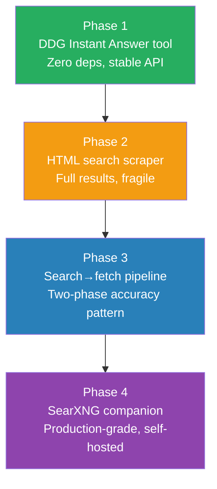

# Agent Web Search Plan

> Give AgentOS agents structured, accurate web search capability without requiring any external API keys — using a two-phase search→fetch pipeline, progressively hardened from a zero-dependency DDG Instant Answer tool to a self-hosted SearXNG companion.

---

## Why This Matters

Agents currently have `web-fetch` (fetch a known URL) and `http-client` (raw HTTP). They have **no way to discover URLs** — they cannot search the web. This blocks any research, fact-finding, or information-gathering task that doesn't start with a known URL.

A naive HTML scraping approach is fragile and inaccurate — snippets alone mislead agents and cause semantic drift and hallucination spirals (confirmed by NotebookLM research). The correct pattern is a **two-phase pipeline**: search discovers URLs, `web-fetch` fetches the actual content for accuracy.

---

## Current State

| Capability | Status | Tool |
|---|---|---|
| Fetch a known URL | ✅ Done | `web-fetch` |
| Make HTTP requests | ✅ Done | `http-client` |
| Discover URLs via search | ❌ Missing | — |
| Full page content from search results | ❌ Missing | — |
| Multi-engine aggregated search | ❌ Missing | — |

---

## Target Architecture

```
Agent
  │
  ▼
web-search (discovery)
  │  Returns: [{rank, title, url, snippet, source_engine}]
  │
  ▼
Agent selects top N URLs
  │
  ▼
web-fetch (accuracy)
  │  Returns: full page text content (up to 32k chars)
  │
  ▼
Context Window ← factually grounded content
  │
  ▼
Semantic Memory ← cached for future reuse
```

---

## Phase Overview

| Phase | Name | Effort | Dependencies | Detail Doc | Status |
|---|---|---|---|---|---|
| 1 | DDG Instant Answer tool | 0.5d | None | [[01-ddg-instant-answer-tool]] | planned |
| 2 | HTML search scraper | 1.5d | Phase 1 | [[02-html-search-scraper]] | planned |
| 3 | Search→fetch pipeline | 1d | Phase 1, 2 | [[03-search-fetch-pipeline]] | planned |
| 4 | SearXNG companion service | 2d | Phase 3 | [[04-searxng-integration]] | planned |

---

## Phase Dependency Graph



---

## Key Design Decisions

1. **Two-phase pattern is mandatory.** Search snippets alone are not accurate enough to inject into context — they cause semantic drift and hallucination spirals. `web-search` is a URL discovery tool; `web-fetch` is the accuracy tool. Agents must be guided to use both.

2. **DDG Instant Answer API first.** It is the only zero-dependency, no-API-key, stable (official) option. It covers factual queries immediately. It is not full web search — that comes in Phase 2.

3. **HTML scraping is Phase 2, not Phase 1.** HTML scraping is inherently fragile (breaks on layout changes). It is useful and should exist, but it must not be the only search capability. Phase 1 provides a stable foundation.

4. **SearXNG is the production target.** Self-hosted, multi-engine, stable JSON API, no API keys, handles rate limiting and layout changes internally. It requires an SSRF allowlist entry for its endpoint — this is acceptable as a trusted internal service.

5. **SSRF allowlist is scoped, not disabled.** SearXNG runs at a configured internal address. The `PermissionSet` allowlist for `network.search` is scoped to that exact host — not a blanket SSRF bypass.

6. **`network.outbound:x` is reused for phases 1-3.** No new permission type is needed. Phase 4 may introduce `network.search` as a semantic alias for clarity.

7. **Results feed Semantic memory.** Search results (URLs + snippets) are ephemeral; fetched page content should be written to Semantic memory for reuse across tasks. This is not mandatory in early phases but is the architectural target.

---

## Risks

| Risk | Likelihood | Mitigation |
|---|---|---|
| DDG Instant Answer API changes or removes endpoints | Low | Official API — changes are announced. Phase 2 scraper is the fallback. |
| DDG HTML layout change breaks CSS selectors | Medium | Use robust selectors (`.result__title`, `.result__snippet`). Pin scraper version. SearXNG (Phase 4) eliminates this risk. |
| IP rate limiting from DDG during testing | Medium | Use `AGENTOS_TEST_ALLOW_LOCAL` pattern for test mocking. Don't hit real DDG in CI. |
| SearXNG SSRF allowlist too broad | Low | Allowlist is host-specific, not a wildcard. Audit log records every search call. |
| Agent relies on snippets instead of fetching content | High | System prompt guidance + `agent-manual` entry documenting the two-phase pattern. |

---

## Related

- [[Agent Web Search Research]] — NotebookLM research findings
- [[01-ddg-instant-answer-tool]] — Phase 1 detail
- [[02-html-search-scraper]] — Phase 2 detail
- [[03-search-fetch-pipeline]] — Phase 3 detail
- [[04-searxng-integration]] — Phase 4 detail
- [[30-Pure Agentic Workflow Compatibility]] — parent agentic workflow plan
- [[Real World Adoption Roadmap Plan]] — ecosystem context
