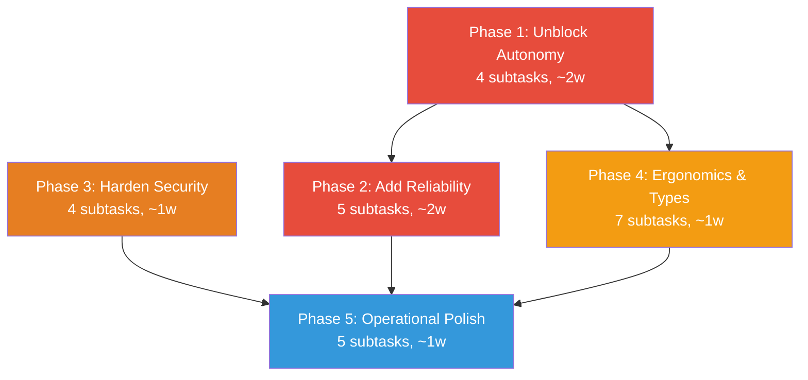

# Agentic Readiness Fixes Plan

> Address all 30 issues identified in the [[00-Master Audit Summary|Agentic Readiness Audit]] to bring AgentOS from prototype-grade (2.5/5) to production-grade (4.0+/5) for autonomous agent workflows.

---

## Why This Matters

The audit scored AgentOS at **3.4/5 overall**, with agent autonomy at **2.5/5**. An AI agent operating within AgentOS today:
- Is capped at 10 tool calls per task (complex work impossible)
- Can only call one tool per LLM turn (2-5x latency/cost overhead)
- Loses all state on kernel restart (tasks, escalations, budgets)
- Cannot use tools at all with an OpenAI backend
- Must guess tool input formats (no schemas documented)

These are engineering fixes, not design flaws. The architecture is sound.

---

## Current State

| System | Score | Key Blocker |
|--------|-------|-------------|
| Type System | 3.8/5 | Missing TaskState::Suspended, HardwareResource variants |
| Tool System | 3.9/5 | No input schemas, data_dir confinement |
| Memory System | 3.5/5 | Blocking mutexes, no auto-populate |
| Kernel & Tasks | 3.2/5 | 10-iteration cap, single tool call, all in-memory |
| LLM & Agents | 3.0/5 | OpenAI tools broken, pubkey trust vuln |
| Security | 4.3/5 | Proxy token rotation gap, no audit chain verify |
| Web/Pipeline/HAL | 3.2/5 | Pipeline injection, streaming leak |

---

## Target Architecture

After all 5 phases:
- Agent autonomy score: **4.0+/5**
- Overall score: **4.2+/5**
- Production deployment: **Ready** for staging/production

---

## Phase Overview

| Phase | Name | Effort | Dependencies | Detail Doc |
|-------|------|--------|--------------|------------|
| 1 | Unblock Agent Autonomy | ~2w | None | [[01-unblock-agent-autonomy]] |
| 2 | Add Reliability | ~2w | Phase 1 (partial) | [[02-add-reliability]] |
| 3 | Harden Security | ~1w | None (parallel with 2) | [[03-harden-security]] |
| 4 | Agent Ergonomics & Types | ~1w | Phase 1 | [[04-agent-ergonomics-and-types]] |
| 5 | Operational Polish | ~1w | Phases 1-4 | [[05-operational-polish]] |

---

## Phase Dependency Graph

Note: Phase 3 (Security) can run **in parallel** with Phase 2 since they touch different subsystems.

---

## Key Design Decisions

1. **Configurable iteration limits per-task** — Use `TaskReasoningHints.estimated_complexity` to set defaults (Low=10, Med=25, High=50), overridable per-task. Rationale: fixed global cap is too restrictive for complex workflows but unlimited is dangerous.

2. **Multi-tool calls via collect-all parsing** — Parse ALL valid JSON blocks from LLM response, execute in parallel via `tokio::JoinSet`. Rationale: modern LLMs emit parallel tool calls; single-extraction wastes inference budget.

3. **SQLite persistence for kernel state** — Persist scheduler queue, escalation state, and cost snapshots to the existing audit SQLite DB (or a separate state DB). Rationale: SQLite is already a dependency; no new infrastructure needed.

4. **`tokio::task::spawn_blocking` for memory stores** — Wrap `std::sync::Mutex` operations in `spawn_blocking` rather than migrating to `tokio::sync::Mutex`. Rationale: SQLite is not async-aware; `spawn_blocking` is the correct pattern for blocking I/O in async code.

5. **JSON Schema in TOML manifests** — Add `[input_schema]` table to each TOML manifest with JSON Schema properties. Wire into `agent-manual` tool-detail and `tools_for_prompt()`. Rationale: LLMs need structured schemas to construct correct payloads.

6. **Immutable pubkey registration** — Move `register_pubkey()` to kernel boot only, store in vault, reject re-registration. Rationale: mutable pubkey map is an authentication bypass.

7. **Context-aware variable escaping in pipelines** — `sanitize_for_json()` and `sanitize_for_prompt()` based on interpolation context. Rationale: blind escaping breaks valid content; context-aware escaping preserves meaning while preventing injection.

---

## Risks

| Risk | Likelihood | Impact | Mitigation |
|------|-----------|--------|------------|
| Multi-tool parsing breaks existing single-call flows | Medium | High | Feature-flag behind config; default to multi, fallback to single |
| State persistence migration breaks in-memory fast path | Low | Medium | Keep in-memory as primary, persist async in background |
| Input schema documentation incomplete for edge cases | Medium | Low | Start with 80% coverage; iterate based on agent feedback |
| Security fixes (pubkey, pipeline) break existing tests | Medium | Medium | Add migration path; update all tests in same PR |

---

## Subtask Index

See [[31-Agentic Readiness Fixes]] for the full subtask index with status tracking.
