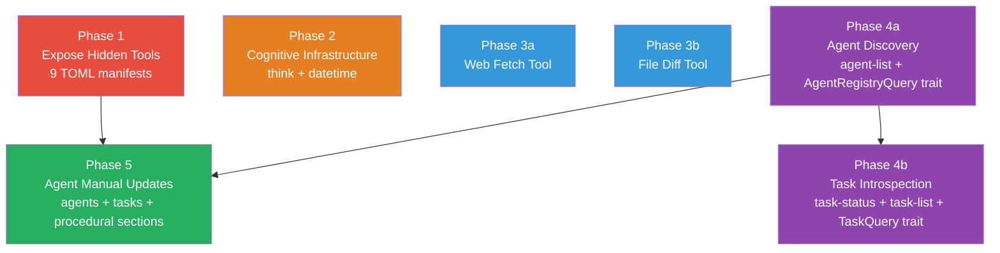

# Agentic Workflow Compatibility Plan

> Close the gap between the current tool inventory and what is needed for a self-sufficient, pure agentic loop — no human in the path, no shell hacks.

---

## Why This Matters

An LLM agent running on AgentOS must be able to:

1. Discover every tool available to it
2. Reason about its actions explicitly (scratchpad)
3. Know the current time without shelling out
4. Find other agents to collaborate with
5. Check the status of tasks it delegated
6. Fetch and read web content without raw HTML noise
7. Compare file versions without a subprocess
8. Record and recall how-to procedures
9. Delete stale memories

Today **nine implemented tools are invisible** to agents because they have no TOML manifests. Four additional tools do not exist at all. Two more require ToolExecutionContext to carry new kernel references. Together these gaps mean agents must use `shell-exec` as a fallback for time, diff, and HTML parsing — bypassing the capability model.

---

## Current State

| Category | Tools with Manifests | Hidden (no manifest) | Missing entirely |
|---|---|---|---|
| File I/O | 7 | 0 | 0 |
| Memory | 8 (semantic, episodic, blocks, archival) | 4 (procedure-create, procedure-search, memory-delete, memory-stats) | 0 |
| Execution | 2 (shell-exec, http-client) | 0 | web-fetch, file-diff |
| Coordination | 1 (agent-message) | 1 (task-delegate) | agent-list, task-status, task-list |
| Cognition | 1 (agent-manual) | 0 | think, datetime |
| System / HAL | 1 (sys-monitor) | 4 (process-manager, log-reader, network-monitor, hardware-info) | 0 |
| **Total** | **20** | **9** | **7** |

### ToolExecutionContext gaps

`ToolExecutionContext` (defined in `crates/agentos-tools/src/traits.rs`) currently carries:
- `data_dir`, `task_id`, `agent_id`, `trace_id`, `permissions`
- `vault: Option<Arc<ProxyVault>>`
- `hal: Option<Arc<HardwareAbstractionLayer>>`
- `file_lock_registry: Option<Arc<FileLockRegistry>>`

Missing:
- `agent_registry: Option<Arc<dyn AgentRegistryQuery>>` — needed by `agent-list`
- `task_registry: Option<Arc<dyn TaskQuery>>` — needed by `task-status`, `task-list`

---

## Target Architecture

```
Pure Agentic Loop
─────────────────────────────────────────────────────────
 Agent receives task
   │
   ├─ think              ← explicit reasoning (audit-logged, no mutation)
   ├─ datetime           ← know current UTC time
   ├─ agent-manual       ← discover tools, permissions, events
   │
   ├─ [Memory Tier]
   │   ├─ memory-search / archival-search
   │   ├─ memory-write / archival-insert
   │   ├─ memory-delete                   ← (currently hidden)
   │   ├─ memory-stats                    ← (currently hidden)
   │   ├─ procedure-search                ← (currently hidden)
   │   └─ procedure-create                ← (currently hidden)
   │
   ├─ [File Tier]
   │   ├─ file-reader / file-writer / file-editor
   │   ├─ file-glob / file-grep
   │   ├─ file-delete / file-move
   │   └─ file-diff                       ← (new)
   │
   ├─ [Network Tier]
   │   ├─ http-client
   │   └─ web-fetch                       ← (new, HTML→text)
   │
   ├─ [Coordination Tier]
   │   ├─ agent-message
   │   ├─ agent-list                      ← (new, needs AgentRegistryQuery)
   │   ├─ task-delegate                   ← (currently hidden)
   │   ├─ task-status                     ← (new, needs TaskQuery)
   │   └─ task-list                       ← (new, needs TaskQuery)
   │
   └─ [System Tier]
       ├─ sys-monitor
       ├─ process-manager                 ← (currently hidden)
       ├─ log-reader                      ← (currently hidden)
       ├─ network-monitor                 ← (currently hidden)
       └─ hardware-info                   ← (currently hidden)
─────────────────────────────────────────────────────────
```

---

## Phase Overview

| # | Phase | Subtask | Effort | Deps | Status |
|---|-------|---------|--------|------|--------|
| 1 | Expose Hidden Tools | [[30-01-Missing Tool Manifests]] | 4h | none | planned |
| 2 | Cognitive Infrastructure | [[30-02-Think and Datetime Tools]] | 4h | none | planned |
| 3 | Content Processing | [[30-03-Web Fetch Tool]] | 4h | none | planned |
| 3b | Content Processing | [[30-04-File Diff Tool]] | 3h | none | planned |
| 4 | Agent & Task Awareness | [[30-05-Agent Discovery Tool]] | 6h | none | planned |
| 4b | Agent & Task Awareness | [[30-06-Task Introspection Tools]] | 6h | Phase 4 | planned |
| 5 | Self-Documentation | [[30-07-Agent Manual New Sections]] | 4h | Phases 1,4 | planned |

---

## Phase Dependency Graph



Phases 1, 2, 3a, 3b, and 4a are **independent and can be executed in parallel**.
Phase 4b requires Phase 4a (shares trait extension).
Phase 5 requires Phases 1 and 4a.

---

## Key Design Decisions

### 1. Trait injection for kernel resources (agent-list, task-status, task-list)

`agentos-tools` cannot depend on `agentos-kernel` (would create a circular dependency since the kernel depends on tools). The solution is to define thin query traits in `agentos-types` (already a shared leaf crate):

```rust
// crates/agentos-types/src/tool.rs (or a new registry_query.rs)

pub trait AgentRegistryQuery: Send + Sync {
    fn list_agents(&self) -> Vec<AgentSummary>;
}

pub struct AgentSummary {
    pub id: AgentID,
    pub name: String,
    pub status: String,
    pub capabilities: Vec<String>,
}

pub trait TaskQuery: Send + Sync {
    fn get_task(&self, id: &TaskID) -> Option<TaskSummary>;
    fn list_tasks_for_agent(&self, agent_id: &AgentID, limit: usize) -> Vec<TaskSummary>;
}

pub struct TaskSummary {
    pub id: TaskID,
    pub description: String,
    pub status: String,
    pub assigned_agent: Option<String>,
    pub created_at: DateTime<Utc>,
    pub completed_at: Option<DateTime<Utc>>,
}
```

`AgentRegistry` (in `agentos-kernel`) implements `AgentRegistryQuery`. The `Scheduler` implements `TaskQuery`. The kernel injects both as `Arc<dyn Trait>` when building `ToolExecutionContext`.

Adding two `Option<Arc<dyn Trait>>` fields to `ToolExecutionContext` is a **breaking change** — all struct literal sites must be updated with `None`. The implementing agent must grep for all `ToolExecutionContext {` literals and add both fields.

### 2. `think` tool is a no-op with audit logging

The `think` tool exists solely to give the LLM a named tool to invoke for explicit chain-of-thought that becomes visible in the audit log. It:
- Takes `{ "thought": "..." }` as input
- Writes an `AuditEvent` of type `AgentThought` (new variant)
- Returns `{ "acknowledged": true }` — the thought itself, not a result

This is how production agentic systems (Claude's own tools, Devin, etc.) handle explicit reasoning: the model _calls_ a tool rather than just thinking internally, making the reasoning auditable.

### 3. `web-fetch` uses reqwest + html2text — no new runtime deps

`http-client` already pulls in `reqwest`. `web-fetch` reuses the same reqwest client and adds the `html2text` crate (pure-Rust HTML-to-Markdown converter) to strip HTML tags. The `html2text` crate is MIT-licensed, ~200KB, no native deps.

### 4. `file-diff` uses the `similar` crate

`similar` (formerly `difflib`) is the standard Rust diff library, used by cargo itself. It produces unified diffs from string slices. No native deps.

### 5. Missing manifests require no code changes

Phases 1 tools are fully implemented. The manifests are just declarations — writing them makes the tools discoverable via `agent-manual` and registrable by the kernel loader. Each manifest is derived directly from the tool's `required_permissions()` and input/output schema.

---

## Risks

| Risk | Mitigation |
|------|-----------|
| ToolExecutionContext breaking change affects many test sites | Grep for all `ToolExecutionContext {` literals before implementation; update all with `agent_registry: None, task_registry: None` |
| `html2text` output quality varies by page structure | Add `extract_mode: "text" | "markdown"` option so agents can choose |
| `AgentRegistryQuery` returns stale snapshot if agents register mid-task | Acceptable — registry is append-mostly; staleness window is milliseconds |
| Phase 5 (agent-manual) blocked if Phase 4 is delayed | Decouple: Phase 5 can add agents/tasks sections as static docs first, make them dynamic in a follow-up |

---

## Related

- [[30-Pure Agentic Workflow Compatibility]] — implementation checklist
- [[Agentic Tool Loop Flow]] — data flow diagram
- [[27-Agent Manual Tool]] — prior agent-manual implementation
- [[29-File Operations Expansion]] — prior file tool work
