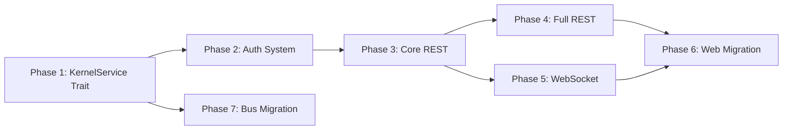

# API Layer Plan

> Extract a `KernelService` trait as the unified API boundary, build REST + WebSocket on top, and decouple the web UI from kernel internals — enabling external integrations and improving maintainability.

---

## Why This Matters

The web UI holds `Arc<Kernel>` and reaches directly into 35+ public fields. This means:

1. **No external integration surface.** IDE plugins, CI/CD, third-party services cannot talk to AgentOS programmatically. Only 4 ad-hoc `/api/*` routes exist.
2. **Tight coupling.** Web handlers aggregate data from 6+ kernel subsystems per page. Kernel refactors break the web layer.
3. **Duplicated logic.** The bus protocol (96 commands) and web handlers implement overlapping functionality through different codepaths.

## Current State

| Component | State |
|-----------|-------|
| `agentos-web` | 52 HTML endpoints, direct `Arc<Kernel>` access, no API abstraction |
| Bus protocol | 96 `KernelCommand` variants, JSON-over-UDS, used by CLI only |
| Kernel public surface | 35+ `pub` fields, ~15 `api_*` methods, all modules `pub` |
| Authentication | Single startup bearer token + session cookie |
| Real-time | SSE only (6 endpoints), no WebSocket |
| External API | None (4 ad-hoc `/api/*` routes for pipelines/costs/traces) |

## Target Architecture

```
┌─────────────┐   ┌──────────────┐   ┌───────────────┐
│  External    │   │  Browser     │   │  CLI          │
│  Consumers   │   │  (HTML UI)   │   │  (agentctl)   │
└──────┬───────┘   └──────┬───────┘   └───────┬───────┘
       │                  │                    │
  REST/WS API        HTML routes          Bus (UDS)
  /api/v1/*          /* (unchanged)       KernelCommand
       │                  │                    │
       ▼                  ▼                    ▼
┌─────────────────────────────────────────────────────┐
│              KernelService trait                      │
│  (agentos-api/src/service.rs)                        │
├─────────────────────────────────────────────────────┤
│              impl KernelService for Kernel            │
│  (agentos-api/src/kernel_impl.rs)                    │
├─────────────────────────────────────────────────────┤
│              Kernel internals                         │
│  (scheduler, registries, vault, audit, etc.)         │
└─────────────────────────────────────────────────────┘
```

## Phase Overview

| Phase | Name | Effort | Dependencies | Detail Doc | Status |
|-------|------|--------|-------------|------------|--------|
| 1 | KernelService trait + impl | 3d | None | [[01-kernel-service-trait]] | complete |
| 2 | Auth system (API keys + JWT) | 2d | Phase 1 | [[02-auth-system]] | complete |
| 3 | Core REST endpoints | 3d | Phase 2 | [[03-core-rest-endpoints]] | complete |
| 4 | Full REST endpoints | 2d | Phase 3 | [[04-full-rest-endpoints]] | complete |
| 5 | WebSocket layer | 3d | Phase 3 | [[05-websocket-layer]] | complete |
| 6 | Web handler migration | 3d | Phase 4, 5 | [[06-web-handler-migration]] | complete |
| 7 | Bus dispatch migration | 2d | Phase 1 | [[07-bus-dispatch-migration]] | complete |

## Phase Dependency Graph



Phases 4 and 5 can run in parallel. Phase 7 is independent of 4/5/6.

## Key Design Decisions

1. **`KernelService` trait as single boundary.** All consumers call the same trait. One place to test, mock, version. The `impl` block in `kernel_impl.rs` is where all kernel internal access is consolidated.

2. **REST + WebSocket, no gRPC.** REST covers 90% of use cases. WebSocket adds bidirectional real-time for streaming chat and event subscriptions. gRPC adds protobuf maintenance overhead not justified yet.

3. **API keys + JWT.** API keys for service-to-service (stored in vault, scoped to PermissionSet). JWT for interactive sessions (1h expiry, RS256-signed).

4. **URL-prefixed versioning (`/api/v1/`).** One line in the router, avoids painful migration later.

5. **New `agentos-api` crate.** Owns trait, DTOs, REST router, WS handler, auth, OpenAPI generation.

6. **WebSocket supplements SSE.** HTML UI keeps SSE (HTMX native). WebSocket is for programmatic consumers.

7. **Phased migration.** Never break the web UI. API layer is additive. Web handlers migrate last, one domain at a time.

## Risks

| Risk | Likelihood | Impact | Mitigation |
|------|-----------|--------|------------|
| Web UI breaks during Phase 6 | Medium | High | Migrate one handler file at a time; each commit deployable |
| DTO type explosion | Medium | Medium | Start flat, nest only when warranted |
| WebSocket complexity | Medium | Medium | Start with subscribe/event, add bidirectional incrementally |
| Auth adds latency | Low | Low | JWT validation is local (no network); RSA verify is ~0.1ms |
| Trait doesn't cover all bus commands | Low | Low | Start with ~30 methods, expand on demand |

## Related

- [[API Layer Research]] — analysis of current coupling patterns
- [[API Layer Data Flow]] — request lifecycle through the new architecture
- Design spec: `docs/superpowers/specs/2026-03-30-api-layer-design.md`
