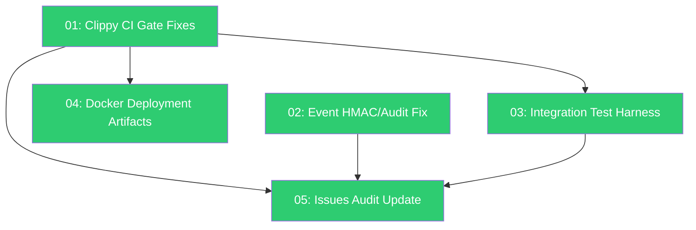

# Bug Fixes and Deployment Readiness Plan

> Close the remaining architectural gaps from the Issues and Fixes audit, fix clippy/CI blockers, and prepare canonical deployment artifacts so that AgentOS can be built, tested, and shipped from a clean `main` branch.

---

## Why This Matters

The codebase has undergone rapid development across 12 spec items and 7 feedback phases. A post-implementation audit (2026-03-10) identified 9 issues and 6 deployment blockers. A cross-reference of the Issues and Fixes document against the actual code (2026-03-13) reveals that **7 of the 9 issues have already been fixed** in the most recent commit (`f63a02f`). However, 2 issues remain open, 4 new clippy errors block CI, 6 integration tests are still `#[ignore]`, and no Docker deployment artifacts exist.

---

## Current State

| Item | Documented Status | Actual Status (2026-03-13) |
|---|---|---|
| Issue #1: Cancellation token / graceful shutdown | Open | **Fixed** -- `CancellationToken` in `Kernel`, all loops use `tokio::select!`. 6 CLI tests still `#[ignore]`. |
| Issue #2: Partition persistence bug | Open | **Fixed** -- `set_partition_for_task()` exists and is called. |
| Issue #3: LLM adapters use `as_entries()` | Open | **Fixed** -- all adapters call `active_entries()`. Only Ollama test uses `as_entries()` (acceptable). |
| Issue #4: Escalation CLI missing | Open | **Fixed** -- `list`, `get`, `resolve` commands exist with full bus/kernel wiring. |
| Issue #5: Uncertainty parsing stub | Open | **Fixed** -- `parse_uncertainty()` called in `task_executor.rs` post-inference. |
| Issue #6: Reasoning hints always `None` | Open | **Fixed** -- `infer_reasoning_hints()` auto-infers from prompt in `cmd_run_task` and `cmd_delegate_task`. |
| Issue #7: Episodic memory `.ok()` swallows errors | Open | **Fixed** -- all `.record()` calls use `if let Err(e) { tracing::warn! }`. |
| Issue #8: Dead code | Open | **Partially fixed** -- `has_dependencies()`, `make_engine()` removed. New clippy lints found. |
| Issue #9: Event signing bypass (HMAC/audit) | Open | **Still open** -- `AgentMessageBus` and `ScheduleManager` emit events with `signature: vec![]`. |
| Clippy CI gate | Failing | **4 errors**: `if_same_then_else`, `collapsible_if`, `unwrap_or_default`, `new_without_default` |
| `cargo fmt` | Unknown | **Passing** -- clean output. |
| Docker artifacts | Missing | **Still missing** -- no Dockerfile or docker-compose.yml. |
| Integration test harness | Broken | **6 tests `#[ignore]`** -- need in-process kernel lifecycle harness. |

---

## Target Architecture

After this plan:

1. `cargo clippy --workspace -- -D warnings` passes with zero errors
2. `cargo test --workspace` runs all tests including the 6 previously-ignored integration tests
3. `AgentMessageBus` and `ScheduleManager` use the lifecycle event pattern (like `ToolRegistry`)
4. A working `Dockerfile` + `docker-compose.yml` exist for single-node deployment
5. Issues and Fixes document is updated with resolved status on 7 of 9 items

---

## Phase Overview

| # | Phase | Effort | Dependencies | Status | Link |
|---|---|---|---|---|---|
| 01 | Fix clippy errors (CI gate) | 1h | None | complete | [[01-clippy-ci-gate-fixes]] |
| 02 | Event HMAC/audit lifecycle pattern | 4h | None | complete | [[02-event-hmac-audit-fix]] |
| 03 | Integration test harness | 4h | 01 | complete | [[03-integration-test-harness]] |
| 04 | Docker deployment artifacts | 4h | 01 | complete | [[04-docker-deployment-artifacts]] |
| 05 | Issues and Fixes audit update | 1h | 01, 02 | complete | [[05-issues-and-fixes-audit-update]] |

---

## Phase Dependency Graph

---

## Key Design Decisions

1. **Lifecycle event pattern for AgentMessageBus and ScheduleManager** -- follow the same pattern as `ToolRegistry`: lightweight notification enums sent to the kernel run loop, which calls the properly signing/auditing `emit_event` path. This avoids giving subsystems access to the HMAC signing key.

2. **In-process kernel lifecycle harness for integration tests** -- rather than connecting over a real Unix socket, boot the kernel in-process with a `CancellationToken`, run the test, then cancel. This makes tests deterministic and removes the need for `#[ignore]`.

3. **Multi-stage Docker build** -- minimize image size by building in a Rust builder stage and copying only the binary to a slim runtime stage. Alpine or Debian-slim base.

4. **Clippy fixes are trivial and non-breaking** -- all 4 errors have mechanical fixes (collapse `if`, use `unwrap_or_default`, add `Default` impl, simplify identical branches). No design change needed.

5. **Do not re-plan already-fixed issues** -- 7 of 9 documented issues have been fixed in recent commits. Updating the Issues and Fixes document to reflect reality is the correct action, not re-implementing.

---

## Risks

| Risk | Likelihood | Impact | Mitigation |
|---|---|---|---|
| Clippy updates introduce new lints on next toolchain upgrade | Medium | Low | Pin `rust-toolchain.toml` for CI, run clippy in CI to catch early |
| Integration test harness introduces flakiness from timing | Medium | Medium | Use `tokio::time::timeout` with generous margins, mock LLM for determinism |
| Docker build breaks on dependency changes | Low | Low | Pin Cargo.lock in image, use `cargo chef` for layer caching |
| Lifecycle event refactor breaks event subscription matching | Low | High | Existing tests cover subscription matching; add specific test for communication events |

---

## Related

- [[Issues and Fixes]]
- [[16-First Deployment Readiness Program]]
- [[First Deployment Readiness Plan]]
