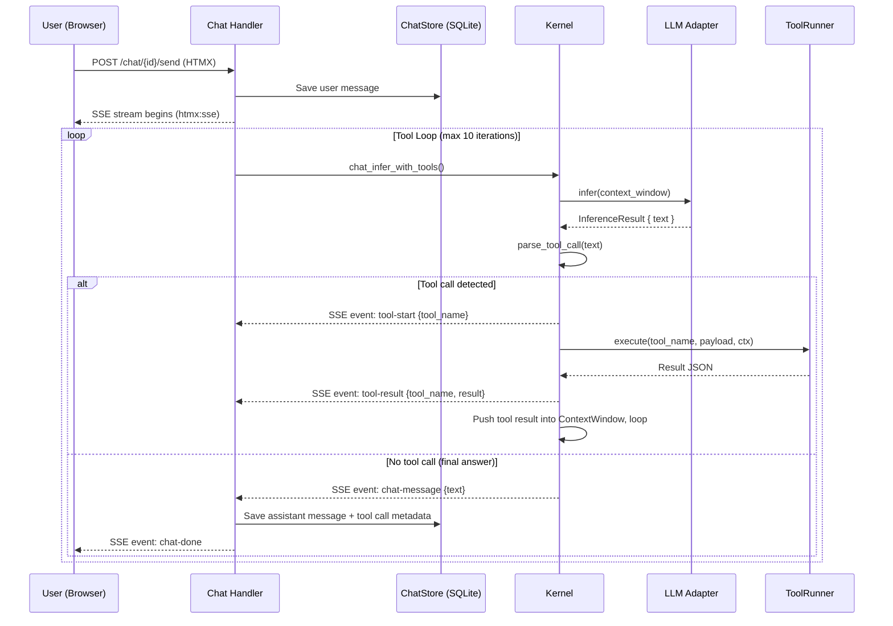
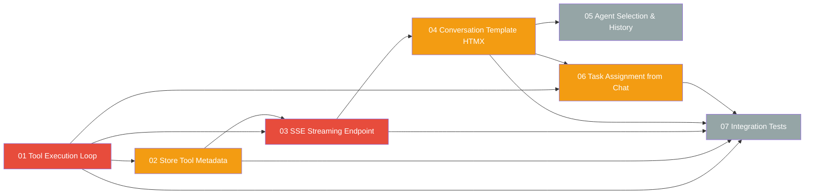

# Chat Interface Plan

> Build a production-quality chat interface in the AgentOS web UI that correctly executes tool calls returned by the LLM and provides a real-time, streaming conversation experience with inline tool activity indicators.

---

## Why This Matters

The current chat implementation has two critical shortcomings:

1. **Tool calls are not executed.** When the LLM returns a JSON tool call block (e.g., `{"tool": "agent-manual", ...}`), the raw JSON is stored as the assistant's response and displayed verbatim to the user. The `chat_infer` method in `kernel.rs` calls `llm.infer()` once and returns `result.text` without checking for tool calls. The existing `parse_tool_call` function in `tool_call.rs` and the tool execution loop in `task_executor.rs` are never invoked from the chat path.

2. **No streaming or interactivity.** The chat uses synchronous POST-redirect-GET. The user submits a form, waits for the full inference to complete (which can take 10-30 seconds), and then sees the page reload with the response. There are no typing indicators, no SSE streaming, no inline tool call visibility, and no way to assign tasks from within the conversation.

---

## Current State

| Component | File | State |
|-----------|------|-------|
| Chat handler | `crates/agentos-web/src/handlers/chat.rs` | POST-redirect-GET; no tool loop; no streaming |
| Chat store | `crates/agentos-web/src/chat_store.rs` | SQLite; `role` is `user`/`assistant` only; no tool-call metadata |
| Chat list template | `crates/agentos-web/src/templates/chat.html` | Session list + new session form; functional |
| Conversation template | `crates/agentos-web/src/templates/chat_conversation.html` | Basic message bubbles; no activity indicators; no streaming |
| Kernel chat_infer | `crates/agentos-kernel/src/kernel.rs:123-220` | Single `llm.infer()` call; no tool detection; returns `Result<String, String>` |
| Tool call parser | `crates/agentos-kernel/src/tool_call.rs` | `parse_tool_call()` exists, tested, works on markdown JSON blocks |
| Tool runner | `crates/agentos-tools/src/runner.rs` | `execute(tool_name, payload, context)` fully functional |
| SSE infrastructure | `crates/agentos-web/src/handlers/events.rs` | `Sse<KeepAliveStream<BoxStream>>` pattern already in use |
| LLM streaming trait | `crates/agentos-llm/src/traits.rs` | `infer_stream(ctx, tx: mpsc::Sender<InferenceEvent>)` exists |
| CSS | `crates/agentos-web/static/css/app.css:710-970` | Chat activity, thinking dots, done banners already styled |
| Template engine | `crates/agentos-web/src/templates.rs` | MiniJinja with auto-escape; `include_str!` registration |
| Router | `crates/agentos-web/src/router.rs` | Four chat routes already registered |

---

## Target Architecture

---

## Phase Overview

| # | Phase | Effort | Dependencies | Detail |
|---|-------|--------|-------------|--------|
| 01 | [[01-chat-tool-execution-loop]] | 2d | None | Add `chat_infer_with_tools()` to kernel; detect tool calls, execute them, re-infer |
| 02 | [[02-chat-store-tool-metadata]] | 0.5d | Phase 01 | Extend `ChatStore` schema to record tool call activity alongside messages |
| 03 | [[03-chat-sse-streaming-endpoint]] | 2d | Phase 01, 02 | Replace POST-redirect-GET with SSE endpoint; stream tokens + tool activity events |
| 04 | [[04-chat-conversation-template-htmx]] | 2d | Phase 03 | Rewrite conversation template with HTMX SSE swap, activity indicators, thinking dots |
| 05 | [[05-chat-agent-selection-and-history]] | 1d | Phase 04 | Agent selector on conversation page, session deletion, search, history pagination |
| 06 | [[06-chat-task-assignment-from-chat]] | 1.5d | Phase 01, 04 | Detect task-assignment intents in chat, create kernel tasks, show inline status |
| 07 | [[07-chat-integration-tests]] | 1d | Phase 01-06 | End-to-end tests with MockLLMCore covering tool loop, SSE, error paths |

---

## Phase Dependency Graph

---

## Key Design Decisions

1. **Tool loop in kernel, not handler.** The tool execution loop belongs in `kernel.rs` as a new `chat_infer_with_tools()` method, not in the web handler. This keeps the web layer thin (it just proxies SSE events) and allows the CLI or other frontends to reuse the same logic. The existing `task_executor.rs` tool loop is too tightly coupled to `AgentTask` (capability tokens, cost budgets, injection scanning) to be reused directly, so we build a lighter-weight loop specifically for chat.

2. **SSE, not WebSocket.** The existing codebase already has SSE infrastructure (`events.rs`), HTMX has native SSE support via `hx-ext="sse"`, and SSE is simpler to implement with Axum. WebSocket adds bidirectional complexity we do not need -- chat input is always a form POST.

3. **Chat tool calls use a permissive PermissionSet.** Chat is an authenticated web session (the user logged in with the auth token). Tool calls from chat get a `PermissionSet` with read/query/observe permissions by default. Write/execute permissions require the user to explicitly confirm via an escalation prompt in the UI. This is simpler than the full capability token system used by tasks.

4. **Max 10 tool iterations per message.** Prevents infinite loops if the LLM keeps requesting tools. Matches the task executor's pattern but with a lower limit since chat is interactive.

5. **Tool activity stored as a new `tool` role in chat_messages.** Rather than adding a separate table, we extend the `role` CHECK constraint to include `'tool'` and store tool call/result JSON in the `content` column. This keeps the schema simple and the message ordering natural.

6. **Streaming is optional/progressive.** Phase 01-02 fix the critical tool execution bug using the existing POST-redirect-GET flow. Phases 03-04 add streaming as an enhancement. This means the tool loop is usable immediately even before SSE is wired up.

7. **CSP header update for SSE.** The `connect-src 'self'` directive in the security headers middleware already allows SSE connections to the same origin, so no CSP changes are needed.

---

## Risks

| Risk | Impact | Mitigation |
|------|--------|------------|
| LLM enters infinite tool-call loop | Chat hangs, user sees endless activity | Hard cap at 10 iterations; timeout at 120s total |
| Tool execution fails mid-loop | Partial context injected, LLM confused | Inject error JSON into context; LLM sees the error and can respond |
| SSE connection drops (network) | User sees stale UI | HTMX reconnects automatically; add `hx-trigger="sse:error"` fallback |
| Large tool results overflow context window | `ContextWindow` truncation | Truncate tool results to 4KB before injecting; summarize if needed |
| Concurrent sends to same session | Race condition on message ordering | Use `session_id`-keyed mutex in handler; SQLite WAL handles concurrent reads |
| Chat PermissionSet too permissive | Security risk from unguarded tool execution | Default to read-only; write/execute require UI confirmation dialog |

---

## Related

- [[28-Chat Interface]] -- next-steps index with subtask breakdown
- [[Chat Tool Execution Flow]] -- data flow diagram (to be created in Phase 01)
