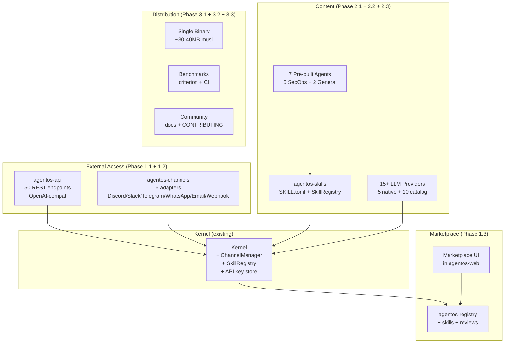
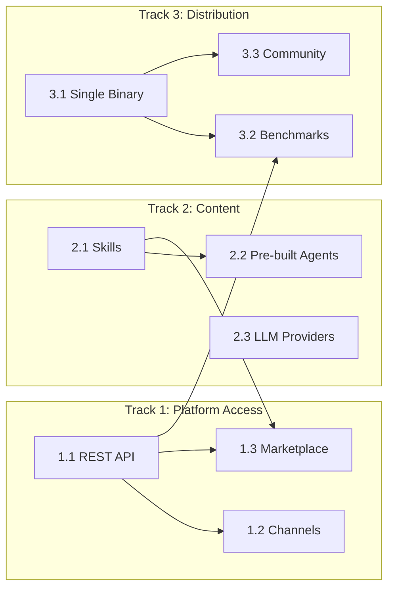

# Competitive Gap Closure Plan

> **For agentic workers:** REQUIRED SUB-SKILL: Use superpowers:subagent-driven-development (recommended) or superpowers:executing-plans to implement this plan task-by-task.

> Close the 7 critical gaps between AgentOS and OpenClaw/OpenFang through 3 parallel tracks totaling 9 implementation phases.

**Design spec:** `docs/superpowers/specs/2026-03-30-competitive-gap-closure-design.md`

---

## Why This Matters

AgentOS has the deepest security, audit, and hardware infrastructure of any agent OS — but zero distribution story. OpenClaw has 335K GitHub stars and 2M monthly users. OpenFang (also Rust-based) has 40 channels, 26 LLM providers, and published benchmarks showing 13x throughput over Python frameworks. AgentOS is invisible to 90% of the ecosystem.

## Current State

| Area | AgentOS Today | Gap |
|------|--------------|-----|
| Messaging channels | 0 bidirectional (notification-only: Telegram, ntfy, email) | No Discord, Slack, WhatsApp; no inbound routing to agents |
| REST/HTTP API | Unix socket IPC only; web UI is HTML-only | No OpenAI-compatible endpoint; no JSON API for external tools |
| LLM providers | 5 (OpenAI, Anthropic, Gemini, Ollama, Custom) | Missing Bedrock, Azure, Groq, and 10+ OpenAI-compatible providers |
| Pre-built agents | 0 | No autonomous skills; no scheduled agent workflows |
| Single binary | `cargo build` workspace only | No release binaries, no Docker image, no install script |
| Benchmarks | None | No published performance data |
| Marketplace | Registry API exists (headless) | No web UI, no ratings, no community discovery |

## Target Architecture

## Phase Overview

| Phase | Name | Track | Effort | Dependencies | Detail Doc | Status |
|-------|------|-------|--------|-------------|------------|--------|
| 1.1 | REST/HTTP API Layer | Platform Access | 5d | None | [[01-rest-api-layer]] | complete |
| 1.2 | Channel Adapter System | Platform Access | 5d | Phase 1.1 | [[02-channel-adapter-system]] | complete |
| 1.3 | Marketplace UI | Platform Access | 3d | Phase 1.1, 2.1 | [[03-marketplace-ui]] | complete |
| 2.1 | Skills Abstraction | Content | 3d | None | [[04-skills-abstraction]] | complete |
| 2.2 | Pre-built Agents | Content | 3d | Phase 2.1 | [[05-prebuilt-agents]] | complete |
| 2.3 | LLM Provider Expansion | Content | 3d | None | [[06-llm-provider-expansion]] | complete |
| 3.1 | Single Binary Distribution | Distribution | 2d | None | [[07-single-binary-distribution]] | complete |
| 3.2 | Benchmarks & Performance | Distribution | 2d | Phase 1.1, 3.1 | [[08-benchmarks-performance]] | complete |
| 3.3 | Community Infrastructure | Distribution | 2d | Phase 3.1 | [[09-community-infrastructure]] | complete |

## Phase Dependency Graph

## Key Design Decisions

1. **OpenAI-compat `/v1/chat/completions` as public surface; MCP as internal tool protocol.** Every SDK speaks OpenAI format. MCP is the right tool protocol (65% of ClawHub skills are MCP wrappers).
2. **`agentos-api` is separate from `agentos-web`.** API = JSON for machines. Web = HTML for humans. Clean separation.
3. **`ChannelAdapter` trait with 6 reference adapters.** Discord, Slack, Telegram, WhatsApp, Email, Webhook. Community adds more.
4. **Skills > Tools.** A skill = prompt + tools + triggers + schedule + budget. Skills are the autonomous capability unit.
5. **Security/ops agents as differentiation.** 5 agents that leverage AgentOS's unique audit/HAL/injection subsystems.
6. **Provider catalog for instant LLM reach.** `providers.toml` auto-configures `CustomCore` for OpenAI-compatible providers. 5 native adapters for non-compatible providers.
7. **Single binary via musl + embedded assets.** Target ~30-40MB. One `curl | sh` install.
8. **Benchmarks with CI regression gating.** >5% regression blocks merge.

## New Crates

| Crate | Purpose |
|-------|---------|
| `agentos-api` | REST/HTTP API server (50 endpoints, OpenAI-compat) |
| `agentos-channels` | Bidirectional channel adapters (6 adapters) |
| `agentos-skills` | Skill abstraction, registry, lifecycle |

## Risks

| Risk | Impact | Mitigation |
|------|--------|------------|
| Channel API changes (Meta, Discord) | Adapter breaks | Pin API versions, abstract transport |
| OpenAI API format drift | Compat endpoint breaks | Track changelog, version compat layer |
| musl breaks FFI (fastembed ONNX) | Binary won't build | Test early, fallback to dynamic linking |
| Community skill security | Trust erosion | Leverage InjectionScanner, mandatory sandbox |
| Scope creep (40 channels) | Delayed delivery | Ship 6, community adds via trait |
