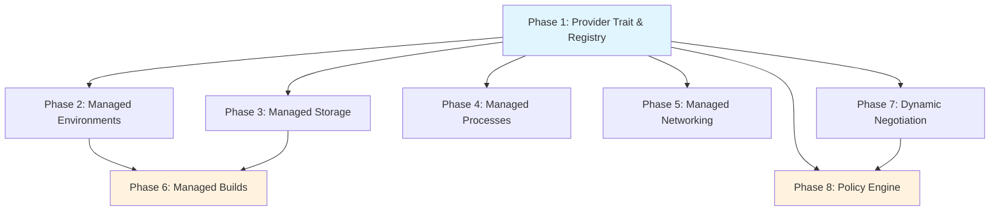

# Kernel Mediated Capabilities Plan

> **For agentic workers:** REQUIRED SUB-SKILL: Use superpowers:subagent-driven-development (recommended) or superpowers:executing-plans to implement this plan task-by-task. Steps use checkbox (`- [ ]`) syntax for tracking.

> Give agents full system-level powers — package installation, process management, builds, networking, storage — without raw OS access. The kernel mediates every system interaction through typed, audited, policy-controlled capability providers that work on bare metal without Docker.

---

## Why This Matters

AgentOS today has best-in-class security: capability tokens, seccomp-BPF, Landlock, bubblewrap sandboxing, audit logging. But this security comes at a cost — agents cannot install packages, run builds, manage processes, or access network services. They are secure but impotent for real-world software engineering tasks.

Competing systems (OpenHands, Devin, Claude Code) give agents full shell access inside Docker containers. This works but requires Docker, provides no per-action audit trail, no policy control, no multi-agent isolation, and fails catastrophically on prompt injection.

The solution is not "give agents raw access" or "require Docker." It is: **bring system capabilities inside the AgentOS ecosystem as kernel-mediated abstractions.** Agents declare *what* they need, the kernel decides *how* to provide it, applies policy, and audits every action. This is the same pattern used by Android (system services), WASI (capability handles), iOS (scoped storage), and browsers (fetch + CORS).

**Key constraint:** Not every user runs AgentOS in Docker. Many install directly on their system. The security model must work on bare metal without relying on container isolation as a safety net.

---

## Current State

| Component | What Exists | Limitation |
|-----------|-------------|------------|
| `CapabilityToken` | HMAC-SHA256 signed, unforgeable | Static grants at task start; no runtime negotiation |
| `PermissionSet` | Wildcard `*`, path-prefix matching, deny entries | No per-destination network policy |
| `--root` flag | Grants `*:rwxqo` on all resources | Doesn't disable physical sandbox layers |
| HAL drivers (16) | System, Process, Network, Storage, GPU, etc. | Mostly read-only monitoring; limited action |
| Shell-exec + bwrap | Sandboxed shell execution | bwrap mandatory; binary network on/off |
| Seccomp-BPF | ~100 syscall allowlist | Global policy only; can't tune per-tool |
| Landlock | Write restriction to `data_dir` | No expandable filesystem zones |
| WASI/Wasmtime | WASM tool execution with CPU/memory limits | No network/fs access unless manifest declares |
| Escalation system | `PendingEscalation` with expiry, auto-deny | Ready for capability negotiation |
| Audit log | 83+ event types, append-only, hash-chained | Tool-level, not per-resource |

---

## Target Architecture

```
Agent Intent: "Install numpy and run pytest"
         │
         ▼
┌─────────────────────────────────────────┐
│          KERNEL CAPABILITY BROKER        │
│                                          │
│  CapabilityProvider trait                 │
│  ├── EnvProvider      (env.*)            │
│  ├── StorageProvider  (storage.*)        │
│  ├── ProcessProvider  (proc.*)           │
│  ├── NetworkProvider  (net.*)            │
│  └── BuildProvider    (build.*)          │
│                                          │
│  For each request:                       │
│  1. Validate capability token            │
│  2. Check policy (allowlists, limits)    │
│  3. Fire approval hook (if required)     │
│  4. Execute via managed abstraction      │
│  5. Apply resource limits (cgroups)      │
│  6. Audit with per-resource granularity  │
│  7. Return structured result             │
└─────────────────────────────────────────┘
         │
         ▼
Agent receives: { "status": "ok", "installed": "numpy==1.26.4" }
(structured data, not raw stdout)
```

---

## Phase Overview

| Phase | Name | Effort | Dependencies | Detail Doc | Status |
|-------|------|--------|-------------|------------|--------|
| 1 | Capability provider trait & registry | 2d | None | [[01-capability-provider-trait]] | planned |
| 2 | Managed environments | 3d | Phase 1 | [[02-managed-environments]] | planned |
| 3 | Managed storage zones | 2d | Phase 1 | [[03-managed-storage-zones]] | planned |
| 4 | Managed processes | 2.5d | Phase 1 | [[04-managed-processes]] | planned |
| 5 | Managed networking | 2d | Phase 1 | [[05-managed-networking]] | planned |
| 6 | Managed builds | 2.5d | Phase 1, 2, 3 | [[06-managed-builds]] | planned |
| 7 | Dynamic capability negotiation | 2d | Phase 1 | [[07-dynamic-capability-negotiation]] | planned |
| 8 | Policy engine & operator controls | 2d | Phase 1, 7 | [[08-policy-engine-operator-controls]] | planned |

---

## Phase Dependency Graph



**Parallelism:** Phases 2, 3, 4, 5, and 7 can all begin once Phase 1 is complete. Phase 6 requires 2+3. Phase 8 requires 1+7.

---

## Key Design Decisions

1. **Mediation, not restriction.** Agents can do everything a developer can — but every action flows through the kernel, gets checked against policy, and leaves a trail. The kernel is a capability broker, not a blocker.

2. **No Docker dependency.** All isolation uses kernel-native mechanisms (Landlock, cgroups v2, namespaces, bwrap). Works on bare metal Linux. Graceful degradation on macOS/Windows (policy-only enforcement).

3. **Structured I/O everywhere.** Capability providers return typed JSON results, not raw stdout. Agents get `{ "installed": "numpy==1.26.4", "size_bytes": 12345 }` not `"Collecting numpy\n  Downloading..."`.

4. **Dynamic capability negotiation.** Agents can request capabilities they don't have at runtime. The kernel checks policy, fires approval hooks, and grants scoped, time-limited tokens. Uses the existing `PendingEscalation` system.

5. **Per-agent isolation.** Each agent's environments, processes, storage zones, and network connections are scoped to that agent. Multi-agent systems get mutual isolation by default.

6. **Allowlist-first policy.** Every capability domain has a default-deny allowlist. Operators configure what packages, binaries, network destinations, and paths agents can access. Unknown = denied or escalated.

7. **Extend existing infrastructure.** HAL drivers, WASI execution, bwrap sandbox, escalation system, and audit log all serve as foundations. No new runtimes or daemons — everything runs within the kernel process.

8. **cgroups v2 for resource limits.** Process and build capabilities use cgroups v2 for memory, CPU, and I/O limits — more robust than rlimits alone. Falls back to rlimits on systems without cgroup delegation.

---

## Risks

| Risk | Impact | Mitigation |
|------|--------|------------|
| cgroups v2 requires systemd delegation or root | Blocks process/build limits on restricted systems | Fallback to rlimits + bwrap; document setup |
| Allowlist maintenance burden for operators | Operators won't configure policies → agents still blocked | Ship curated default allowlists per ecosystem (Python, Node, Rust) |
| Structured I/O breaks for unexpected tool output | Agent gets parsing errors instead of results | Fallback to raw text capture with `"raw_output"` field |
| Package installation as attack vector | Supply chain attacks via malicious packages | Pin versions, verify checksums, allow operator review |
| Performance overhead of kernel mediation | Each tool call adds latency vs raw shell | Cache policy decisions, batch audit writes, async where possible |
| Cross-platform parity | Linux has cgroups+Landlock; macOS/Windows don't | Define clear platform tiers: full (Linux), policy-only (macOS/Windows) |

---

## Related

- [[Kernel Mediated Capabilities Research]]
- [[Kernel Mediated Capabilities Data Flow]]
- [[Multi-Agent Coordination Plan]] — child agents inherit mediated capabilities
- [[Agent Scratchpad Plan]] — scratchpad tools use storage zones
- [[08-policy-engine-operator-controls]] — operator-facing configuration
