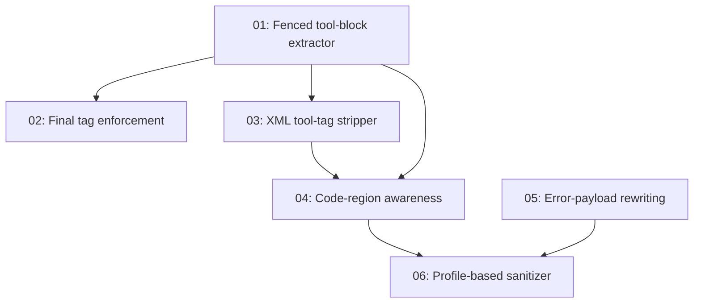

# Output Sanitization Plan

> Stop tool-call JSON, intent messages, and other internal scaffolding from leaking into the user-facing chat UI by extracting them server-side and stripping them from visible text.

---

## Why this matters

A user pasted a screenshot showing the AgentOS chat UI render this assistant turn:

````
I'll run a live demonstration across multiple capabilities. Watch me research, process data, delegate analysis, and store insights — all coordinated together.

```json
{"tool": "web-search", "intent_type": "query", "payload": {"query": "...", "limit": 5}}
{"tool": "agent-list", "intent_type": "query", "payload": {"status": "online"}}
{"tool": "datetime", "intent_type": "query", "payload": {}}
```
````

The model followed the documented protocol from [[../../crates/agentos-kernel/src/system_prompt.rs|system_prompt.rs]] (lines 76-83) which instructs agents to emit fenced ` ```json ` blocks for tool calls — but the kernel chat handler at `kernel.rs:1554` only inspects `result.tool_calls` (the structured native channel). Result: the JSON the model intended as a tool invocation gets rendered as visible text and the tools never run.

This is two failures at once:
1. **Sanitization gap** — internal scaffolding leaks into the user view.
2. **Parsing gap** — the tool calls the model meant to make never execute.

## Current state

| Layer | What exists today | Gap |
|---|---|---|
| Anthropic adapter | Parses `content_block_start.type == "tool_use"` correctly | None |
| OpenAI adapter | Parses `delta.tool_calls` correctly | None |
| Ollama adapter | Parses native `message.tool_calls` only | No fallback to fenced ` ```json ` parsing |
| Gemini adapter | Native function-call parsing | No fallback parsing |
| Chat streaming path | Forwards every `TextChunk` directly to the SSE stream | No filter; tool blocks are visible to the user |
| Chat completion path | Persists `result.text` verbatim | No post-processing; tool blocks remain in chat history |
| System prompt | Tells models to emit ` ```json ` blocks | Blocks are emitted but never re-parsed when adapters miss them |

## Target architecture

A new kernel module `output_sanitizer` provides:

1. **`extract_tool_intent_blocks(text)`** — pure function that scans a complete text for fenced ` ```json ` blocks parsing as `{"tool": ..., "intent_type": ..., "payload": ...}`, returns cleaned text + extracted intents.
2. **`OutputSanitizerStream`** — stateful streaming filter that buffers across chunk boundaries, hides matching fenced blocks from the streamed text, and reports a count of suppressed blocks.

Wired into [[../../crates/agentos-kernel/src/kernel.rs|kernel.rs]] `chat_infer_streaming`:

```text
LLM token stream
    │
    ▼
OutputSanitizerStream::push(chunk)        ← hides leaked blocks live
    │
    ▼
ChatStreamEvent::TextChunk (sanitized)
    │
    ▼
On Done event:
  if result.tool_calls.is_empty():
    extract_tool_intent_blocks(&result.text)
    if extracted: promote to result.tool_calls,
                  warn-log,
                  use cleaned text as visible answer
```

Defense-in-depth: even when `result.tool_calls` is non-empty, the cleaned text is still used so any straggler blocks the model emitted alongside structured tool calls also get removed.

## Phase Overview

| Phase | Name | Effort | Dependencies | Detail Doc | Status |
|-------|------|--------|-------------|------------|--------|
| 1 | Fenced tool-block extractor + stream filter | 1d | None | [[01-fenced-tool-block-extractor]] | complete |
| 2 | `<final>` tag enforcement (opt-in strict mode) | 1d | Phase 1 | [[02-final-tag-enforcement]] | complete |
| 3 | XML tool-tag stripper (`<tool_call>`, `<function_call>`, `<invoke>`) | 1d | Phase 1 | [[03-xml-tool-tag-stripper]] | complete |
| 4 | Code-region awareness for all strippers | 0.5d | Phase 1, 3 | [[04-code-region-awareness]] | complete |
| 5 | Error-payload rewriting for raw provider errors | 1d | None | [[05-error-payload-rewriting]] | complete |
| 6 | Profile-based sanitizer (delivery / history / debug) | 0.5d | Phase 1-4 | [[06-profile-based-sanitizer]] | complete |

## Phase dependency graph



## Key design decisions

1. **Server-side extraction over prompt engineering.** The system prompt continues to instruct models to emit fenced ` ```json ` blocks because many local models (Ollama, smaller weights) cannot use structured tool-call APIs. The fix is to parse what the model emits, not to forbid the format.
2. **Suppress streaming chunks before they reach the SSE stream.** Filtering the persisted text after the fact would still leak content visually during streaming. The stream filter must be stateful and run inline.
3. **Buffer mid-fence, decide at close-fence.** When the stream filter sees an opening ` ``` ` it buffers everything until the matching closing fence, then decides hide-or-emit. Worst case: the entire fenced block is held in memory until the close — bounded by the model's response size.
4. **Hide-only at the streaming layer; execute via the post-stream extractor.** The streaming filter does not try to dispatch tool calls mid-stream because tool execution happens in the kernel iteration loop after inference completes. Hiding visually is the streaming concern; promoting to `result.tool_calls` is the post-stream concern.
5. **Defense in depth.** The complete-text extractor runs even when `result.tool_calls` is non-empty, so any straggler blocks (e.g., model emitted both a structured call AND wrote about it in text) get cleaned.
6. **Match the documented intent shape strictly.** Only blocks parsing as a JSON object with `tool: string`, `intent_type: string`, `payload: any` are stripped. Tutorial code samples that happen to be ` ```json ` blocks for unrelated content (e.g., `{"foo": 1}`) are left alone.
7. **Out of scope for Phase 1: code-region awareness in tutorials.** A tutorial chatbot explaining "here's what an AgentOS tool call looks like" with a literal example would have its example stripped. Phase 4 adds awareness via tracking nested code fences. Phase 1 accepts this edge case.
8. **No execution of leaked blocks in Phase 1.** Promoting them to `result.tool_calls` is in scope for Phase 1, but only when `result.tool_calls` is empty (i.e., the adapter found no native calls). This avoids double-execution.

## Risks

| Risk | Mitigation |
|---|---|
| Stream filter buffers an unbounded fenced block when the model never closes the fence | `flush()` emits remaining buffer at end of stream regardless |
| False positives — tutorial agents explaining tool syntax get their examples stripped | Strict shape match (`tool` + `intent_type` + `payload` keys present); Phase 4 adds code-region awareness |
| Hidden tool calls are silent failures from the user's perspective | Log a `tracing::warn!` when blocks are suppressed; add an audit event in a future phase |
| UTF-8 boundary violation when slicing text by byte index | All scanning is on ASCII characters (` ``` `, `<`, `>`, `{`, `}`); slices cut at ASCII boundaries which are always char boundaries |
| Performance regression on large streams | Filter is O(n) over input, no allocations beyond the pending buffer; benchmark in Phase 1 tests |

## Related

- [[Output Sanitization Research]] — OpenClaw analysis and mitigation patterns
- [[../../reference/handbook/04-CLI Reference Complete|CLI Reference]]
