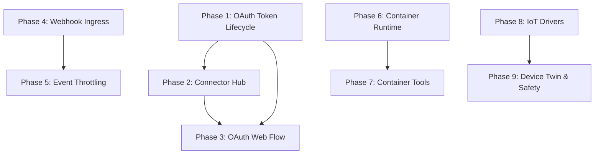

# Real-World Actor Extensions

> Bridge AgentOS from a virtual sandbox to physical and external systems — securely, incrementally, and building on existing crates.

---

## Why This Matters

AgentOS agents currently operate in a closed loop: user message -> LLM reasoning -> tool execution -> response. To be genuinely autonomous, agents need to:

1. **Authenticate with external services** without exposing raw credentials to the LLM context
2. **React to external events** (webhooks, alerts) without polling
3. **Execute untrusted code** in disposable, isolated containers
4. **Interact with physical hardware** (IoT sensors/actuators) with hard safety bounds

These four capabilities are table stakes for production agentic systems (OpenAI Assistants, LangGraph, AutoGPT all support subsets). AgentOS has the kernel architecture to do it better — capability tokens, audit logging, and sandboxing already exist.

---

## Current State

| Capability | Exists Today | Gap |
|-----------|-------------|-----|
| Secrets storage | `agentos-vault` — AES-256-GCM, Argon2id, proxy tokens, scope-based access | No OAuth2 lifecycle (refresh tokens, PKCE flow, expiry tracking) |
| HTTP requests | `http-client` tool | No transparent credential injection; agent sees raw tokens |
| External events | `ExternalEvents` category + `WebhookReceived` event type in types | No ingress endpoint, no throttling, no agent wake-up from webhooks |
| Channel adapters | `agentos-channels` — 6 adapters including `WebhookAdapter` (HMAC-SHA256) | Outbound-only webhook; no inbound webhook ingress or routing |
| Process sandboxing | `agentos-sandbox` — seccomp-BPF, Landlock, resource limits | Process-level only; no container/VM isolation for complex workloads |
| WASM execution | `agentos-wasm` — Wasmtime, 256 MiB limit, epoch-based CPU | Limited to WASM; can't run arbitrary Docker images (Python, Node, etc.) |
| Hardware | `agentos-hal` — 15+ drivers, device registry, approval workflow | No IoT protocols (MQTT, CoAP), no device twin, no safety engine |
| Web UI | `agentos-web` — Axum, auth, CSRF, 50+ handlers | No OAuth dance pages, no webhook management UI, no container monitoring |

---

## Target Architecture

```
                    External Services (GitHub, Slack, Stripe, ...)
                              |
               +--------------+--------------+
               |                             |
        OAuth2 Flow                   Webhook Ingress
        (Web UI)                      (Axum endpoint)
               |                             |
               v                             v
    +------------------+          +--------------------+
    | Connector Hub    |          | Event Throttle     |
    | (agentos-        |          | (debounce, batch,  |
    |  connectors)     |          |  rate-limit)       |
    +--------+---------+          +--------+-----------+
             |                             |
             |    +------------------------+
             |    |
             v    v
    +------------------+      +------------------+      +-----------------+
    | agentos-vault    |      | Kernel           |      | agentos-hal     |
    | (OAuth creds,    |      | (task creation,  |      | (MQTT driver,   |
    |  token refresh)  |      |  event routing)  |      |  device twin,   |
    +------------------+      +--------+---------+      |  safety engine) |
                                       |                +-----------------+
                              +--------+---------+
                              | agentos-runtime  |
                              | (Docker/         |
                              |  Firecracker)    |
                              +------------------+
```

---

## Phase Overview

| Phase | Name | Effort | Dependencies | Detail Doc | Status |
|-------|------|--------|-------------|------------|--------|
| 1 | OAuth token lifecycle | 2d | None | [[01-oauth-token-lifecycle]] | complete |
| 2 | API connector hub | 3d | Phase 1 | [[02-connector-hub]] | complete |
| 3 | OAuth web flow | 1.5d | Phase 1, 2 | [[03-oauth-web-flow]] | complete |
| 4 | Webhook ingress | 2d | None | [[04-webhook-ingress]] | complete |
| 5 | Event throttling & wake-up | 1.5d | Phase 4 | [[05-event-throttling]] | complete |
| 6 | Container runtime core | 3d | None | [[06-container-runtime]] | complete |
| 7 | Container tools & quotas | 2d | Phase 6 | [[07-container-tools]] | complete |
| 8 | IoT protocol drivers | 2d | None | [[08-iot-protocol-drivers]] | complete |
| 9 | Device twin & safety engine | 2.5d | Phase 8 | [[09-device-twin-safety]] | complete |

---

## Phase Dependency Graph



**Parallel tracks:** Subsystems A (1-3), B (4-5), C (6-7), and D (8-9) are independent of each other. All four tracks can proceed concurrently.

---

## Key Design Decisions

1. **Extend `agentos-vault`, don't create `agentos-auth`.** The vault already has AES-256-GCM, Argon2id, proxy tokens, and scope-based access. Adding OAuth2 state management as a new module inside the vault avoids duplicating crypto infrastructure and secret lifecycle logic.

2. **Connector Hub is a new crate (`agentos-connectors`).** Connectors are a distinct abstraction from tools — they define a namespace of tools backed by a single external API. This warrants its own crate rather than overloading `agentos-tools`.

3. **Webhook ingress extends `agentos-web`, not `agentos-channels`.** Inbound webhooks are HTTP endpoints — they belong in the web server. The channel system is for outbound delivery. The ingress routes into the existing event system via `EventCategory::ExternalEvents`.

4. **Container runtime is a new crate (`agentos-runtime`).** The existing `agentos-sandbox` is process-level isolation (seccomp/Landlock) for tool execution. Container orchestration (Docker/Firecracker) is fundamentally different — separate lifecycle, networking, volume mounts, image management.

5. **IoT extends `agentos-hal`, not a new crate.** HAL already has the driver trait, device registry, approval workflow, and event sink. MQTT/CoAP are just new driver types. The Device Twin is a registry extension. The Safety Engine is a new `DeviceAccessGate` implementation.

6. **Safety rules are declarative config, never LLM-generated.** The hardware safety engine uses operator-defined rules in `config/hardware_limits.toml` evaluated by typed Rust code. LLM instructions are not a safety boundary.

7. **Rate limiting is per-endpoint, not global.** Each webhook endpoint gets its own token bucket and debounce window. A noisy GitHub repo shouldn't starve a critical Stripe endpoint.

---

## Risks

| Risk | Impact | Mitigation |
|------|--------|------------|
| OAuth2 complexity (PKCE, refresh, revocation) | Token leaks, broken flows | Use proven `oauth2` crate; vault encrypts all tokens at rest; audit every token operation |
| Webhook flood → runaway LLM costs | Financial | Token-bucket rate limiter + debounce batching + per-endpoint cost caps |
| Container escape | Host compromise | Default no-network; cgroup limits; TTL enforcement; operator approval for privileged images |
| IoT safety — hallucinated actuator commands | Physical harm | Declarative safety rules in Rust; operator-defined bounds; require explicit approval per device per agent |
| Scope creep — 9 phases is large | Stalled delivery | Phases are independent tracks; each phase is self-contained and shippable; prioritize A > B > C > D |

---

## Related

- [[Agent Scratchpad Plan]] — agent working memory (complete)
- [[Multi-Agent Coordination Plan]] — sub-agent spawning (Phase 1-4 complete)
- [[Task Checkpointing Plan]] — crash recovery (complete)
- [[Web UI Redesign Plan]] — web interface (planned)
