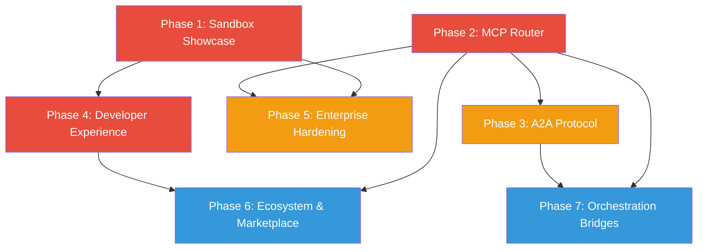

# AgentOS Strategic Roadmap Plan

> Transform AgentOS from a powerful internal project into the industry-standard secure runtime for autonomous AI agents by proving enterprise trust, dominating protocol adoption, and removing developer friction.

---

## Why This Matters

The AI agent space is consolidating from experimental scripts into production infrastructure (2025-2026). Four categories have emerged: no-code builders, SDK frameworks, domain SaaS, and **agent runtimes/operating systems**. AgentOS is in the runtime/OS category — the only Rust-based, kernel-level agent execution environment with defense-in-depth security.

The window to establish AgentOS as the "Linux of Agents" is now. MCP adoption is accelerating (OpenAI, Google, Microsoft onboard), enterprises are demanding provable security, and no competitor combines kernel-level execution + capability tokens + WASM sandboxing + multi-tier memory + cost enforcement + HAL.

**Core thesis:** Don't compete with frameworks (LangGraph, CrewAI, PydanticAI) — become the secure runtime they execute on.

---

## Current State

| Asset | Status | Notes |
|-------|--------|-------|
| 27-crate Rust workspace | Built | ~67k+ LOC, compiles clean |
| Capability token system | Complete | HMAC-SHA256, per-tool validation |
| Trust tier system | Complete | Core/Verified/Community/Blocked + Ed25519 sigs |
| AES-256-GCM vault | Complete | Argon2id KDF, ZeroizingString |
| Append-only audit log | Complete | 83+ event types, HMAC chain |
| Seccomp-BPF sandbox | Complete | Linux-only |
| WASM sandbox | Complete | Wasmtime for Community tools |
| Multi-tier memory | Complete | Episodic/Semantic/Procedural, FTS5+cosine+RRF |
| Cost tracking | Complete | Per-agent budgets, auto model downgrade |
| HAL | Complete | CPU, sensors, network, GPU drivers |
| Task checkpointing | Complete | SQLite-backed, crash recovery |
| Multi-agent coordination | Complete (Phase 1-4) | Sub-agent spawning, teams, context handoff |
| REST API | Complete | 50 endpoints, OpenAI-compat SSE |
| Channel adapters | Complete | Discord, Slack, Telegram, WhatsApp, Email, Webhook |
| Skill system | Complete | SKILL.toml manifests, 7 core skills |
| `agentos-mcp` crate | Exists | Needs full spec completion |
| Web UI | In progress | Dashboard, HTMX-based |
| Public docs / DX | Gap | No external developer guide |
| Enterprise certification | Gap | No SOC2, no compliance process |
| A2A protocol | Gap | Not started |

---

## Target Architecture

```
┌─────────────────────────────────────────────────────────┐
│                  EXTERNAL ECOSYSTEM                      │
│  LangGraph │ CrewAI │ PydanticAI │ Google ADK │ Custom  │
└──────┬──────────┬──────────┬──────────┬──────────┬──────┘
       │          │          │          │          │
       ▼          ▼          ▼          ▼          ▼
┌─────────────────────────────────────────────────────────┐
│              PROTOCOL LAYER (Phase 2 + 3)                │
│  ┌──────────────────┐  ┌──────────────────────────────┐ │
│  │  MCP Router       │  │  A2A Gateway                 │ │
│  │  (Stdio/SSE/HTTP) │  │  (Agent↔Agent interop)       │ │
│  │  + CapToken auth  │  │  + Discovery + Negotiation   │ │
│  └──────────────────┘  └──────────────────────────────┘ │
└──────────────────────────┬──────────────────────────────┘
                           │
┌──────────────────────────▼──────────────────────────────┐
│                  AgentOS KERNEL                           │
│  ┌──────────┐ ┌──────────┐ ┌──────────┐ ┌────────────┐ │
│  │Capability│ │  WASM    │ │  Cost    │ │ Escalation │ │
│  │  Tokens  │ │ Sandbox  │ │ Tracker  │ │  Manager   │ │
│  ├──────────┤ ├──────────┤ ├──────────┤ ├────────────┤ │
│  │  Audit   │ │ Multi-   │ │  Task    │ │   HAL      │ │
│  │   Log    │ │ Tier Mem │ │Checkpoint│ │  Drivers   │ │
│  └──────────┘ └──────────┘ └──────────┘ └────────────┘ │
└──────────────────────────┬──────────────────────────────┘
                           │
┌──────────────────────────▼──────────────────────────────┐
│              DEVELOPER EXPERIENCE (Phase 4)              │
│  ┌──────────────┐ ┌──────────┐ ┌──────────────────────┐ │
│  │ CLI Workflows│ │Templates │ │ Public Docs + Guides │ │
│  │ (guided)     │ │(scaffold)│ │ (agentos.dev)        │ │
│  └──────────────┘ └──────────┘ └──────────────────────┘ │
└─────────────────────────────────────────────────────────┘
```

---

## Phase Overview

| Phase | Name | Effort | Dependencies | Detail Doc | Status |
|-------|------|--------|-------------|------------|--------|
| 1 | Sandbox Showcase & Enterprise Trust | 2w | None | [[01-sandbox-showcase-enterprise-trust]] | complete |
| 2 | MCP-Native Secure Router | 3w | None | [[02-mcp-native-secure-router]] | complete |
| 3 | A2A Protocol Support | 2w | Phase 2 | [[03-a2a-protocol-support]] | complete |
| 4 | Developer Experience & Onboarding | 2w | Phase 1 (demo assets) | [[04-developer-experience-onboarding]] | complete |
| 5 | Enterprise Hardening | 2w | Phase 1, 2 | [[05-enterprise-hardening]] | complete |
| 6 | Ecosystem & Marketplace | 2w | Phase 2, 4 | [[06-ecosystem-marketplace]] | complete |
| 7 | Orchestration Bridges | 1w | Phase 2, 3 | [[07-orchestration-bridges]] | complete |

**Total estimated effort: ~14 weeks** (phases 1-2 and 4 can run in parallel)

---

## Phase Dependency Graph



**Critical path:** Phase 2 (MCP) → Phase 3 (A2A) → Phase 7 (Bridges)
**Parallel tracks:** Phase 1 + Phase 2 can start simultaneously. Phase 4 can start after Phase 1 demo assets.

---

## Key Design Decisions

1. **MCP-first, not adapter-bolted-on.** The `agentos-mcp` crate must implement the full MCP spec natively (tools, resources, prompts, notifications, OAuth, sampling) rather than wrapping existing tool dispatch. This is how mcp-agent won mindshare.

2. **A2A as complement to MCP.** MCP handles agent↔tool communication. A2A handles agent↔agent. Both are needed for the ecosystem play. Implement A2A after MCP is solid.

3. **Demo before docs.** The sandbox showcase (Phase 1) produces shareable artifacts (video, whitepaper) that drive awareness. Developer docs (Phase 4) convert awareness to adoption. Order matters.

4. **Templates over tutorials.** Developers learn by running code, not reading guides. Ship `agentos init` templates that produce working agents in <5 minutes, with comments explaining the security model inline.

5. **Bridges are thin adapters.** Orchestration bridges (Phase 7) should be MCP/A2A protocol adapters, not deep integrations. If the protocols work, the bridges are trivial.

6. **Enterprise hardening is process + code.** SOC2 compliance requires organizational processes (policies, incident response) beyond just code. Phase 5 scopes the code work; the process work is flagged as external.

7. **HAL is a blue ocean.** No competitor touches hardware. IoT/edge agent management via HAL is a unique differentiator worth protecting and promoting.

---

## Risks

| Risk | Impact | Likelihood | Mitigation |
|------|--------|-----------|------------|
| MCP spec instability | High — building on moving target | Medium | Pin to stable spec version, abstract transport layer |
| A2A adoption uncertainty | Medium — Google-driven, may not gain traction | Medium | Keep A2A layer thin and optional; MCP is primary |
| Enterprise trust requires more than demos | High — SOC2 is a process, not a feature | High | Phase 5 scopes code; flag organizational process as separate workstream |
| Developer onboarding friction underestimated | High — 27-crate workspace is intimidating | High | Template-first approach; abstract complexity behind `agentos init` |
| Competitor catches up on security | Medium — OpenFang or mcp-agent adds tokens | Low | Moat is the *integrated stack*, not any single feature |
| Resource constraints (solo/small team) | High — 14 weeks is ambitious | High | Phases are independent; ship Phase 1+2 first for maximum impact |
| Rust barrier to contribution | Medium — smaller contributor pool than Python | Medium | Python SDK (Phase 4 stretch) and MCP bridges lower the bar |

---

## Success Metrics

| Phase | Metric | Target |
|-------|--------|--------|
| 1 | Demo video views / whitepaper downloads | 1k+ views in first month |
| 2 | MCP spec compliance score | 100% of tools/resources/prompts/transports |
| 3 | A2A interop test with ≥2 external frameworks | LangGraph + PydanticAI |
| 4 | Time from `curl install` to running first agent | < 5 minutes |
| 5 | Audit log tamper-detection coverage | 100% of security events |
| 6 | External tools registered in marketplace | 10+ community tools |
| 7 | External framework successfully routing through AgentOS | 1+ production bridge |

---

## Related

- [[Strategic Roadmap Research Synthesis]] — source-grounded competitive research
- [[Competitive Gap Closure Plan]] — completed gap closure (V3)
- [[Real-World Actor Plan]] — OAuth, webhooks, connectors, IoT
- [[Real World Adoption Roadmap Plan]] — complementary adoption initiatives
