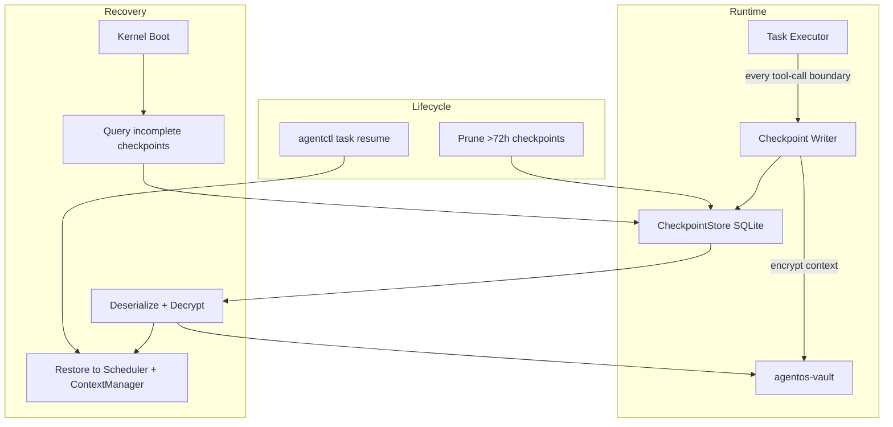
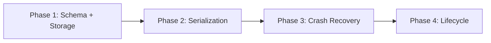

# Task Checkpointing

> Add durable task checkpointing so long-running agent tasks can be resumed after kernel restarts, matching the crash-recovery capabilities of LangGraph and Temporal.

---

## Why This Matters

AgentOS has no durable execution model. If the kernel restarts (Issue #12 documents 4 unclean restarts in 50 minutes), all in-flight tasks are lost -- their context windows, tool call history, and intermediate results vanish. Competing frameworks (LangGraph, Temporal, CrewAI) offer checkpointing/durable execution as a core feature.

For multi-agent coordination this is especially critical: a coordinator task that has spawned 5 sub-agents and collected results from 3 will lose all progress on restart.

## Current State

| Component | Current Behavior |
|-----------|-----------------|
| `AgentTask` | In-memory only; not serialized to disk during execution |
| `ContextWindow` | Held in `ContextManager.tasks: RwLock<HashMap<TaskID, TaskContext>>` -- volatile |
| `TaskScheduler` | Has `state_store: Option<Arc<KernelStateStore>>` but only persists task metadata (state, timestamps), not context |
| `KernelStateStore` | Persists `TaskState` transitions to SQLite; no context or tool-call history |
| Audit log | SQLite-backed (`agentos-audit`); records events but not restorable state |
| `agentos-vault` | AES-256-GCM encryption available; not used for task state |
| Kernel boot | 17-step boot sequence in `run_loop.rs`; no recovery step |
| `ContextWindow` serialization | `#[derive(Serialize, Deserialize)]` already implemented on `ContextWindow` and `ContextEntry` |

## Target Architecture

## Phase Overview

| Phase | Name | Effort | Dependencies | Detail Doc | Status |
|-------|------|--------|-------------|------------|--------|
| 1 | Checkpoint schema and storage | 1d | None | [[01-checkpoint-schema-and-storage]] | complete |
| 2 | State serialization | 2d | Phase 1 | [[02-state-serialization]] | complete |
| 3 | Crash recovery | 2d | Phase 2 | [[03-crash-recovery]] | complete |
| 4 | Checkpoint lifecycle | 1d | Phase 3 | [[04-checkpoint-lifecycle]] | complete |

## Phase Dependency Graph

## Key Design Decisions

1. **Checkpoints are written per tool-call, not per token.** Tool calls are the natural transaction boundary in agent execution -- each one produces a discrete state change. This bounds write frequency to ~1-10 per task iteration (not hundreds per token stream).

2. **Context blob is encrypted with the vault key.** Agent context windows may contain user secrets, API keys passed via tool results, or sensitive data. Encrypting the checkpoint with `agentos-vault` (AES-256-GCM, Argon2id key derivation) ensures secrets are protected at rest.

3. **Recovery is opt-in at CLI (`agentos task resume`).** Silent auto-resume could cause duplicate side effects (re-executing tool calls that modify external state). The user must explicitly choose to resume a checkpointed task. On boot, the kernel logs which tasks have checkpoints available but does not resume them automatically.

4. **Checkpoint pruning mirrors existing snapshot expiry at 72h.** The `TimeoutChecker` already sweeps expired snapshots with `sweep_expired_snapshots(max_age)`. Checkpoint pruning uses the same pattern and interval.

5. **Checkpoint store lives in its own SQLite file, not the audit DB.** The audit DB is append-only with HMAC chain integrity. Checkpoint data is mutable (pruned) and much larger (context blobs). A separate file avoids bloating the audit log and breaking its integrity model.

## Risks

| Risk | Likelihood | Impact | Mitigation |
|------|-----------|--------|------------|
| Checkpoint write latency slows task execution | Medium | Medium | Write checkpoints on `spawn_blocking` to avoid blocking the async executor |
| Context deserialization fails after schema change | Low | High | Version the checkpoint schema; skip unloadable checkpoints with warning |
| Resumed task references tools/agents that no longer exist | Medium | Medium | Validate tool/agent availability before resume; fail fast with clear error |
| Disk space growth from frequent checkpoints | Low | Low | 72h pruning + only keeping latest checkpoint per task (overwrite previous) |
| Encryption key rotation invalidates old checkpoints | Low | Medium | Store key version in checkpoint metadata; support decryption with old key |

## Related

- [[Multi-Agent Coordination Plan]]
- [[Event-Driven Completion Plan]]
- [[Issues and Fixes]] (Issue #12 -- restart instability)
- [[Observability Uplift Plan]]
