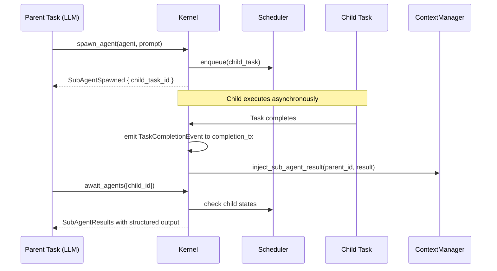
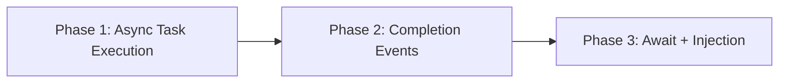

# Event-Driven Task Completion

> Replace the synchronous-blocking task execution model with event-driven completion so parent tasks can run concurrently with child sub-agents and receive structured results via context injection.

---

## Why This Matters

The current multi-agent coordination feature spawns child tasks but has two critical flaws:

1. **`cmd_run_task` blocks the caller** -- it calls `execute_task_sync()` which occupies the handler until the task finishes. Sub-agent tasks spawned by `cmd_spawn_sub_agent` are enqueued but their parent cannot proceed concurrently.
2. **`cmd_await_sub_agents` returns state strings, not results** -- it polls `scheduler.get_task()` and returns `"state=running"` or `"state=complete result=<prompt_preview>"`. The existing `inject_sub_agent_result()` method in `ContextManager` is never called, so child outputs are never injected into the parent's context window. This is Issue #13 from [[Issues and Fixes]].

Without this fix, multi-agent coordination is structurally broken: the coordinator LLM never sees what its sub-agents produced.

## Current State

| Component | Current Behavior |
|-----------|-----------------|
| `cmd_run_task` | Calls `execute_task_sync()` synchronously; blocks until task completes |
| `cmd_spawn_sub_agent` | Enqueues child task on scheduler; returns `TaskID` immediately |
| `cmd_await_sub_agents` | Polls `scheduler.get_task()` for each child; returns `(TaskID, String)` pairs with state labels |
| `ContextManager::inject_sub_agent_result()` | Implemented (line 126 of `context.rs`) but never called from anywhere |
| `SubAgentResult` type | Defined in `agentos-types/src/context.rs` line 832; has `child_task_id`, `agent_name`, `output`, `success` fields |
| `KernelResponse::SubAgentResults` | Carries `Vec<(TaskID, String)>` -- flat string pairs, no structured output |
| Task completion events | `TaskCompleted` / `TaskFailed` audit events exist; no in-process notification channel |

## Target Architecture

## Phase Overview

| Phase | Name | Effort | Dependencies | Detail Doc | Status |
|-------|------|--------|-------------|------------|--------|
| 1 | Async task execution | 2d | None | [[01-async-task-execution]] | planned |
| 2 | Completion event emission | 2d | Phase 1 | [[02-completion-event-emission]] | planned |
| 3 | Event-driven await and injection | 1d | Phase 2 | [[03-event-driven-await-and-injection]] | planned |

## Phase Dependency Graph

## Key Design Decisions

1. **Events route through a Tokio broadcast channel, not `user_inbox`.** The `UserInbox` is a SQLite-backed persistent store for user-facing notifications. Task completion events are ephemeral kernel-internal signals. A `broadcast::channel<TaskCompletionEvent>` on the `Kernel` struct is the right primitive -- subscribers get real-time notification without SQLite overhead.

2. **Parent registers child task IDs it is waiting on in a `WaitSet` stored in `ContextManager`.** This avoids polling. When a completion event fires, the kernel checks if any active parent has that child in its wait set and injects the result immediately.

3. **`inject_sub_agent_result()` is called by the completion event handler, not the tool executor.** This ensures results are injected even if the parent is not actively calling `await_agents` at the moment the child completes. The parent's next LLM turn will see the injected context entry.

4. **Timeout on `await_agents` uses existing `TimeoutChecker` infrastructure.** The parent task's overall timeout still applies. If all children have not completed within the parent's remaining budget, `await_agents` returns partial results with `"state=running"` for incomplete children.

5. **Non-blocking `cmd_run_task` is backward-compatible.** Callers that want synchronous behavior (e.g., the CLI `agentos task run`) continue to block by polling `task status` until terminal state. The internal change is that `cmd_run_task` returns a `TaskID` immediately and the execution loop runs on a spawned Tokio task.

## Risks

| Risk | Likelihood | Impact | Mitigation |
|------|-----------|--------|------------|
| Breaking the CLI synchronous UX | Medium | High | Keep `cmd_run_task` returning full result for interactive CLI; only sub-agent spawns are async |
| Completion event lost if parent context is evicted | Low | Medium | Check for context existence before injection; log warning if parent context is gone |
| Race between child completion and parent calling `await_agents` | Medium | Low | Inject result on completion; `await_agents` reads already-injected context entries |
| Broadcast channel backpressure if many tasks complete simultaneously | Low | Low | Use bounded channel with `lagged` handling; log dropped events |

## Related

- [[Multi-Agent Coordination Plan]]
- [[Issues and Fixes]] (Issue #13)
- [[Task Checkpointing Plan]]
- [[Observability Uplift Plan]]
