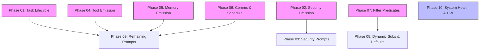

# Event Trigger System Completion Plan

> Complete the event-driven triggering system so all 47 event types are emitted, filtered, and delivered with rich trigger prompts.

---

## Why This Matters

The event bus infrastructure is fully built — subscription registry, throttling, loop detection, dispatch loop, CLI, and audit logging all work. But only **4 of 47 event types** are actually being emitted (`AgentAdded`, `AgentRemoved`, `AgentPermissionGranted`, `AgentPermissionRevoked`). The system is dormant. Until events fire from task execution, security checks, memory pressure, tool failures, and agent communication, agents cannot react to OS state changes — the core promise of the event trigger spec.

---

## Current State

| Component | Status | Notes |
|-----------|--------|-------|
| EventBus (subscription CRUD, throttle, loop detection) | Complete | `event_bus.rs` — 425 lines, 14 tests |
| EventDispatcher (emit, sign, chain-depth, task creation) | Complete | `event_dispatch.rs` — 236 lines |
| Event types (47 types, 10 categories) | Complete | `agentos-types/src/event.rs` — 380 lines |
| CLI commands (7 subcommands) | Complete | `cli/src/commands/event.rs` — 324 lines |
| Kernel wiring (field, channel, supervised task) | Complete | `kernel.rs` lines 70-73, `run_loop.rs` |
| Audit logging (8 audit event types) | Complete | `audit/src/log.rs` |
| **Emission points** | **4 of 47** | Only AgentLifecycle events emit |
| **Trigger prompts** | **4 custom + generic** | AgentAdded/Removed, PermissionGranted/Revoked |
| **Filter predicates** | **Stubbed** | Always pass — no DSL evaluation |
| **Dynamic subscriptions** | **Not started** | No Subscribe/Unsubscribe intents |
| **Role-based defaults** | **Not started** | No auto-subscribe on agent connect |

---

## Target Architecture

```
                    ┌─────────────────────────────────────────┐
                    │              Event Sources               │
                    ├──────┬──────┬──────┬──────┬──────┬──────┤
                    │Task  │Secur-│Memory│Tools │Comms │Sched │
                    │Exec  │ity   │      │      │      │ule   │
                    └──┬───┴──┬───┴──┬───┴──┬───┴──┬───┴──┬───┘
                       │      │      │      │      │      │
                       ▼      ▼      ▼      ▼      ▼      ▼
                    ┌─────────────────────────────────────────┐
                    │         emit_event() → EventBus          │
                    │  ┌─────────────────────────────────────┐ │
                    │  │ Subscription Registry                │ │
                    │  │  - Type filter (Exact/Category/All)  │ │
                    │  │  - Predicate filter (DSL eval)  ←NEW │ │
                    │  │  - Throttle policy check             │ │
                    │  │  - Chain depth check                 │ │
                    │  └─────────────────────────────────────┘ │
                    └──────────────────┬──────────────────────┘
                                       │
                                       ▼
                    ┌─────────────────────────────────────────┐
                    │  build_trigger_prompt()                   │
                    │  - 13 custom prompts ←NEW                │
                    │  - Generic fallback for the rest         │
                    └──────────────────┬──────────────────────┘
                                       │
                                       ▼
                    ┌─────────────────────────────────────────┐
                    │  create_triggered_task()                  │
                    │  → CapabilityToken → TaskScheduler        │
                    │  → AuditLog                              │
                    └─────────────────────────────────────────┘
```

---

## Implementation Order

| Phase | Name | Effort | Files Changed | Dependencies | Detail Doc |
|-------|------|--------|---------------|--------------|------------|
| 01 | Task Lifecycle Emission | 3h | 2 | None | [[01-task-lifecycle-emission]] |
| 02 | Security Event Emission | 3h | 3 | None | [[02-security-event-emission]] |
| 03 | Security Trigger Prompts | 3h | 1 | Phase 02 | [[03-security-trigger-prompts]] |
| 04 | Tool Event Emission | 2h | 2 | None | [[04-tool-event-emission]] |
| 05 | Memory Event Emission & Prompt | 3h | 3 | None | [[05-memory-event-emission-and-prompt]] |
| 06 | Communication & Schedule Emission | 3h | 2 | None | [[06-communication-and-schedule-emission]] |
| 07 | Event Filter Predicates | 4h | 2 | None | [[07-event-filter-predicates]] |
| 08 | Dynamic Subscriptions & Role Defaults | 4h | 4 | Phase 07 | [[08-dynamic-subscriptions-and-role-defaults]] |
| 09 | Remaining Trigger Prompts | 3h | 1 | Phases 01,04,05,06 | [[09-remaining-trigger-prompts]] |
| 10 | System Health & Hardware Emission | 4h | 3 | None | [[10-system-health-and-hardware-emission]] |

---

## Phase Dependency Graph



Phases 01, 02, 04, 05, 06, 07, 10 can all be executed **in parallel** — they touch different files. Phase 03 depends on 02. Phase 08 depends on 07. Phase 09 depends on 01, 04, 05, 06 (needs emission points to exist before writing prompts that reference them).

---

## Key Design Decisions

1. **Pass `event_sender` via `Arc<Kernel>` self reference.** All kernel methods already have `&self` access. Subsystems that don't (ToolRegistry, AgentMessageBus, etc.) will receive an `mpsc::UnboundedSender<EventMessage>` clone at construction time rather than taking a kernel reference.

2. **Payloads remain `serde_json::Value` for now.** Typed payload structs (spec section 4) are deferred — the generic JSON approach works and avoids a large refactor. Phase 10+ can add typed payloads if needed.

3. **Filter predicates use a simple key-op-value DSL.** Not a full expression parser — supports `field == value`, `field > number`, `field IN [list]`, and `AND` conjunction. Enough for all spec examples without pulling in a dependency.

4. **Dynamic subscriptions are a new IntentType.** Agents emit `IntentType::Subscribe` / `IntentType::Unsubscribe` through the normal intent pipeline, validated by the capability engine (requires `event.subscribe` permission).

5. **Role-based defaults are applied at agent connect time.** When `cmd_connect_agent()` runs, it checks the agent's role against a default subscription table and creates subscriptions automatically.

---

## Risks

| Risk | Impact | Mitigation |
|------|--------|------------|
| Event flood from high-frequency emission points (task loop, memory) | Agent overwhelmed, scheduler saturated | Throttle defaults on all new emissions; ContextWindowNearLimit fires max once per task |
| Circular event chains (event → task → event → task) | Stack overflow, infinite loop | Existing chain_depth=5 limit + existing loop detection |
| event_sender threading through subsystems is invasive | Large refactor if done wrong | Use `Option<UnboundedSender>` with lazy init; subsystems that predate events get sender injected |
| Filter predicate DSL parsing bugs | Wrong events delivered or dropped | Extensive unit tests; fail-open (deliver) on parse error with audit warning |

---

## Related

- [[agentos-event-trigger-system]] — Original design spec
- [[Event Trigger Flow]] — Existing flow diagram
- [[Event Trigger Completion Data Flow]] — Updated emission flow
