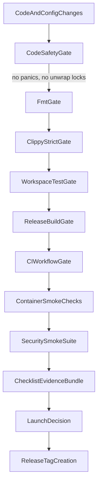

# First Deployment Readiness Data Flow

> Flow of validation artifacts from code changes to launch decision.

---

## Diagram

## Steps

1. **Code safety hardening** — remove `panic!()` from production paths, add poison-recovery on all `RwLock` access, mark hanging tests `#[ignore]`.
2. Apply formatting fixes and run formatting gate.
3. Run strict linting and ensure no warning-denied failures.
4. Execute full test suite for behavioral confidence.
5. Build release artifacts for binary reproducibility.
6. **CI workflow validation** — confirm `.github/workflows/` gate chain runs green.
7. Validate container startup, health checks, persistence, and LLM endpoint configurability.
8. Execute security smoke scenarios with specific assertions and confirm audit evidence.
9. Assemble evidence into launch checklist and evaluate go/no-go.
10. If all criteria pass, cut the first release tag.

## Artifacts

| Artifact | Produced By | Used By |
|---|---|---|
| safety audit (grep for panic/unwrap) | code safety gate | preflight checklist |
| fmt/clippy logs | quality gate run | preflight checklist |
| test report | workspace test run | release decision |
| CI workflow run | GitHub Actions | release decision |
| release binaries | release build | container image build |
| compose health evidence | container smoke test | launch readiness |
| security scenario results | security smoke suite (specific test files) | security sign-off |
| audit event evidence | security smoke suite | security sign-off |
| release checklist | operator sign-off | tag cut authorization |

## Related

- [[First Deployment Readiness Plan]]
- [[First Deployment Readiness Research Synthesis]]
- [[16-First Deployment Readiness Program]]
