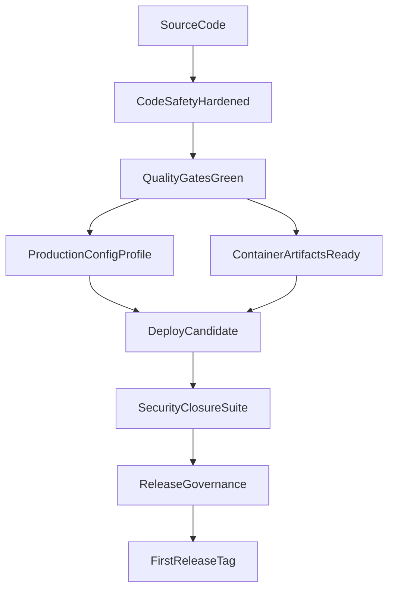
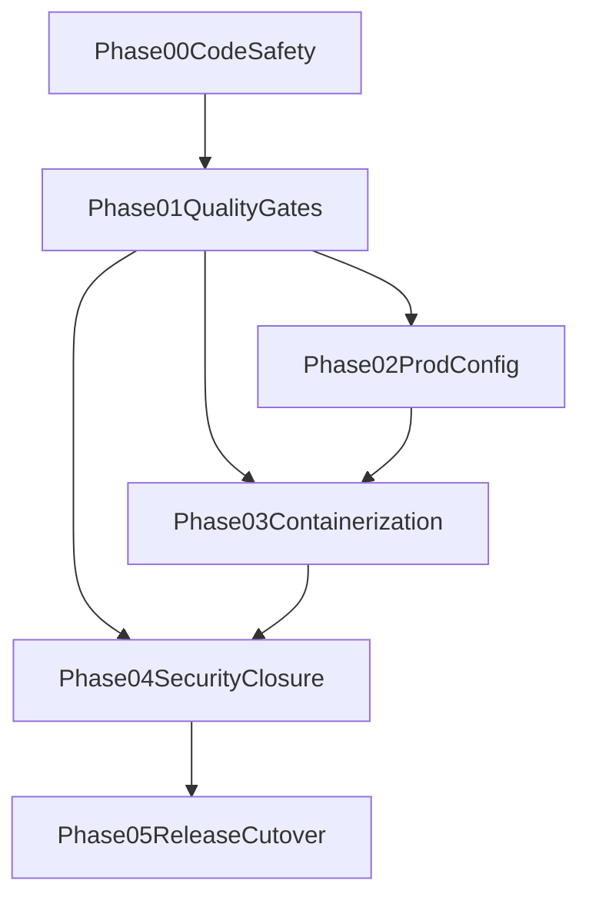

# First Deployment Readiness Plan

> Master plan to close deployment blockers and cut the first production baseline.

---

## Why this matters

AgentOS can compile and run tests, but first deployment requires stricter guarantees: runtime safety (no panics), clean quality gates, production-safe runtime defaults, reproducible deployment artifacts, and security/release governance. This plan closes the gap from "works locally" to "ship-ready baseline."

## Current state

| Area | Current State | Risk |
|---|---|---|
| Code safety | `panic!()` reachable in agent message bus; RwLock poisoning in capability engine (10 sites) | Kernel crash from normal agent operations |
| Quality gates | `fmt` and strict `clippy` failing; 6 CLI integration tests hang | Unreliable release candidate quality |
| Runtime config | Development defaults under `/tmp`; hardcoded `localhost` LLM endpoints | State loss; breaks container/remote deployment |
| Deployment packaging | Docker-first strategy documented, artifacts missing in repo | Non-reproducible deployment |
| Security closure | Controls implemented, verification not fully operationalized | Unknown deploy-time security posture |
| Release governance | No first release tag protocol | No immutable baseline or rollback anchor |
| CI automation | No workflow file; gates run manually | Quality gates will regress without enforcement |

## Target architecture

## Phase overview

| Phase | Name | Effort | Depends On | Detail |
|---|---|---|---|---|
| 00 | Code Safety Hardening | 4h | none | [[00-code-safety-hardening]] |
| 01 | Quality Gates Stabilization | 1d | 00 | [[01-quality-gates-stabilization]] |
| 02 | Production Config Baseline | 6h | 01 | [[02-production-config-baseline]] |
| 03 | Containerization and Runtime | 1.5d | 01, 02 | [[03-containerization-and-runtime]] |
| 04 | Security Gate Closure | 2d | 01, 03 | [[04-security-gate-closure]] |
| 05 | Release Process and Cutover | 4h | 01, 04 | [[05-release-process-and-cutover]] |

## Phase dependency graph

## Minimum viable v0.1.0

If time is constrained, the minimum shippable baseline is Phases 00 + 01 + 02. This gives:
- No panics or lock-poisoning crashes
- Clean quality gates (fmt, clippy, tests)
- Production-safe config with persistent paths and configurable LLM endpoints

Phases 03-05 (containerization, security smoke suite, release governance) can follow in v0.1.1 or v0.2.0. The kernel is functional and safe to run on a single machine after Phase 02.

## Key design decisions

1. **Safety-first, style-second**: runtime crash paths (`panic!`, lock poisoning) are fixed before cosmetic quality gates. A formatted binary that panics is worse than an unformatted one that doesn't.
2. **Gate-first release policy**: deployment cannot proceed unless `fmt`, strict `clippy`, tests, and release build all pass.
3. **Separate production config profile**: keep developer defaults simple while requiring explicit production profile for deployment.
4. **Repository-owned deployment artifacts**: Docker assets live in repo to enforce reproducibility and versioned operations.
5. **Security as acceptance suite**: security checks are executable release gates, not narrative guidance only.
6. **Immutable first tag criterion**: first release tag is created only from a fully validated commit.
7. **CI enforcement**: quality gates must be automated in a workflow file to prevent regression.

## Risks

| Risk | Impact | Mitigation |
|---|---|---|
| Lock-poisoning fix changes concurrency behavior | Subtle runtime bugs | Test capability engine under concurrent load after fix |
| Clippy/fmt fixes trigger regressions | Delayed release | Require test pass after each crate fix batch |
| Config migration mistakes | Startup/data issues | Add migration and path validation checklist |
| Container runtime differences (seccomp, linking) | Deployment drift | Standardize compose profile; test multi-stage build early |
| Security checks incomplete | False confidence | Define mandatory scenario list with exact assertions |
| Tagging without hard criteria | Unstable baseline | Enforce signed-off launch checklist before tag |
| No CI — gates regress silently | Broken release candidate | Add workflow file in Phase 01 |

## Related

- [[16-First Deployment Readiness Program]]
- [[First Deployment Readiness Research Synthesis]]
- [[First Deployment Readiness Data Flow]]
- [[12-Production Readiness Audit]]
