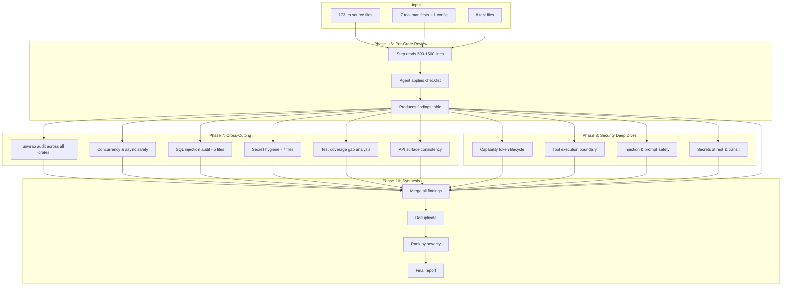

# Full Codebase Review Data Flow

> How source files flow through review steps and how findings are consolidated.

---

## Diagram



---

## Steps

1. **Input Selection** — Each step receives a curated list of 1-6 source files (500-1,500 lines total)
2. **Agent Review** — Agent reads files, applies the step-specific checklist, and records findings
3. **Findings Output** — Each step outputs a markdown table with: File, Line(s), Severity, Category, Description, Suggested Fix
4. **Cross-Cutting Passes** — Sweep across all crates for specific concerns (unwrap, SQL, concurrency, secrets)
5. **Security Deep Dives** — Re-read critical files with adversarial questions
6. **Synthesis** — Merge all findings, deduplicate, rank by severity, produce final report

---

## Parallelization Strategy

```
Phase 1 (5 steps)     ─── all in parallel ───>  findings
Phase 2 (10 steps)    ─── all in parallel ───>  findings
Phase 3 (2 steps)     ─── all in parallel ───>  findings
Phase 4 (7 steps)     ─── all in parallel ───>  findings
Phase 5 (16 steps)    ─── all in parallel ───>  findings
Phase 6 (8 steps)     ─── all in parallel ───>  findings
Phase 7 (6 steps)     ─── all in parallel ───>  findings
Phase 8 (4 steps)     ─── all in parallel ───>  findings
Phase 9 (1 step)      ─── single agent ──────>  findings
Phase 10 (1 step)     ─── single agent ──────>  FINAL REPORT
```

Maximum parallelism within each phase. Phases execute sequentially (1 → 2 → ... → 10), except phases 7-8 can start after phase 6.

---

## Related

- [[Full Codebase Review Plan]]
- [[10-synthesis-and-report]]
