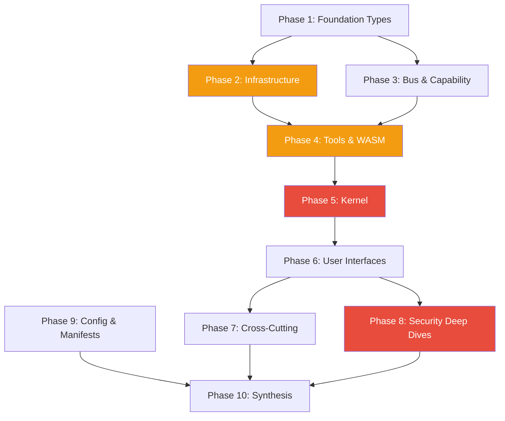

# Full Codebase Review Plan

> Systematic, context-budget-aware review of the entire AgentOS codebase (~32K lines, 17 crates, 173 files) covering correctness, security, architecture, and quality.

---

## Why This Matters

AgentOS has grown through V1-V3 without a structured code review. The codebase now includes security-critical subsystems (vault, capability tokens, injection scanning, sandboxing) that demand adversarial scrutiny. A full review will:

- Surface latent bugs before they reach production
- Validate security invariants (crypto, auth, injection defense, path traversal)
- Identify test coverage gaps in the 14 untested crates
- Ensure architectural consistency across 17 crates

---

## Current State

| Metric | Value |
|--------|-------|
| Total crates | 17 |
| Total source files | 173 (.rs) |
| Total source lines | ~32,625 |
| Test files | 8 (1,161 lines) |
| Largest crate | agentos-kernel (49 files, 13,483 lines) |
| Largest file | task_executor.rs (1,412 lines) |
| Tool manifests | 7 (tools/core/*.toml) |
| Crates with tests | 3 of 17 (cli, tools, sdk) |

---

## Target Architecture

Each review step stays within **500-1,500 lines** of source code so a single agent can read, analyze, and produce findings without exceeding context limits. Steps follow the crate dependency graph bottom-up.

```
Layer 0: agentos-types, agentos-sdk-macros (no deps)
Layer 1: audit, vault, llm, sandbox, hal, memory, pipeline
Layer 2: capability, bus
Layer 3: tools, wasm, sdk
Layer 4: kernel (depends on all above)
Layer 5: cli, web
```

---

## Phase Overview

| Phase | Name | Steps | Lines | Effort | Dependencies | Detail Doc |
|-------|------|-------|-------|--------|-------------|------------|
| 1 | Foundation Types | 5 | 2,431 | 2h | None | [[01-foundation-types-review]] |
| 2 | Infrastructure | 10 | 9,944 | 6h | Phase 1 | [[02-infrastructure-review]] |
| 3 | Bus & Capability | 2 | 1,470 | 1h | Phase 1 | [[03-bus-and-capability-review]] |
| 4 | Tools & WASM | 7 | 3,252 | 3h | Phases 1-3 | [[04-tools-and-wasm-review]] |
| 5 | Kernel | 16 | 13,483 | 8h | Phases 1-4 | [[05-kernel-core-review]] |
| 6 | User Interfaces | 8 | 5,276 | 4h | Phases 1-5 | [[06-user-interfaces-review]] |
| 7 | Cross-Cutting Passes | 6 | (re-reads) | 3h | Phases 1-6 | [[07-cross-cutting-passes]] |
| 8 | Security Deep Dives | 4 | (re-reads) | 3h | Phases 1-6 | [[08-security-deep-dives]] |
| 9 | Config & Manifests | 1 | ~300 | 30m | None | [[09-config-and-manifests-review]] |
| 10 | Synthesis | 1 | — | 2h | All | [[10-synthesis-and-report]] |

**Total: 60 steps across 10 phases.**

---

## Phase Dependency Graph



---

## Key Design Decisions

1. **Bottom-up dependency order** — review leaf crates first so foundational issues are caught before reviewing dependent code
2. **500-1,500 line budget per step** — fits within a single agent's context window with room for analysis
3. **Independent steps within phases** — enables parallel execution (spawn multiple agents per phase)
4. **Security-critical steps tagged** — allows priority-first execution if time is limited
5. **Cross-cutting passes as separate phase** — concerns like `unwrap()` audits and SQL injection span all crates and are better done as dedicated sweeps than per-crate checks
6. **Adversarial deep dives last** — re-read the most critical code with a dedicated attacker mindset after understanding the full system

---

## Review Output Format

Every step produces a findings table:

```markdown
| File | Line(s) | Severity | Category | Description | Suggested Fix |
|------|---------|----------|----------|-------------|---------------|
```

- **Severity:** critical / high / medium / low / info
- **Category:** security / correctness / performance / style / architecture / test-gap

---

## Risks

| Risk | Likelihood | Impact | Mitigation |
|------|-----------|--------|------------|
| Review produces too many low-severity findings, obscuring critical issues | Medium | Medium | Phase 10 synthesis filters by severity; address critical/high first |
| Kernel review (Phase 5) takes longer due to 13K lines | High | Low | 16 granular steps keep each within budget; can parallelize |
| Security deep dives miss novel attack patterns | Low | High | Structured adversarial questions per step; combine with automated tooling (clippy, cargo-audit) |
| Findings become stale if implementation changes during review | Medium | Low | Run `cargo build && cargo test` at synthesis phase to validate |

---

## How to Execute

1. **Spawn an agent per step** with the step's file list and checklist
2. **Steps within a phase can run in parallel** (no inter-step dependencies)
3. **Phases should run roughly in order** (1 through 8), though 7-8 can start after 6
4. **Each agent produces a findings table** in the standard format
5. **Phase 10 consolidates** all findings into the final report

---

## Related

- [[Full Codebase Review Data Flow]]
- [[16-Full Codebase Review]]
