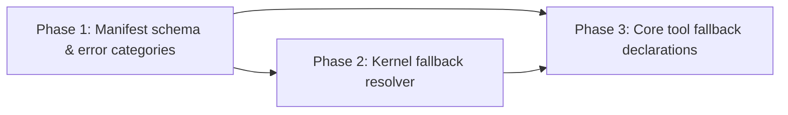

# Graceful Degradation Chains Plan

> Enable tools to declare fallback chains in their manifests so the kernel can automatically recover from common failures without burning an LLM inference round-trip.

---

## Why This Matters

When a tool fails today — file locked, network timeout, permission denied, disk full — the error returns to the LLM, which spends tokens reasoning about what to try next. For common, predictable failures, this is wasteful. The agent asked for exactly this: "Having fallback options registered would let me recover automatically rather than escalating immediately."

The pattern is simple: a tool manifest declares "if I fail with error X, try tool Y with these parameter transformations." The kernel intercepts the failure, checks for a matching fallback, and transparently retries — the LLM only sees the final result. If all fallbacks fail, *then* escalate to the LLM.

This is cheap to implement (manifest extension + kernel intercept), high leverage (saves tokens on the most common failure modes), and zero risk (fallback chains are optional and backward-compatible).

---

## Current State

| Component | What Exists | Limitation |
|-----------|-------------|------------|
| Tool manifests (TOML) | Name, description, schema, permissions, trust tier | No fallback or retry declarations |
| `ToolRunner::execute()` | Single-shot execution, returns `Result<Value, AgentOSError>` | No retry logic; error goes straight to LLM |
| `AgentOSError` variants | Rich error enum with 30+ variants | No error categorization for fallback matching |
| Task executor | Handles tool results, injects into context | No fallback interception layer |

---

## Target Architecture

```
Tool Execution Request
│
├── ToolRunner::execute("file-write", payload)
│   └── Result::Err(StorageError("disk full"))
│
├── FallbackResolver checks tool manifest:
│   └── file-write.toml declares:
│       [[fallback]]
│       on_error = "StorageError"
│       try_tool = "file-write"
│       transform = { path = "prepend:/tmp/overflow/" }
│       max_retries = 1
│
├── ToolRunner::execute("file-write", transformed_payload)
│   └── Result::Ok(...)  ← success on fallback path
│
└── Return Ok result to task executor
    (LLM never sees the original failure)
```

---

## Phase Overview

| Phase | Name | Effort | Dependencies | Detail Doc | Status |
|-------|------|--------|-------------|------------|--------|
| 1 | Manifest fallback schema & error categories | 1d | None | [[01-fallback-schema-and-error-categories]] | complete |
| 2 | Kernel fallback resolver | 1.5d | Phase 1 | [[02-kernel-fallback-resolver]] | complete |
| 3 | Core tool fallback declarations | 0.5d | Phase 1, 2 | [[03-core-tool-fallback-declarations]] | planned |

---

## Phase Dependency Graph



---

## Key Design Decisions

1. **Manifest-declared, not code-declared** — Fallback chains are defined in TOML manifests, not in Rust tool code. This means any tool (including WASM and user tools) can declare fallbacks without code changes, and fallbacks are visible/auditable without reading source.

2. **Error category matching, not string matching** — Errors match by `AgentOSError` variant name (e.g., `StorageError`, `PermissionDenied`, `NetworkError`), not by message string. This is stable across code changes and avoids brittle substring matching.

3. **Payload transforms are simple key-value operations** — Supported transforms: `prepend`, `append`, `replace`, `default` (set if missing). No arbitrary code execution in transform logic. Complex fallbacks that need custom logic should be separate tools.

4. **Max 3 fallback hops per chain** — Hard cap to prevent infinite retry loops. Configurable per-tool but kernel enforces the ceiling.

5. **Audit every fallback** — Each fallback attempt is logged as a `ToolFallbackAttempted` audit event with the original error, fallback tool, and transformed payload. The LLM may not see it, but the audit trail is complete.

6. **Fallback is opt-in, not automatic** — Tools with no `[[fallback]]` sections behave exactly as today. Zero backward-compatibility risk.

---

## Risks

| Risk | Impact | Mitigation |
|------|--------|------------|
| Fallback masks a real error the LLM should see | Medium — agent misses important context | Fallback results include `_fallback_used: true` metadata; LLM can inspect if needed |
| Infinite retry between two tools that fallback to each other | High — resource exhaustion | Max 3 hops; kernel tracks visited tools per chain |
| Payload transform produces invalid input for fallback tool | Medium — second failure | Schema-validate transformed payload before executing fallback; if invalid, skip to next fallback or escalate |
| Fallback tool requires different permissions | Low — capability violation | Fallback resolver checks capability token against fallback tool's permissions before attempting |

---

## Related

- [[Multi-Agent Coordination Plan]] — fallback chains complement graceful degradation for agent-level failures
- [[Architecture Overview]]
