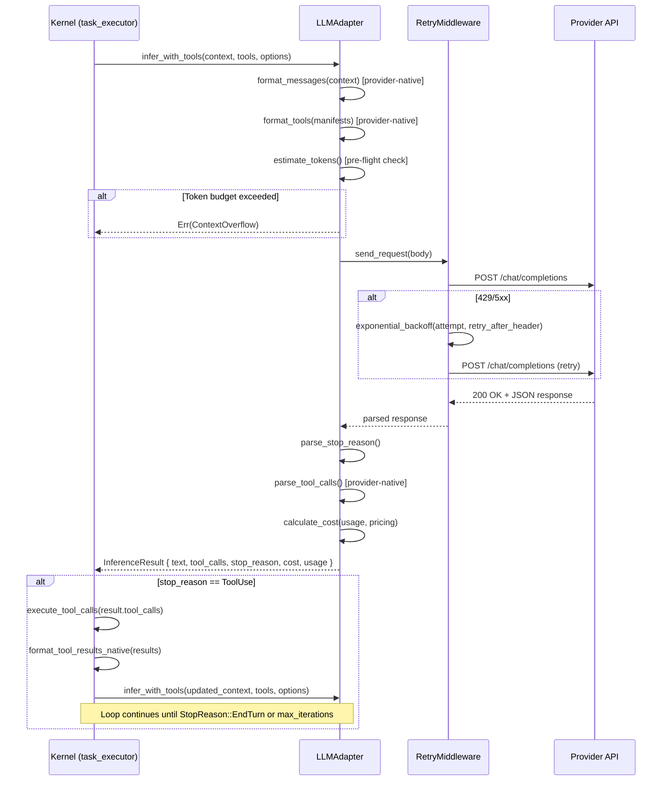
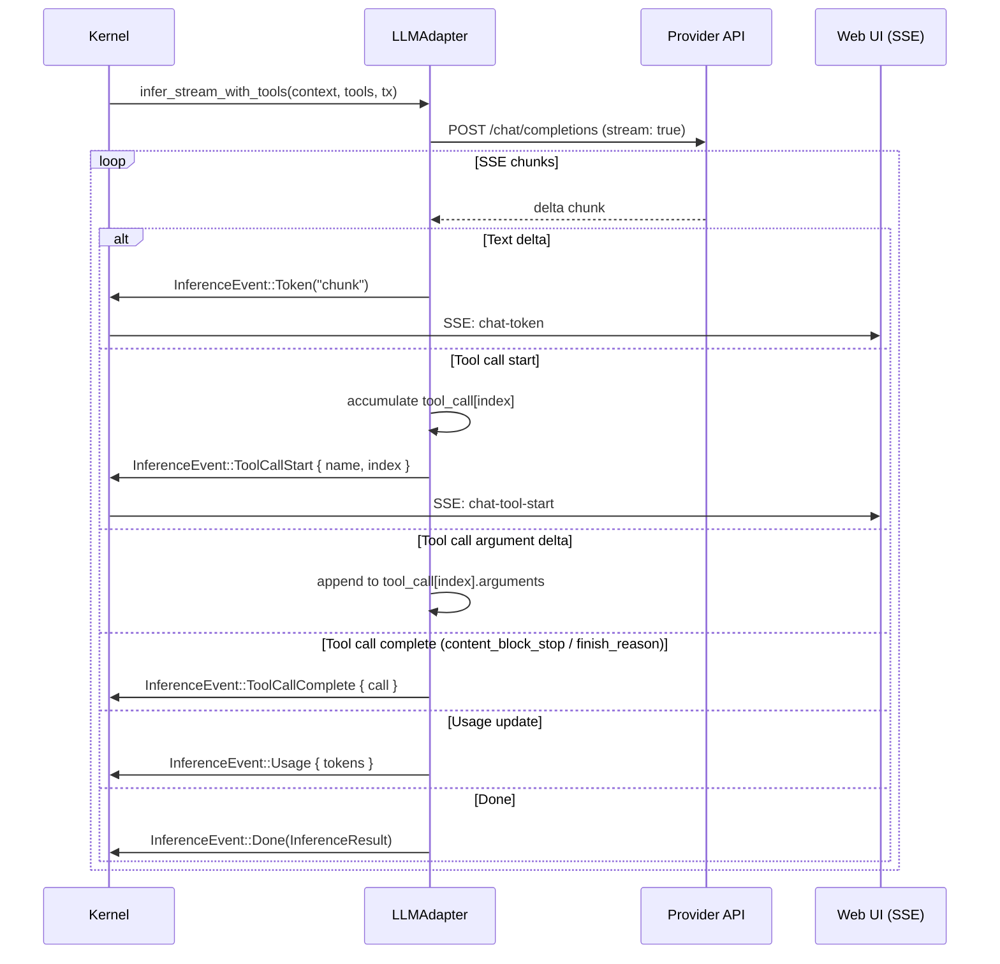
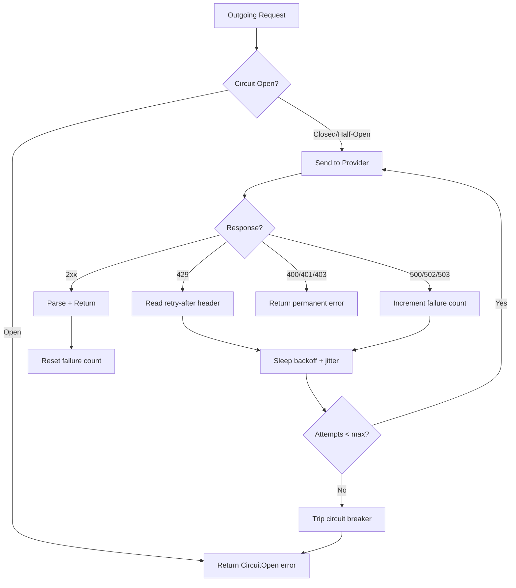
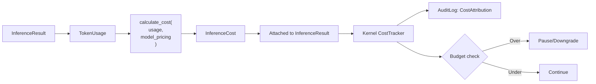
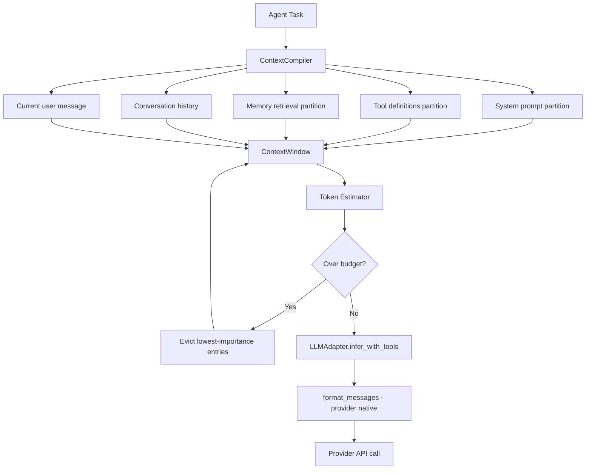

# LLM Adapter Redesign Data Flow

> How inference requests, tool calls, and streaming events flow through the redesigned LLM adapter layer.

---

## Agentic Inference Loop (Non-Streaming)



## Streaming Inference with Tool Calls



## Tool Result Injection (Provider-Native)

```mermaid
flowchart TD
    TR[Tool Results from Kernel] --> SW{Provider?}

    SW -->|OpenAI| OAI["role: tool\ntool_call_id: call_xxx\ncontent: result_json"]
    SW -->|Anthropic| ANT["role: user\ncontent: [{type: tool_result,\ntool_use_id: toolu_xxx,\ncontent: result_text}]"]
    SW -->|Gemini| GEM["role: user\nparts: [{functionResponse:\n{name: fn, response: {...}}}]"]
    SW -->|Ollama| OLL["role: tool\ncontent: result_json"]

    OAI --> CTX[Append to ContextWindow]
    ANT --> CTX
    GEM --> CTX
    OLL --> CTX

    CTX --> NEXT[Next infer_with_tools() call]
```

## Retry and Circuit Breaker Flow



## Cost Attribution Flow



## Context Compilation Integration



---

## Related

- [[LLM Adapter Redesign Plan]]
- [[LLM Adapter Redesign Research]]
