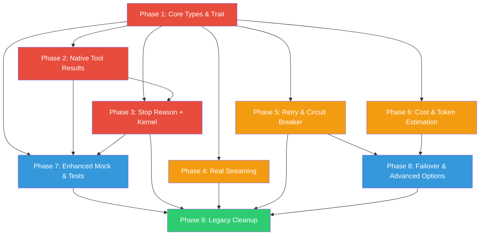

# LLM Adapter Redesign Plan

> Comprehensive redesign of the `agentos-llm` crate to support production-grade agentic workflows: native multi-turn tool calling, streaming tool accumulation, retry/failover resilience, unified stop reasons, and per-inference cost attribution.

---

## Why This Matters

AgentOS positions LLMs as the CPU of an agent operating system. The LLM adapter layer is the instruction fetch/decode unit -- every agent task, every chat interaction, and every tool use loop passes through it. The current implementation has critical gaps:

1. **Broken multi-turn tool loops.** Tool results are injected as plain user messages, not provider-native tool result formats. This causes validation errors or degraded behavior on OpenAI, Anthropic, and Gemini.
2. **No stop reason propagation.** The kernel parses response text with regex to detect tool calls instead of using the model's `finish_reason`/`stop_reason` signal. This is fragile and lossy.
3. **Fake streaming.** Only Ollama streams; the other three providers fake it by calling `infer()` and emitting the whole response as one event. The web UI's SSE streaming is a lie.
4. **Zero resilience.** A single 429 or network error kills the entire task. No retry, no backoff, no failover.
5. **Legacy text format coupling.** Tool calls are rendered to markdown JSON blocks and re-parsed by the kernel, losing structured data and introducing ambiguity.

---

## Current State

| Component | State | Problem |
|-----------|-------|---------|
| `LLMCore` trait | 7 methods | Missing `InferenceOptions`, `StopReason`, native tool result format |
| `InferenceResult` | Has text + tool_calls | Missing `stop_reason`, `cost`, `cached_tokens`, `thinking` |
| `InferenceEvent` | Token/Done/Error | Missing ToolCallStart/Delta/Complete, Usage events |
| `ModelCapabilities` | 5 fields | Missing streaming, parallel tools, prompt caching, thinking |
| OpenAI adapter | Tool calling works | No streaming, no retry, wrong tool result format, no stop_reason |
| Anthropic adapter | Tool calling works | No streaming, no retry, wrong tool result format, no stop_reason |
| Gemini adapter | Tool calling works | No streaming, no retry, wrong tool result format, no stop_reason |
| Ollama adapter | Streaming + tools | Real streaming but tool calls not in stream, no tool result format |
| Custom adapter | Basic inference | No tools, no streaming, no retry |
| Mock adapter | Returns canned strings | Cannot simulate tool calls, stop reasons, or streaming |
| `tool_helpers.rs` | Legacy format helpers | `append_legacy_blocks` creates fragile text coupling |
| Kernel integration | `chat_infer_with_tools` | Regex-parses tool calls, ignores native `InferenceToolCall` structs |

---

## Target Architecture

After the redesign, the adapter layer will:

1. **Speak native tool protocols** -- each provider sends/receives tool calls and results in its native format
2. **Propagate stop reasons** -- `StopReason::ToolUse` / `EndTurn` / `MaxTokens` drives the kernel loop
3. **Stream everything** -- all providers emit real streaming events including tool call accumulation
4. **Retry automatically** -- configurable exponential backoff with jitter for retryable errors
5. **Track costs** -- every `InferenceResult` carries `InferenceCost` computed from the pricing table
6. **Fail over** -- unhealthy providers are circuit-broken; agents can have fallback providers
7. **Estimate tokens** -- pre-flight token estimation prevents context overflow before API calls

---

## Phase Overview

| Phase | Name | Effort | Dependencies | Detail Doc | Status |
|-------|------|--------|-------------|------------|--------|
| 1 | Core types and trait redesign | 2d | None | [[01-core-types-and-trait-redesign]] | complete |
| 2 | Native tool result formatting | 2d | Phase 1 | [[02-native-tool-result-formatting]] | complete |
| 3 | Stop reason propagation and kernel migration | 1.5d | Phase 1, 2 | [[03-stop-reason-and-kernel-migration]] | complete |
| 4 | Real streaming for all providers | 2d | Phase 1 | [[04-real-streaming-all-providers]] | complete |
| 5 | Retry middleware and circuit breaker | 1.5d | Phase 1 | [[05-retry-middleware-and-circuit-breaker]] | complete |
| 6 | Cost attribution and token estimation | 1d | Phase 1 | [[06-cost-attribution-and-token-estimation]] | complete |
| 7 | Enhanced mock and testing infrastructure | 1d | Phase 1, 2, 3 | [[07-enhanced-mock-and-testing]] | complete |
| 8 | Provider failover and advanced options | 1.5d | Phase 5, 6 | [[08-provider-failover-and-advanced-options]] | complete |
| 9 | Legacy cleanup and migration completion | 1.5d | All prior phases | [[09-legacy-cleanup-and-migration]] | complete |

---

## Phase Dependency Graph

**Critical path:** Phase 1 -> Phase 2 -> Phase 3 -> Phase 9 (fixes the broken agentic loop)

**Parallel work:** Phases 4, 5, 6 can proceed in parallel after Phase 1

---

## Key Design Decisions

1. **`StopReason` enum over text parsing.** The kernel will use `InferenceResult.stop_reason` to decide whether to continue the tool loop, not regex on the response text. This eliminates the fragile `parse_tool_call()` / `append_legacy_blocks()` pipeline.

2. **`InferenceOptions` struct for per-call configuration.** Instead of hardcoding `tool_choice: "auto"`, `stream: false`, etc., each inference call passes options that control behavior. This supports forced tool choice, structured output, and temperature overrides.

3. **Provider-native `ContextRole::Tool` variant.** Add `ContextRole::Tool { call_id: String }` so the kernel can inject tool results that adapters format correctly for their provider.

4. **Retry at the adapter level, not the kernel.** The adapter wraps the HTTP client with retry middleware. The kernel does not need to know about 429 errors -- it just gets a result or a permanent error.

5. **Streaming events are additive.** New `InferenceEvent` variants are added without removing existing ones. The web UI handler and kernel can pattern-match on what they care about.

6. **`InferenceCost` attached to every result.** The adapter calculates cost from the pricing table and attaches it. The kernel cost_tracker reads it instead of recalculating. Dead code in `types.rs` becomes live.

7. **`MockLLMCore` supports full agentic simulation.** The mock can return tool calls with specific stop reasons, simulate streaming, and track detailed call history for assertions.

8. **Backward compatibility via phased migration.** Phases 1-2 add new types without breaking existing code. Phase 3 migrates the kernel. Phase 9 removes legacy code. No big-bang rewrite.

9. **No new crate dependencies for retry.** Use a simple `RetryPolicy` struct with exponential backoff implemented in ~50 lines, not a heavy framework like `backon` or `tower`.

---

## Risks

| Risk | Likelihood | Impact | Mitigation |
|------|-----------|--------|------------|
| Provider API changes during implementation | Medium | Medium | Pin API versions in adapter headers (e.g., `anthropic-version: 2023-06-01`) |
| Breaking kernel integration during Phase 3 | High | High | Phase 3 is a careful migration with backward-compatible shims; test coverage first (Phase 7) |
| Streaming implementation complexity | Medium | Medium | Phase 4 is isolated; can be deferred without blocking the core agentic loop fix |
| Token estimation inaccuracy | Low | Low | Estimation is advisory; actual counts come from provider response |
| Legacy code removal breaks unknown callers | Low | High | Phase 9 runs `cargo test --workspace` and audits all `parse_tool_call` call sites |

---

## Related

- [[LLM Adapter Redesign Research]]
- [[LLM Adapter Redesign Data Flow]]
- [[01-core-types-and-trait-redesign]]
- [[02-native-tool-result-formatting]]
- [[03-stop-reason-and-kernel-migration]]
- [[04-real-streaming-all-providers]]
- [[05-retry-middleware-and-circuit-breaker]]
- [[06-cost-attribution-and-token-estimation]]
- [[07-enhanced-mock-and-testing]]
- [[08-provider-failover-and-advanced-options]]
- [[09-legacy-cleanup-and-migration]]
