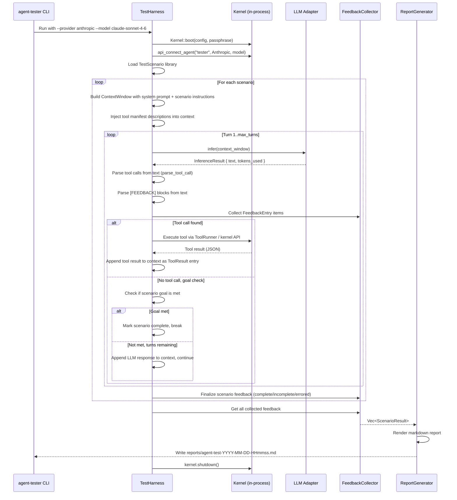

# LLM Agent Testing Data Flow

> How data moves from test scenario definition through LLM interaction to the final feedback report.

---

## Diagram



---

## Steps

### 1. Initialization

The `agent-tester` binary parses CLI arguments (`--provider`, `--model`, `--api-key`, `--scenarios`, `--output-dir`). It boots a kernel in a temporary directory using the same pattern as `tests/e2e/common.rs::setup_kernel()`, then registers a test agent using the chosen LLM provider.

### 2. Scenario Loading

The `ScenarioLibrary` loads all built-in scenarios (registration, tool discovery, file I/O, etc.) or a filtered subset if `--scenarios tool-discovery,file-io` was specified. Each `TestScenario` contains:
- `name: String` -- unique identifier
- `description: String` -- human-readable purpose
- `system_prompt: String` -- instructions for the LLM about its role and this specific test
- `initial_user_message: String` -- the opening prompt that kicks off the scenario
- `max_turns: usize` -- turn budget (default 10)
- `goal_check: fn(&str) -> bool` -- closure that inspects the LLM's last response for goal completion signals
- `required_capabilities: Vec<String>` -- permissions the test agent needs for this scenario

### 3. Context Window Construction

For each scenario, the harness:
1. Creates a fresh `ContextWindow::new(100)` with `OverflowStrategy::SemanticEviction`
2. Pushes a `System` entry with the testing persona prompt (who you are, what feedback format to use)
3. Pushes a `System` entry with the scenario-specific instructions
4. Pushes a `Tools` category entry listing available tool names and their descriptions (loaded from `ToolRegistry`)
5. Pushes a `User` entry with the `initial_user_message`

### 4. Driver Loop

The loop calls `llm.infer(&context_window)` and processes the response:
- **Tool call parsing**: Uses `parse_tool_call()` from `agentos-kernel/src/tool_call.rs` to detect `[TOOL_CALL]` blocks. If found, the tool is executed through the kernel's tool runner with proper `ToolExecutionContext` (permissions, data_dir, etc.), and the result is appended as a `ContextRole::ToolResult` entry.
- **Feedback parsing**: A custom parser extracts `[FEEDBACK]...[/FEEDBACK]` JSON blocks (modeled on `parse_uncertainty()` in `agentos-llm/src/types.rs`).
- **Goal checking**: The scenario's `goal_check` closure is called on the full response text. If it returns `true`, the scenario is marked complete.
- **Turn advancement**: The LLM's response is appended as `ContextRole::Assistant`, and if the scenario is not complete and there are turns remaining, the loop continues.

### 5. Feedback Collection

Each `FeedbackEntry` has:
```rust
struct FeedbackEntry {
    scenario: String,
    turn: usize,
    category: FeedbackCategory,   // Usability, Correctness, Ergonomics, Security, Performance
    severity: FeedbackSeverity,   // Info, Warning, Error
    observation: String,
    suggestion: Option<String>,
    context: Option<String>,      // What the LLM was trying to do when it noticed this
}
```

The `FeedbackCollector` aggregates entries across all scenarios and all turns.

### 6. Report Generation

After all scenarios complete (or exhaust turns), the `ReportGenerator`:
1. Groups feedback by category and severity
2. Summarizes each scenario's outcome (complete/incomplete/errored, turn count, tool calls made, feedback count)
3. Produces a top-level "Executive Summary" with counts by severity
4. Writes the full report as markdown to `reports/agent-test-YYYY-MM-DD-HHmmss.md`

### 7. Cleanup

The kernel is shut down via `kernel.shutdown()`, the temporary directory is dropped, and the process exits with code 0 (all scenarios complete) or 1 (any scenario errored).

---

## Key Data Types

| Type | Crate | Purpose |
|------|-------|---------|
| `ContextWindow` | `agentos-types` | Rolling context fed to LLM on each turn |
| `ContextEntry` | `agentos-types` | Individual message in the context |
| `InferenceResult` | `agentos-llm` | LLM response with text, tokens, duration |
| `LLMCore` trait | `agentos-llm` | Abstraction over all LLM providers |
| `ParsedToolCall` | `agentos-kernel` | Parsed tool invocation from LLM text |
| `ToolExecutionContext` | `agentos-tools` | Permission + environment for tool execution |
| `TestScenario` | `agentos-agent-tester` (new) | Scenario definition |
| `FeedbackEntry` | `agentos-agent-tester` (new) | Single feedback observation |
| `ScenarioResult` | `agentos-agent-tester` (new) | Complete scenario outcome |
| `TestReport` | `agentos-agent-tester` (new) | Final aggregated report |

---

## Related

- [[LLM Agent Testing Plan]] -- master plan with phases and design decisions
- [[01-test-harness-crate]] -- Phase 1: crate skeleton
- [[02-llm-driver-loop]] -- Phase 2: the core interaction loop
