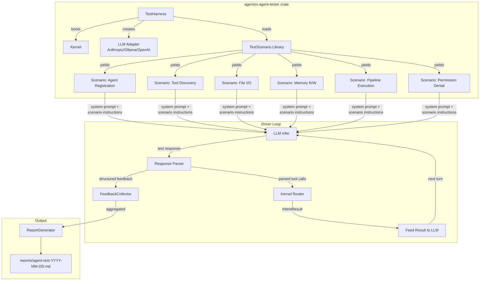
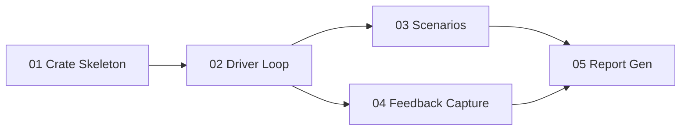

# LLM Agent Testing Plan

> Design and build an LLM-driven test harness that uses a real LLM as a "user agent" of AgentOS, exercising every subsystem and producing structured usability/correctness feedback.

---

## Why This Matters

AgentOS is designed for AI agents, not humans. Its entire UX surface -- intents, tool manifests, context windows, capability tokens -- is meant to be consumed by LLMs. Yet all existing tests use `MockLLMCore` with canned responses. No test has ever asked: "Can a real LLM actually use this system effectively?"

This plan creates a **closed-loop test harness** where a real LLM (Claude, GPT-4o, or a local Ollama model) is given an AgentOS kernel and told to explore it. The LLM attempts real tasks -- file I/O, memory search, pipeline execution, secret management -- and emits structured JSON feedback about what worked, what failed, and what was confusing. The result is a markdown report that surfaces ergonomic issues, missing error messages, and broken flows that unit tests cannot catch.

---

## Current State

| Aspect | Status |
|--------|--------|
| `MockLLMCore` | Exists, returns canned strings in sequence |
| `AnthropicCore` / `OllamaCore` / `OpenAICore` / `GeminiCore` | Exist, hit real APIs |
| E2E kernel tests | `tests/e2e/` uses `setup_kernel()` + `register_mock_agent()` |
| LLM-driven integration test | **Does not exist** |
| Structured feedback capture | **Does not exist** |
| Report generation | **Does not exist** |

---

## Target Architecture

---

## Phase Overview

| # | Phase | Effort | Dependencies | Link |
|---|-------|--------|--------------|------|
| 01 | Test harness crate skeleton | 2d | None | [[01-test-harness-crate]] |
| 02 | LLM driver loop | 3d | Phase 01 | [[02-llm-driver-loop]] |
| 03 | Test scenario library | 3d | Phase 02 | [[03-test-scenarios]] |
| 04 | Structured feedback capture | 2d | Phase 02 | [[04-feedback-capture]] |
| 05 | Report generation | 2d | Phase 03, 04 | [[05-report-generation]] |

---

## Phase Dependency Graph

---

## Key Design Decisions

1. **New crate, not an integration test.** A dedicated `crates/agentos-agent-tester/` crate lets us depend on `agentos-kernel`, `agentos-llm`, `agentos-bus`, `agentos-tools`, and `agentos-types` without circular dependency issues. It produces a binary `agent-tester` that can be run independently.

2. **In-process kernel, not bus IPC.** The harness boots the kernel in-process (like `tests/e2e/common.rs::setup_kernel()`) and calls the kernel's public API methods directly (`api_connect_agent`, `run_pipeline`, etc.) plus uses the `ContextWindow` and `LLMCore` trait. This avoids bus serialization overhead and socket setup complexity during testing.

3. **Real LLM, not mock.** The entire point is to test with a real reasoning engine. The harness accepts a `--provider` flag (`anthropic`, `openai`, `ollama`, `gemini`) and a `--model` flag. An `--api-key` flag or `AGENTOS_TEST_API_KEY` env var provides credentials. For CI, a `--mock` flag falls back to `MockLLMCore` with scenario-specific scripted responses.

4. **Scenario-based, not free-form.** Each test scenario has a defined goal, system prompt, maximum turns, and success criteria. The LLM is given a focused task ("register yourself, list tools, read a file") rather than open-ended exploration. This makes results reproducible and assertions possible.

5. **Feedback as JSON blocks.** The LLM is instructed to emit `[FEEDBACK]...[/FEEDBACK]` blocks (similar to the existing `[UNCERTAINTY]` pattern) containing structured JSON with fields: `category` (usability/correctness/ergonomics/security), `severity` (info/warning/error), `observation`, and `suggestion`. A parser extracts these from the LLM's natural language responses.

6. **Reports directory.** Test reports are written to `reports/agent-test-YYYY-MM-DD-HHmmss.md` at the workspace root. This directory is gitignored but available locally.

7. **Turn budget per scenario.** Each scenario has a configurable `max_turns` (default 10). If the LLM exhausts its turns without completing the goal, the scenario is marked as `incomplete` with whatever feedback was collected.

---

## Risks

| Risk | Likelihood | Impact | Mitigation |
|------|-----------|--------|------------|
| LLM produces no usable feedback (ignores instructions) | Medium | High | Robust system prompt with examples; validate JSON blocks; retry with stronger prompt if zero feedback after N turns |
| API rate limits or costs during testing | Medium | Medium | Support `--mock` mode for CI; limit turn count; use cheapest model for frequent runs |
| Kernel boot fails in test harness | Low | High | Reuse proven `setup_kernel()` pattern from `tests/e2e/common.rs` |
| LLM hallucinates tool names or intent formats | High | Medium | Feed actual tool manifests in system prompt; validate tool calls before routing; capture hallucination as feedback |
| Flaky results due to LLM non-determinism | High | Medium | Run each scenario 3 times (configurable); report consensus; use temperature=0 where supported |

---

## Related

- [[26-LLM Agent Testing]] -- implementation checklist in next-steps
- [[LLM Agent Testing Data Flow]] -- data flow diagram
- [[01-test-harness-crate]] through [[05-report-generation]] -- phase details
