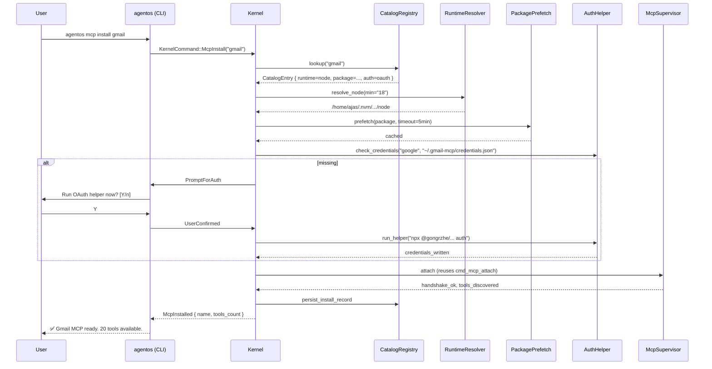
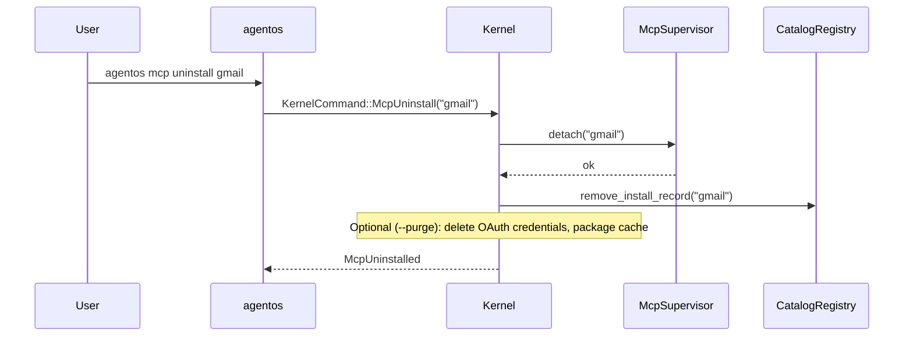
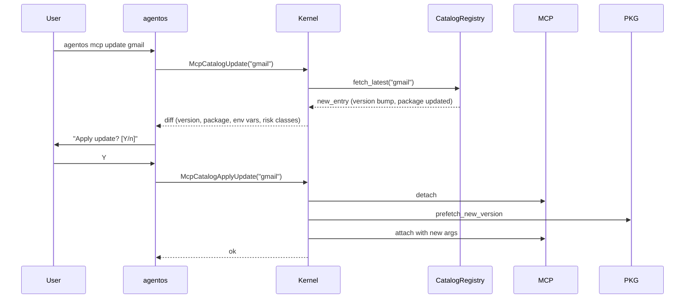

# MCP Catalog Installer — Data Flow

> Request flow and error branches for `agentos mcp install <name>`.

---

## Happy path



---

## Error branches

### 1. Unknown server name

```
User: agentos mcp install foo
Kernel:
  CatalogRegistry::lookup("foo") -> None
Response: Error { message: "No catalog entry 'foo'. Try: agentos mcp catalog search <keyword>" }
```

### 2. Community-tier entry without `--unsafe-allow-community`

```
Interactive mode:
  "Package 'xyz' is community-tier (not vetted). Install anyway? [y/N]"
  If N -> abort with audit event McpInstallRejected { reason: trust_tier }
Non-interactive (--yes without --unsafe-allow-community):
  Abort with explicit error recommending the flag.
```

### 3. Runtime not found or version too low

```
RuntimeResolver::resolve_node(min="18"):
  - nvm: v12.22.9 (too old)
  - volta: not installed
  - asdf: not installed
  - system: not found
Response: Error {
  message: "Need node >= 18 for 'gmail'. Install with: agentos runtime install node@20,
            or pass --runtime-binary /path/to/node"
}
```

### 4. Package prefetch fails

```
PackagePrefetch::npx("-y", "@gongrzhe/..."):
  process exits non-zero, stderr: "404 Not Found"
Response: Error {
  message: "Failed to fetch '@gongrzhe/server-gmail-autoauth-mcp': 404 Not Found.
            Check catalog entry version or npm registry access."
}
```

### 5. OAuth helper abandoned (Ctrl+C mid-flow)

```
AuthHelper::run_helper():
  Detects subprocess exit code != 0
  Verifies credentials_path still missing
Response: Error {
  message: "OAuth flow was not completed. Run 'agentos mcp install gmail' again."
}
Audit: McpAuthAborted { name: "gmail" }
Clean up: no partial state left behind.
```

### 6. Handshake succeeds but tools/list is empty

```
McpSupervisor::list_tools -> Ok([])
Treat as warning, not error. Install succeeds, CLI prints:
  "⚠️  Attached but no tools discovered. The server may require
   additional configuration — check its docs or run:
   agentos mcp call <tool_name> <input>"
```

---

## Uninstall flow



---

## Catalog update flow



Only runs on user command — no silent auto-update.

---

## Related

- [[MCP Catalog Installer Plan]]
- [[MCP Catalog Installer Research]]
- [[01-runtime-resolver]]
- [[04-install-command]]
