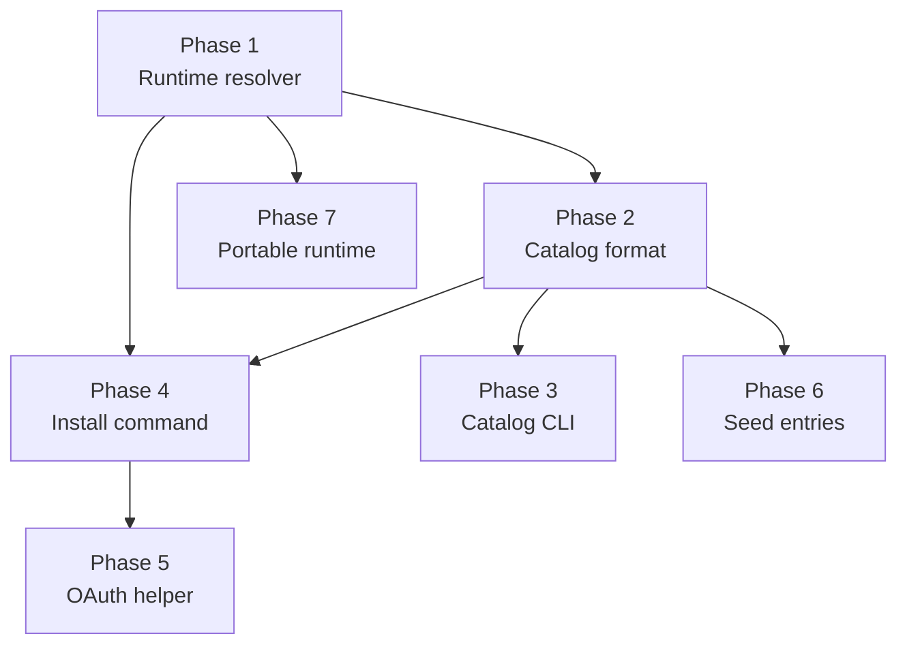

# MCP Catalog & One-Command Installer

> Reduce MCP server attachment from a 6-step manual process to `agentos mcp install <name>`, with runtime auto-detection and OAuth flow helpers.

---

## Why this matters

The current `agentos mcp attach` flow requires the user to:

1. Discover the npm/pypi package name.
2. Install it globally (or know how `npx -y` works).
3. Find the resulting binary path (breaks with nvm/volta/asdf).
4. Handle runtime version mismatches (e.g. system node v12 vs nvm v20).
5. Run any OAuth helper out-of-band and place credentials in the right path.
6. Construct a long `agentos mcp attach ... -- <binary> <args>` command with correct env vars.

Failure in any step surfaces as `"MCP server closed connection unexpectedly"` — which, until the stderr-capture fix landed, hid the real cause.

**Goal:** make attaching a well-known MCP server a one-liner, matching the UX that Claude Desktop / Cursor / Smithery offer, while keeping AgentOS's trust-tier and capability model intact.

---

## Current state

| Component | State | File |
|-----------|-------|------|
| `mcp attach` CLI | ✅ Works; requires explicit command + path | [[agentos-mcp-runtime-attach]] |
| `PluginRegistry` | ✅ Loads `plugins/core/*.toml` for channel plugins | `crates/agentos-kernel/src/plugin_registry.rs` |
| Stdio transport | ✅ Captures stderr (fixed 2026-04-18) | [[01-stderr-capture-fix]] (prior work) |
| Runtime detection | ❌ Missing — relies on inherited `PATH` | — |
| MCP catalog format | ❌ Missing | — |
| One-command install | ❌ Missing | — |
| OAuth helper flow | ❌ Must be run manually | — |
| Portable runtime install | ❌ Missing | — |

---

## Target architecture

```
  User:  agentos mcp install gmail
         │
         ▼
  ┌──────────────────────┐
  │ CLI: cmd_mcp_install │
  └──────────┬───────────┘
             │ load catalog entry
             ▼
  ┌──────────────────────┐      ┌─────────────────────┐
  │ McpCatalogRegistry   │────▶ │ plugins/mcp-catalog │
  │  (plugins + user)    │      │  ~/.agentos/catalog │
  └──────────┬───────────┘      └─────────────────────┘
             │
             ▼
  ┌──────────────────────┐
  │ RuntimeResolver      │  nvm → volta → asdf → bundled → system
  │  (node / python)     │
  └──────────┬───────────┘
             │
             ▼
  ┌──────────────────────┐
  │ PackagePrefetch      │  npx -y … ; pip install --user …
  └──────────┬───────────┘
             │
             ▼
  ┌──────────────────────┐
  │ AuthHelperRunner     │  if OAuth helper configured AND creds missing:
  │                      │    run interactive helper with browser
  └──────────┬───────────┘
             │
             ▼
  ┌──────────────────────┐
  │ Existing mcp attach  │  (unchanged — same persistence path)
  │  + handshake + tools │
  └──────────────────────┘
```

---

## Phase overview

| Phase | Name | Effort | Dependencies | Detail Doc | Status |
|-------|------|--------|-------------|------------|--------|
| 1 | Runtime resolver (node/python detection) | 1d | None | [[01-runtime-resolver]] | planned |
| 2 | MCP catalog format & registry | 1.5d | Phase 1 | [[02-catalog-format-and-registry]] | planned |
| 3 | Catalog CLI (list / search / info) | 0.5d | Phase 2 | [[03-catalog-cli-commands]] | planned |
| 4 | One-command install flow | 2d | Phase 1, 2 | [[04-install-command]] | planned |
| 5 | OAuth helper automation | 1d | Phase 4 | [[05-oauth-helper-automation]] | planned |
| 6 | Seed catalog entries (gmail, github, filesystem, …) | 1d | Phase 2 | [[06-seed-catalog-entries]] | planned |
| 7 | Portable runtime installer (stretch) | 1-2d | Phase 1 | [[07-portable-runtime-installer]] | planned |

---

## Phase dependency graph



---

## Key design decisions

1. **Catalog is TOML, not JSON.** Matches every other AgentOS manifest format (`plugin.toml`, `SKILL.toml`, `tools/*/*.toml`). No special format churn.
2. **Two catalog sources.** Built-in at `plugins/mcp-catalog/*.toml` (embedded via `rust-embed`), user-extensible at `~/.agentos/mcp-catalog/*.toml`. Users can override by ID.
3. **Trust tier on catalog entries, not install-time decision.** Catalog entries declare `trust_tier = "verified"` or `"community"` at authoring time. The kernel refuses to install `"community"` without `--unsafe-allow-community` (or interactive confirmation). Prevents malicious drive-by installs.
4. **Runtime resolver is ordered, explicit, and logged.** Priority: bundled → nvm → volta → asdf → system. Logs chosen binary + version. Fails loudly if version mismatch, suggests `agentos runtime install <name>` remediation.
5. **Install command reuses existing `mcp attach` path.** Under the hood, `mcp install` resolves catalog entry → runtime binary → auth helpers → credentials, then calls `cmd_mcp_attach` with the fully-resolved args. No duplicate logic.
6. **OAuth helper runs in foreground with clear prompt.** Interactive by default; non-interactive `--yes` flag skips auth prompts and fails if credentials missing. Never silently backgrounds a browser flow.
7. **No auto-update of installed servers at boot.** Persistence stays as-is — kernel restores attachments from `mcp_attachments.db`. `mcp update <name>` is explicit.
8. **Package prefetch happens inside install command, not at attach time.** `npx -y` first-run latency of 30-60s must not hit the kernel's attach timeout. Prefetch uses a long timeout, attach uses the normal 30s.
9. **Catalog entries can declare `risk_class` per tool.** Overrides the default `ExecCapable` for known-read-only operations (e.g. `search_emails = "readonly_external"`), so ApprovalHook prompts less aggressively.
10. **Smithery compatibility is Phase 7+.** Not in the critical path. Convert `smithery.yaml` entries to AgentOS catalog format via a converter tool.

---

## Risks

| Risk | Mitigation |
|------|------------|
| Catalog drift — package name changes break installs | Version-pin in catalog entries; `mcp update` shows diff before applying |
| Malicious community-tier entries executed | Trust-tier enforcement; interactive confirmation; Ed25519 signatures on `"verified"` entries (reuse existing signing infra from `agentos-tools/src/signing.rs`) |
| Runtime resolver picks wrong node version (e.g. nvm alias default points at old release) | Log the chosen path + version; allow explicit `--runtime-binary /path/to/node` override on install |
| OAuth helper leaves unfinished state on Ctrl+C | Helper runs in subprocess; on interrupt, delete partial creds file, log audit event, exit cleanly |
| npx prefetch fills disk | Cache under `~/.agentos/mcp-cache/` with TTL + size cap (default 2 GB); `agentos mcp prune` to clear |
| Catalog author typos `binary` field | Install dry-run resolves and prints the full command; user confirms before attach |
| Bundled runtime adds binary bloat to agentos tarball | Portable runtime (Phase 7) is opt-in; default install paths assume host-managed node/python |

---

## Related

- [[MCP Catalog Installer Research]] — research synthesis backing these decisions
- [[MCP Catalog Installer Data Flow]] — request flow + error paths
- [[agentos-mcp-runtime-attach]] — current attach CLI (foundational)
- [[agentos-mcp-persistence-secrets]] — attachment persistence layer (reused)
- `crates/agentos-mcp/src/supervisor.rs` — handshake + tools/list (unchanged)
- `crates/agentos-mcp/src/transport/stdio.rs` — stderr capture landed 2026-04-18
