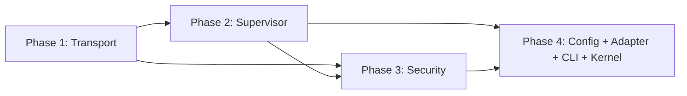

# MCP Client Hardening Plan

> Harden the `agentos-mcp` crate from a 600-line prototype into a production-grade tool extensibility layer with dual transport (stdio + Streamable HTTP), supervised lifecycle, security hardening, and full audit trail.

## Why This Matters

MCP is converging as the industry standard for tool interoperability. The current implementation is stdio-only, has no health monitoring, no audit trail, and no output sanitization. Four half-built extensibility paths (WASM, SDK, registry, MCP) means none are production-grade. This plan makes MCP the primary extensibility mechanism and makes it robust.

## Current State

| Component | Status | Location |
|-----------|--------|----------|
| Stdio transport | Working (basic) | `crates/agentos-mcp/src/client.rs` |
| HTTP transport | Missing | — |
| Auto-reconnect | Single retry | `crates/agentos-mcp/src/handle.rs` |
| Health monitoring | None | — |
| Output sanitization | None | — |
| Injection scanning | None (scanner exists in kernel) | `crates/agentos-kernel/src/injection_scanner.rs` |
| Audit trail | None | — |
| Per-server config | name/command/args only | `crates/agentos-kernel/src/config.rs:871` |
| Rate limiting | None | — |
| Boot parallelism | Sequential | `crates/agentos-kernel/src/kernel.rs:1711` |
| Runtime hot-add/remove | None | — |

## Target Architecture

```
+------------------------------------------+
|  Adapter Layer (McpToolAdapter)          |  AgentTool bridge
+------------------------------------------+
|  Security Layer (McpSecurityGate)        |  Output validation, audit, rate limit
+------------------------------------------+
|  Supervisor Layer (McpSupervisor)        |  Health, backoff, state machine
+------------------------------------------+
|  Transport Layer (McpTransport trait)    |  Stdio / Streamable HTTP
+------------------------------------------+
```

All layers are modules within the existing `agentos-mcp` crate.

## Phase Overview

| Phase | Name | Effort | Dependencies | Detail Doc | Status |
|-------|------|--------|-------------|------------|--------|
| 1 | Transport layer | 1.5d | None | [[01-transport-layer]] | planned |
| 2 | Supervisor layer | 1.5d | Phase 1 | [[02-supervisor-layer]] | planned |
| 3 | Security layer | 1d | Phase 1, 2 | [[03-security-layer]] | planned |
| 4 | Config, adapter, CLI, kernel wiring | 1d | Phase 1, 2, 3 | [[04-config-adapter-cli-kernel]] | planned |

## Phase Dependency Graph



## Key Design Decisions

1. **Layered modules, not new crates** — all four layers stay inside `agentos-mcp` to avoid workspace bloat and circular dependency issues.
2. **Transport trait with error-type contract** — `McpTransportError::Connection` triggers reconnect, `Protocol` does not. This is the critical interface between transport and supervisor.
3. **Supervisor replaces McpServerHandle** — the handle's single-retry approach is replaced by a proper state machine with exponential backoff and health monitoring.
4. **Security gate wraps every call** — output sanitization, injection scanning, and audit logging are mandatory, not opt-in.
5. **Config-inferred transport** — `command` field = stdio, `url` field = HTTP, both = error. No explicit transport type field.
6. **reqwest for HTTP** — already a workspace dependency, no new external crates.

## Risks

| Risk | Mitigation |
|------|------------|
| `reqwest` adds compile-time weight | Already in workspace dep graph |
| Streamable HTTP spec less battle-tested | Stdio remains default; HTTP opt-in |
| Health loop adds background load | Configurable interval, lightweight `tools/list` |
| Hot-add/remove concurrency | `RwLock<HashMap>`, state machine prevents invalid transitions |
| Rate limiting clock precision | `tokio::time::Instant` sliding window |

## Related

- Design spec: `docs/superpowers/specs/2026-03-30-mcp-client-hardening-design.md`
- Current MCP crate: `crates/agentos-mcp/`
