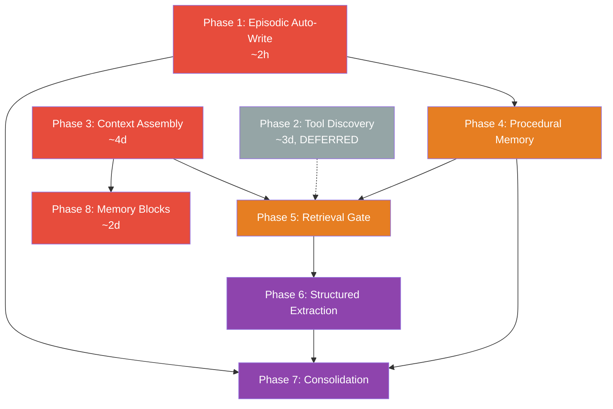

# Memory & Context Architecture — Master Plan

> A tiered memory system with dynamic context assembly and adaptive retrieval — transforming AgentOS from static context loading to intelligent context engineering.

---

## Why This Matters

Research demonstrates that **selective context loading outperforms full-context approaches by 20–90% on accuracy while cutting token costs by 85–98%**. Every major AI lab has independently converged on the same architecture: tiered memory + dynamic context assembly + adaptive retrieval. This plan implements that architecture in AgentOS.

See [[Memory Context Research Synthesis]] for the full research synthesis.

---

## Current State

| Component | Status | What Exists |
|-----------|--------|-------------|
| Semantic memory | ✅ Done | `SemanticStore` — SQLite + FTS5 + cosine + RRF fusion (70/30), `Embedder` (384-dim MiniLM) |
| Episodic memory | ✅ Done | `EpisodicStore` — SQLite + FTS5 + ownership enforcement, `record()` API |
| Context window | ✅ Done | `ContextWindow` — 4 overflow strategies, token budget, importance/pinning, partitions |
| Context manager | ✅ Done | `ContextManager` — per-task windows, 80%/95% token pressure thresholds |
| Tool registry | ✅ Partial | `ToolRegistry` — trust tiers + Ed25519, **name-based lookup only** |
| LLM adapters | ✅ Done | `LLMCore` trait — `infer(&ContextWindow)`, streaming, health, capabilities |
| Episodic auto-write | 🟡 Partial | User prompt recorded; **no task completion/failure/tool-call recording** |
| Tool vector index | 🟠 Deferred | Deferred to V3.3+ — not needed until tool catalog exceeds ~30 tools (currently 14) |
| Procedural memory | 🔴 Missing | No skill/SOP storage |
| Context assembly | 🔴 Missing | No compiled views, no budget allocation by category |
| Retrieval gate | 🔴 Missing | No query classification |
| Memory blocks | 🔴 Missing | No per-agent self-managed memory |

---

## Target Architecture

```
┌──────────────────────────────────────────────────────┐
│                   AGENT RUN LOOP                      │
│                                                       │
│  Input → Retrieval Gate → Multi-Index Retrieval       │
│       → Context Compiler → LLM Inference              │
│       → Tool Execution → Episodic Write (async)       │
└──────────────────────────────────────────────────────┘

┌──────────────────────────────────────────────────────┐
│                 MEMORY TIERS                          │
│                                                       │
│  Working Memory     │ ContextWindow (compiled view)   │
│  Memory Blocks      │ Per-agent labeled blocks (SQL)  │
│  Semantic Memory    │ Facts/knowledge (SQLite+vector)  │
│  Episodic Memory    │ Task events/outcomes (SQLite)    │
│  Procedural Memory  │ Skills/SOPs (SQLite+vector)      │
│  Tool Registry      │ Name-based lookup (vector deferred) │
└──────────────────────────────────────────────────────┘

┌──────────────────────────────────────────────────────┐
│              BACKGROUND PROCESSES                     │
│                                                       │
│  Consolidation      │ Episodic → Procedural distill    │
└──────────────────────────────────────────────────────┘
```

---

## Implementation Order

Phases are reordered by impact. The V3.1 milestone (Phases 1, 3, 8) delivers episodic completeness, intelligent context assembly, and agent self-management in ~1 week. Later phases build on accumulated data.

| Priority | Phase | Effort | Depends On | Detail Doc |
|----------|-------|--------|------------|------------|
| 1 | Episodic Auto-Write | ~2h | — | [[01-episodic-auto-write]] |
| 2 | Context Assembly Engine | ~4d | — | [[03-context-assembly-engine]] |
| 3 | Agent Memory Self-Management | ~2d | Phase 3 | [[08-agent-memory-self-management]] |
| 4 | Adaptive Retrieval Gate | ~2d | Phases 3, 4 | [[05-adaptive-retrieval-gate]] |
| 5 | Procedural Memory Tier | ~2d | Phase 1 | [[04-procedural-memory-tier]] |
| 6 | Consolidation Pathways | ~2d | Phases 4, 6 | [[07-consolidation-pathways]] |
| 7 | Structured Memory Extraction | ~2d | Phase 5 | [[06-structured-memory-extraction]] |
| **Deferred** | Semantic Tool Discovery | ~3d | — | [[02-semantic-tool-discovery]] |

> **Phase 2 (Semantic Tool Discovery) is deferred to V3.3+.** With only 14 built-in tools, the ~23MB embedding model overhead and ONNX runtime dependency are not justified. Name-based lookup is sufficient at this scale. Revisit when the tool catalog exceeds ~30 tools. The plan in [[02-semantic-tool-discovery]] remains valid and ready to execute when needed.

### V3.1 Milestone (ship first)

Phases 1 + 3 + 8 — episodic completeness, structured context compilation, agent memory blocks.

### V3.2 Milestone (build on data)

Phases 4 + 5 — procedural memory tier, adaptive retrieval gate. Retrieval gate works without tool vector search — it routes to semantic, episodic, and procedural indexes; tool discovery queries fall through to name-based lookup.

### V3.3 Milestone (long-tail)

Phases 6 + 7 + 2 — structured extraction, consolidation pathways, and semantic tool discovery. Phase 2 is deferred here because the current 14-tool catalog doesn't justify the ~23MB embedding model overhead. Implement when tool count exceeds ~30.



**Red** = V3.1 (ship first) · **Orange** = V3.2 · **Purple** = V3.3 · **Grey** = Deferred

---

## Key Design Decisions

### 1. Embed tools at registration, not query time
Tool descriptions are static. Embedding once during `ToolRegistry::register()` avoids redundant computation. Query-time only embeds the search query (single `Embedder::embed(&[query])` call).

### 2. Compile context per LLM call (Google ADK pattern)
`ContextCompiler::compile()` builds a fresh `ContextWindow` from underlying state for **every LLM inference call**, including between tool-call cycles within a single task. `ContextManager` stays the authoritative history store; the compiler reads from it via `get_context(task_id)`. Token budgets are allocated by category: system 15%, tools 18%, knowledge 30%, history 25%, task 12%. System goes first (primacy), task goes last (recency).

### 3. ContextManager owns history, compiler builds views
The compiler does **not** replace `ContextManager`. During a single task execution with multiple tool calls, each tool-call→result pair enters `ContextManager` normally. Before each LLM inference, `ContextCompiler::compile()` reads the current state from `ContextManager::get_context()` and produces an optimized `ContextWindow`. This solves the multi-turn state problem cleanly.

### 4. Structured procedures, not code blobs
Unlike Voyager (JavaScript skills), procedural memory stores structured `Procedure` records: name, preconditions, steps, postconditions, success rate, embedding. Fits Rust's type system and is inspectable.

### 5. Heuristic retrieval gate, not LLM-based
The gate runs keyword heuristics *before* LLM inference — no extra API call. Classifies queries into: episodic, semantic, procedural, tool, or skip. Skips retrieval for ~50% of trivial inputs.

### 6. Structured extraction replaces LLM-based extraction
Phase 6 was redesigned: instead of an LLM call per tool result (doubling API costs), we extract facts from **typed tool outputs** (JSON schemas are already registered via `SchemaRegistry`) and let agents explicitly write memories via Phase 8 tools. The agent decides what's worth remembering — this matches the Letta/MemGPT finding that agent-driven memory management outperforms framework-imposed heuristics.

### 7. SQLite-backed memory blocks by default
Agent memory blocks (`MemoryBlockStore`) use SQLite as the default persistence backend, not in-memory with optional persistence. In-memory mode is test-only. Agents accumulate state across conversations, so blocks must survive kernel restarts.

### 8. Async episodic writes, never block the agent loop
Episodic memory writes on task completion/failure happen via `tokio::task::spawn_blocking` since `EpisodicStore` uses `Mutex<Connection>`. The agent loop never waits for a write to complete.

---

## Risks

| Risk | Mitigation |
|------|-----------|
| Embedding model quality bounds search quality | 384-dim MiniLM is adequate; upgrade path to larger models is straightforward via `Embedder` abstraction |
| Consolidation quality depends on LLM abstraction | Minimum 3 similar episodes required; configurable via `ConsolidationConfig` |
| Token budget percentages need tuning per model | Config-driven (`[context.budget]` in `config/default.toml`); easy to adjust without code changes |
| Compiler adds latency on every LLM call | Compilation is CPU-only (no I/O); budgets are simple arithmetic on entry counts/sizes |
| Embedder becomes hard dependency in hot path | Embedder used at retrieval time (Phase 5) for semantic/episodic/procedural search, never in the inference critical path. Tool discovery (Phase 2) deferred — no embedder dependency on tool registration |

---

## Related

- [[Memory Context Research Synthesis]] — source research synthesis
- [[Memory Context Data Flow]] — data flow diagram
- [[05-Episodic Memory Completion]] — existing Phase 5.1 gap doc
- [[Memory Context Architecture Plan]] — this document
