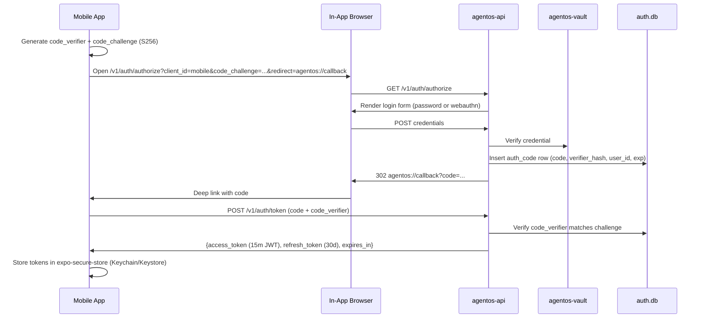
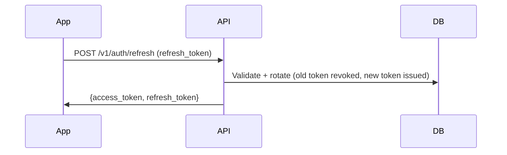
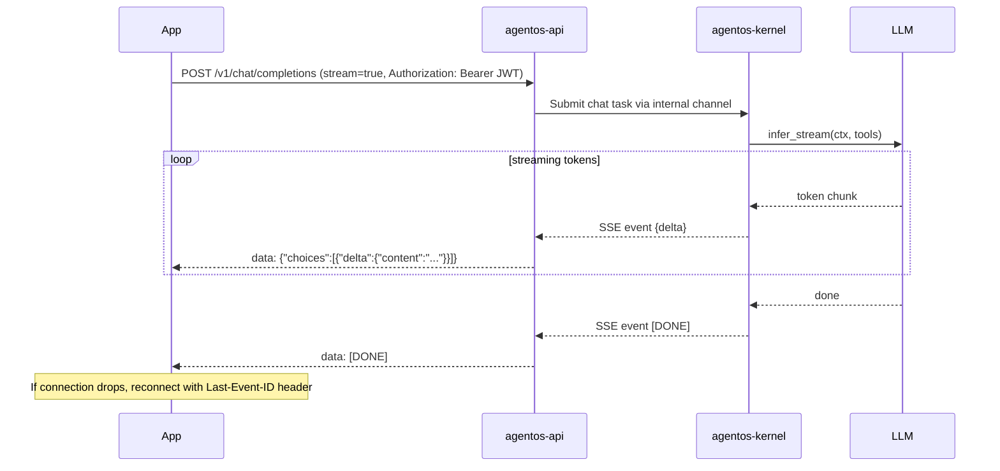
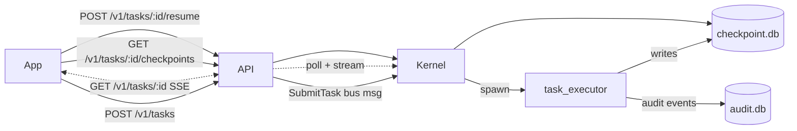
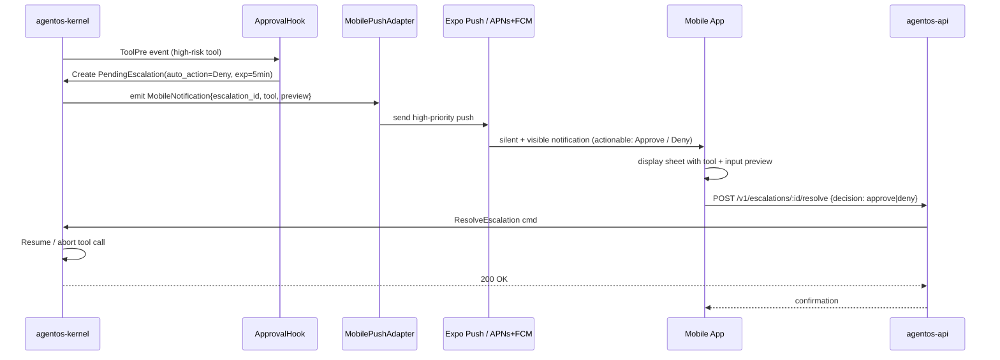
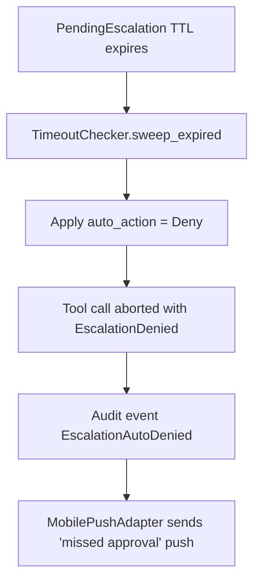
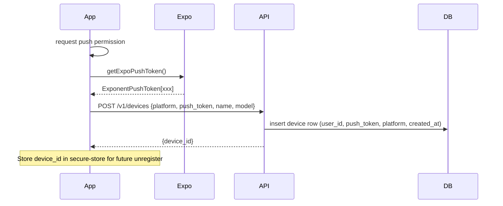

# Mobile App Data Flow

> Data and control flow diagrams covering auth, chat, task execution, pipeline creation, and push-based approvals for the mobile client ↔ cloud AgentOS.

---

## 1. Authentication (OAuth2 + PKCE)



Access-token refresh (silent, on 401 or near-expiry):



## 2. Chat (SSE)



## 3. Task execution + checkpoint monitoring



## 4. Pipeline creation + run

```mermaid
sequenceDiagram
    participant App
    participant API
    participant Kernel as agentos-kernel
    participant Pipe as agentos-pipeline

    App->>API: POST /v1/pipelines {name, steps:[...]} (JSON)
    API->>Kernel: CreatePipeline cmd
    Kernel->>Pipe: store definition
    Kernel-->>API: {pipeline_id}
    API-->>App: 201 {id, name, ...}

    App->>API: POST /v1/pipelines/:id/run
    API->>Kernel: RunPipeline cmd
    Kernel->>Pipe: execute
    loop each step
        Pipe->>Kernel: submit AgentTask
        Kernel-->>Pipe: result
    end
    Pipe-->>Kernel: PipelineRunComplete
    App<-.->API: GET /v1/pipelines/:id/runs/:run_id (SSE for live progress)
```

## 5. Approval workflow (the flagship mobile UX)



Fallback path (approval not delivered within 5 min):



## 6. Device registration



## Related

- [[Mobile App Plan]]
- [[Mobile App Research]]
- [[01-cloud-deployment-foundation]]
- [[02-mobile-oauth2-auth-layer]]
- [[03-device-registration-and-push-relay]]
- [[09-approval-workflow-ux]]
