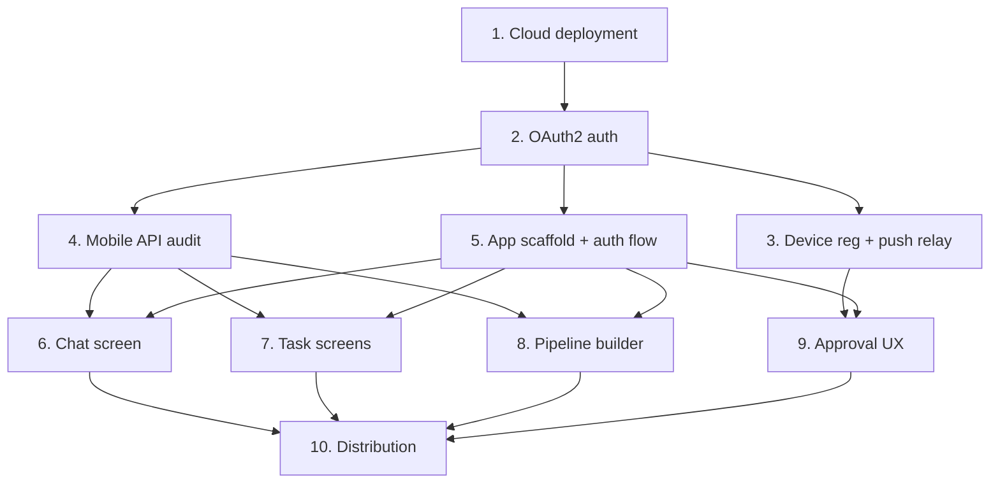

# Mobile App Plan

> A cross-platform mobile control plane for AgentOS — chat with agents, manage tasks, build and run workflows, approve escalations, and monitor the ecosystem from a phone, backed by a cloud-hosted AgentOS instance.

---

## Why this matters

AgentOS today has a CLI, a REST API, and a web UI. None of these are usable on a phone. The highest-leverage mobile use cases are:

1. **Approvals on the go** — escalations (Phase 6 Interactive Approvals) block task execution until a human decides. Push notifications + a one-tap approve/deny UI removes the single biggest mobile friction point.
2. **Ambient chat** — mobile is the dominant interface for conversational workflows; SSE already exists in `agentos-api`.
3. **Task/workflow monitoring** — durable checkpoints and pipeline runs need a glanceable status surface.
4. **Cloud multi-tenancy** — once AgentOS runs as a cloud service, a mobile client is the natural front door.

The backend already has most of the primitives (REST API, SSE streaming, channel system, push-capable escalation). The mobile project is primarily a **client + auth + push relay** effort, not a backend rewrite.

## Current state

| Component | Status | Gap for Mobile |
|-----------|--------|---------------|
| `agentos-api` REST surface | 50 endpoints, SSE chat streaming | No OAuth2 / refresh tokens — only HMAC API keys |
| `agentos-web` WebUI | HTMX + Pico CSS, server-rendered | Not responsive for phones; no PWA manifest |
| `agentos-channels` | 10 adapters (discord, slack, telegram, …) | No APNs/FCM push relay for mobile clients |
| Deployment | Local Unix socket kernel | No Docker image, no cloud reference deploy |
| Auth | `HMAC-SHA256` API keys | Keys unusable in mobile UX — need token exchange |
| Approval UX | CLI / web only | No push-notification → approve/deny flow |
| Pipeline builder | WebUI builder (HTMX) | No JSON-first API contract for mobile builder |

## Target architecture

```
┌─────────────────────────┐       ┌──────────────────────────────┐
│  Mobile App (RN/Flutter)│       │  AgentOS Cloud Instance       │
│  ───────────────────────│       │  ──────────────────────────── │
│  • Auth (OAuth2+PKCE)   │◀────▶ │  agentos-api                  │
│  • Chat (SSE)           │  TLS  │    ├─ /v1/auth/*  (NEW)       │
│  • Tasks / Workflows    │       │    ├─ /v1/chat/completions    │
│  • Approvals            │       │    ├─ /v1/tasks/*             │
│  • Push registration    │       │    ├─ /v1/pipelines/*         │
└─────────────────────────┘       │    └─ /v1/devices/*  (NEW)    │
            ▲                     │                                │
            │ APNs / FCM          │  agentos-kernel                │
            └─────────────────────┤    └─ HookRegistry             │
                                  │        └─ MobilePushHook (NEW) │
                                  │                                │
                                  │  agentos-channels              │
                                  │    └─ MobilePushAdapter (NEW)  │
                                  └──────────────────────────────┘
```

## Phase overview

| Phase | Name | Effort | Dependencies | Detail Doc | Status |
|-------|------|--------|-------------|------------|--------|
| 1 | Cloud deployment foundation | 3d | None | [[01-cloud-deployment-foundation]] | planned |
| 2 | Mobile OAuth2 auth layer | 4d | Phase 1 | [[02-mobile-oauth2-auth-layer]] | planned |
| 3 | Device registration & push relay | 3d | Phase 2 | [[03-device-registration-and-push-relay]] | planned |
| 4 | Mobile API surface audit | 2d | Phase 2 | [[04-mobile-api-surface-audit]] | planned |
| 5 | Mobile app scaffold & auth flow | 4d | Phase 2 | [[05-mobile-app-scaffold-and-auth]] | planned |
| 6 | Agent chat screen (SSE) | 3d | Phase 4, 5 | [[06-agent-chat-screen-sse]] | planned |
| 7 | Task management screens | 4d | Phase 4, 5 | [[07-task-management-screens]] | planned |
| 8 | Workflow / pipeline builder | 5d | Phase 4, 5 | [[08-workflow-pipeline-builder]] | planned |
| 9 | Approval workflow UX | 3d | Phase 3, 5 | [[09-approval-workflow-ux]] | planned |
| 10 | Distribution & release | 3d | Phases 5-9 | [[10-distribution-and-release]] | planned |

## Phase dependency graph



## Key design decisions

1. **Stack: React Native + TypeScript.** Rationale: largest ecosystem for the team's primary language (JS/TS), excellent SSE/WebSocket libs, EAS handles native builds, easy push integration via Expo Notifications. Flutter is a close second but locks us into Dart. Native Swift/Kotlin is rejected — 2× the surface area for a thin client.
2. **Auth: OAuth2 Authorization Code + PKCE, with JWT access + refresh tokens.** Rationale: API keys cannot be pasted into mobile onboarding; refresh tokens enable long-lived sessions. The existing HMAC API-key machinery stays for CLI/machine clients — mobile auth is additive.
3. **Push: provider-agnostic relay.** The kernel emits a `MobileNotification` event; a `MobilePushAdapter` in `agentos-channels` translates to APNs or FCM via a pluggable transport. Expo Push Service is the default transport (no Apple/Google credentials needed in dev) with a direct APNs/FCM option for prod.
4. **Pipeline builder: JSON-first API, not HTML fragments.** Mobile builder posts a `PipelineDefinition` JSON. Server accepts both the HTMX form (web) and JSON (mobile/CLI). No HTML scraping on mobile.
5. **Offline mode: deferred.** Mobile app is **online-only** in v1. SQLite local caching for recent data (read-through) is planned for v2. Rationale: agent state is inherently server-side; offline task execution is out of scope.
6. **Packaging: Docker image + docker-compose reference.** Cloud deployment is documented via a single `Dockerfile` in the repo root + `deploy/docker-compose.yml`. Users self-host; no hosted SaaS in v1.
7. **Single repo, separate mobile directory.** Mobile app lives in `mobile/` inside the agos monorepo — shared OpenAPI types, atomic PRs across backend + mobile. A separate repo would fragment the contract.

## Risks

| Risk | Likelihood | Impact | Mitigation |
|------|-----------|--------|------------|
| Apple/Google app-store review friction | High | Delays launch | Use Expo EAS + start store registration in parallel with dev; first release is TestFlight/internal-track only |
| OAuth2 implementation bugs leak tokens | Medium | Critical (auth compromise) | Use a vetted library (`oauth2` crate server-side, `expo-auth-session` client); threat-model review before public release |
| Mobile SSE over flaky networks | High | Degraded chat UX | Use reconnect-with-backoff; fallback to WebSocket transport if SSE proves unreliable; buffer last event ID |
| Push delivery unreliable on Android (Doze) | Medium | Approvals time out | Use high-priority FCM messages for escalations; surface missed approvals in-app on resume |
| API surface drift between web and mobile | Medium | Bugs, inconsistency | Generate a single OpenAPI spec from `agentos-api`; mobile client is code-generated from it |
| Cloud deploy exposes kernel to the internet | High | Critical | Kernel stays behind `agentos-api`; API does TLS + authN + rate limit; document reverse-proxy reference deploy |

## Out of scope (v1)

- Offline task execution
- Agent-building / tool-authoring on mobile
- Voice input / TTS (could reuse Phase 7 WebSearch ecosystem later)
- Multi-user / organization management (single tenant per deploy in v1)
- Biometric-gated approvals (Face ID / Touch ID) — defer to v2 hardening

## Related

- [[WebUI Redesign Plan]] — web counterpart; share API design where possible
- [[OpenClaw-Inspired Improvements]] — Phase 6 approvals is the push-notification target
- [[Task Checkpointing]] — checkpoint list + resume are mobile-friendly entry points
- [[Multi-Agent Coordination Plan]] — sub-agent streaming may feed mobile chat later
- [[Mobile App Data Flow]] — architecture diagrams
- [[Mobile App Research]] — stack selection rationale, comparable products
