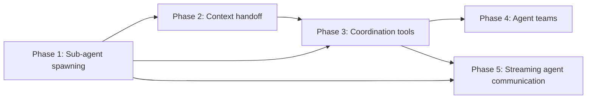

# Multi-Agent Coordination Plan

> **For agentic workers:** REQUIRED SUB-SKILL: Use superpowers:subagent-driven-development (recommended) or superpowers:executing-plans to implement this plan task-by-task. Steps use checkbox (`- [ ]`) syntax for tracking.

> Enable agents to spawn sub-agents, delegate tasks, pass context, and form coordinated teams — the feature that most justifies calling AgentOS an OS.

---

## Why This Matters

AgentOS currently runs agents in isolation. A task starts, an LLM reasons, tools execute, the task ends. There is no mechanism for an agent to say "I need a specialist for this subtask" or "run these three things in parallel and give me the results."

Every serious agentic system — AutoGen, CrewAI, LangGraph — has multi-agent coordination as a first-class primitive. Without it, AgentOS is a single-agent runner with good infrastructure. With it, AgentOS becomes an OS in the truest sense: processes (agents) that fork, communicate, synchronize, and terminate.

The key invariant is **capability scoping**: a child agent can never hold permissions that exceed its parent's. This is the `fork()` security model — inheritance only, never escalation.

---

## Current State

| Component | What Exists | Limitation |
|-----------|-------------|------------|
| `AgentMessageBus` | Agent-to-agent messaging | Fire-and-forget only; no task delegation |
| `CreateAgentGroup` | Named groups of agents | No coordinator/worker roles, no shared context |
| `BroadcastToGroup` | Message to all group members | No response aggregation |
| `CapabilityEngine` | HMAC-signed capability tokens | No token scoping/inheritance |
| `TaskScheduler` | Task queue + execution | No parent-child task relationships |
| `ContextManager` | Per-task context windows | No context slicing or handoff |

---

## Target Architecture

```
Parent Task (Coordinator)
├── spawns SpawnSubAgent command
│   ├── capability_scope = parent_caps ∩ requested_caps
│   ├── context_slice = selected messages from parent context
│   └── result_injection = "on_complete" | "on_demand"
│
├── Child Task A (specialist agent)
│   └── runs independently, writes result to SubAgentResult store
│
├── Child Task B (parallel)
│   └── runs independently
│
└── AwaitSubAgents([task_a_id, task_b_id])
    └── injects child results into parent context window
        └── parent LLM continues with combined results
```

---

## Phase Overview

| Phase | Name | Effort | Dependencies | Detail Doc | Status |
|-------|------|--------|-------------|------------|--------|
| 1 | Sub-agent spawning | 2d | None | [[01-sub-agent-spawning]] | complete |
| 2 | Context handoff | 2d | Phase 1 | [[02-context-handoff]] | complete |
| 3 | Coordination tools | 2d | Phase 1, 2 | [[03-coordination-tools]] | complete |
| 4 | Agent teams | 1.5d | Phase 1, 2, 3 | [[04-agent-teams]] | complete |
| 5 | Streaming agent communication | 2d | Phase 1, 3 | [[05-streaming-agent-communication]] | partial |

---

## Phase Dependency Graph



---

## Key Design Decisions

1. **Parent task suspends during child execution** — simpler than full async coordination; parent's context window is frozen while children run. Avoids race conditions on shared context. Async/parallel execution deferred to Phase 4.

2. **Capability inheritance only, never escalation** — child capabilities are the intersection of parent capabilities and what the child requests. The `CapabilityEngine` enforces this at token issuance, not just at runtime.

3. **Results injected as tool output messages** — child results enter the parent context as a synthetic tool call/response pair, preserving the existing context window format and LLM reasoning flow.

4. **No new IPC** — sub-agent spawning goes through the existing `KernelCommand` dispatch path, not a new bus channel. The kernel is the coordinator.

5. **Coordination tools are first-class tools** — `spawn_agent`, `delegate_task`, `await_agents` are implemented as `AgentTool` instances registered in the tool registry, not special kernel magic. This means they appear in the LLM's tool list naturally.

---

## Risks

| Risk | Mitigation |
|------|-----------|
| Infinite spawn loops (agent spawns itself) | Depth limit (max 5) enforced at `SpawnSubAgent` handler |
| Capability escalation via chained spawns | Intersection-only at each hop — depth N child has parent^N caps |
| Context explosion (large child results) | Result truncation at 8KB; full result stored in episodic memory |
| Orphaned child tasks if parent is cancelled | `CancelTask` cascades to all children via `child_task_ids` tracking |
