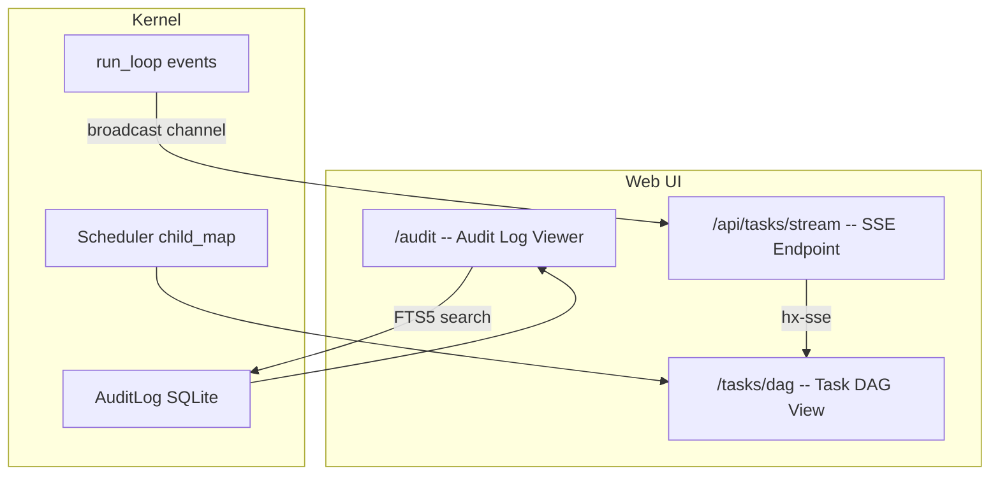
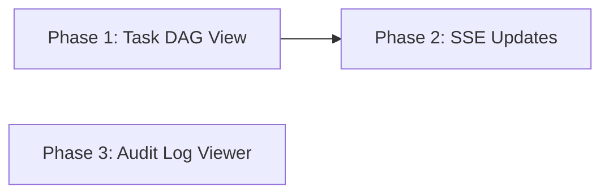

# Observability Uplift

> Add a task DAG viewer, real-time SSE event stream, and audit log explorer to the web UI so operators can observe multi-agent execution, debug failures, and audit system behavior visually.

---

## Why This Matters

AgentOS has 83+ audit event types, a parent-child task DAG (`scheduler.child_map`), and rich task metadata -- but no way to visualize any of it. The web UI (`agentos-web`) currently shows static task lists and agent status pages. Competing frameworks have LangSmith (LangGraph), AutoGen Studio, and CrewAI's monitoring dashboard.

For multi-agent coordination, observability is essential: a coordinator spawning 5 sub-agents across 3 rounds produces a complex execution tree that is impossible to debug from CLI log output alone.

## Current State

| Component | Current Behavior |
|-----------|-----------------|
| Web UI stack | Axum + HTMX + Pico CSS + Alpine.js; server-rendered templates via `minijinja` |
| Task pages | `/tasks` (list), `/tasks/{id}` (detail), `/tasks/{id}/trace` (trace page), `/tasks/{id}/logs/stream` (SSE log stream) |
| Audit log | 83+ event types in `agentos-audit`; SQLite with FTS5; HMAC chain integrity |
| Task DAG data | `scheduler.child_map: RwLock<HashMap<TaskID, Vec<TaskID>>>` tracks parent-child relationships |
| Notification SSE | `AppState.notification_tx: broadcast::Sender<NotificationSsePayload>` exists for notification push |
| Real-time task events | No SSE endpoint for task state changes; log stream exists but is per-task only |
| Audit UI | No audit log viewer in web UI; only `agentos audit list` CLI command |

## Target Architecture

## Phase Overview

| Phase | Name | Effort | Dependencies | Detail Doc | Status |
|-------|------|--------|-------------|------------|--------|
| 1 | Task DAG view | 2d | None | [[01-task-dag-view]] | planned |
| 2 | Real-time SSE updates | 2d | Phase 1 | [[02-realtime-sse-updates]] | planned |
| 3 | Audit log viewer | 2d | None | [[03-audit-log-viewer]] | planned |

## Phase Dependency Graph

Phase 3 is independent of Phases 1 and 2 and can be developed in parallel.

## Key Design Decisions

1. **DAG view is server-rendered HTML, not a JavaScript SPA.** The existing stack uses HTMX for dynamic interactions and `minijinja` for templates. Adding React or a JS framework would break the architectural consistency. HTMX `
/
` tree rendering is sufficient for hierarchical DAG display.

2. **SSE uses a new Tokio broadcast channel on `AppState`, separate from `notification_tx`.** The existing `notification_tx` carries `NotificationSsePayload` (user notifications). Task events are a different concern with different subscribers. A dedicated `task_event_tx: broadcast::Sender<TaskEvent>` avoids coupling.

3. **Audit viewer is read-only -- no write operations through web UI.** The audit log has HMAC chain integrity. Any modification would break the chain. The viewer is strictly a query interface.

4. **Color coding follows standard conventions.** Queued = grey, Running = blue, Complete = green, Failed = red, Cancelled = amber. These are applied via CSS classes on task state badges, consistent across DAG view and task list.

5. **DAG export to Mermaid format for documentation.** An API endpoint `/api/tasks/dag/mermaid` returns the current DAG as a Mermaid `graph TD` string. This lets users paste the DAG into Obsidian or GitHub issues for postmortem analysis.

## Risks

| Risk | Likelihood | Impact | Mitigation |
|------|-----------|--------|------------|
| Large DAGs overwhelm the browser | Low | Medium | Limit DAG depth to 5 levels (matches `MAX_SPAWN_DEPTH`); paginate at root level |
| SSE connection leak if clients disconnect ungracefully | Medium | Low | Use Axum's SSE with `KeepAlive` and `tokio::select!` on `CancellationToken` |
| Audit FTS5 queries slow on large databases | Low | Medium | Add pagination (50 rows/page); use `LIMIT`/`OFFSET` with indexed columns |
| Template complexity increases maintenance burden | Medium | Low | Keep templates under 150 lines each; extract shared components (task badge, state pill) |

## Related

- [[Multi-Agent Coordination Plan]]
- [[Event-Driven Completion Plan]]
- [[Task Checkpointing Plan]]
- [[Issues and Fixes]]
