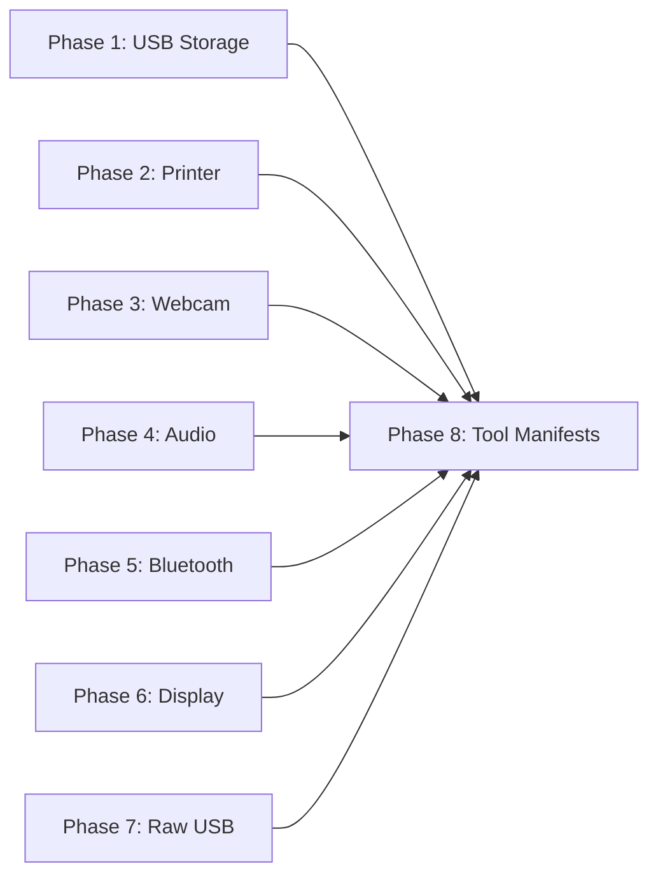

# Peripheral Device Ecosystem Plan

> Give AgentOS agents the ability to interact with real-world peripheral devices — USB drives, printers, monitors, webcams, Bluetooth devices, audio hardware, and raw USB — through a secure, approval-gated, feature-flagged HAL driver architecture.

---

## Why This Matters

AgentOS has a Hardware Abstraction Layer (HAL) with 7 drivers, but they are **read-only sysfs scrapers**. They can detect hardware but cannot control it. An agent today cannot:
- Print a document
- Mount and read files from a USB drive
- Capture a photo or record audio
- Pair a Bluetooth device
- Change display resolution

Without peripheral control, agents are limited to software-only tasks. Enabling device interaction unlocks:
- **Office automation** — print reports, scan documents
- **IoT/edge** — sensor data collection, actuator control
- **Robotics** — Bluetooth HID, USB serial communication
- **Accessibility** — audio I/O for voice agents
- **Industrial** — device inventory, monitoring, maintenance workflows

## Current State

| Capability | Status | Implementation |
|-----------|--------|---------------|
| Detect block devices (USB drives) | Working | `StorageDriver` reads `/sys/block/` metadata |
| Detect GPUs | Working | `GpuDriver` reads `/sys/class/drm/` |
| Detect thermal sensors | Working | `SensorDriver` reads `/sys/class/thermal/` |
| Network interface stats | Working | `NetworkDriver` reads `/sys/class/net/` |
| Device quarantine gate | Working | `HardwareRegistry` auto-quarantines new devices |
| HTTP outbound (APIs) | Working | `http_client.rs` with SSRF protection |
| Mount/unmount USB | Missing | No UDisks2 integration |
| Print documents | Missing | No CUPS/IPP integration |
| Webcam capture | Missing | No V4L2 integration |
| Audio capture/playback | Missing | No PipeWire integration |
| Bluetooth pairing | Missing | No BlueZ integration |
| Display configuration | Missing | No Wayland/X11 integration |
| Raw USB communication | Missing | No libusb integration |

## Target Architecture

```
                    ┌─────────────────────────────────────┐
                    │          AgentOS Kernel              │
                    │                                     │
                    │  CapabilityToken + PermissionSet     │
                    │  Device Quarantine + Audit Log       │
                    └──────────────┬──────────────────────┘
                                   │
                    ┌──────────────▼──────────────────────┐
                    │     HAL (HardwareAbstractionLayer)   │
                    │                                     │
                    │  Existing:          New (feature-gated):
                    │  ├─ SystemDriver    ├─ UsbStorageDriver
                    │  ├─ ProcessDriver   ├─ PrinterDriver
                    │  ├─ NetworkDriver   ├─ WebcamDriver
                    │  ├─ GpuDriver       ├─ AudioDriver
                    │  ├─ StorageDriver   ├─ BluetoothDriver
                    │  ├─ SensorDriver    ├─ DisplayDriver
                    │  └─ LogReaderDriver └─ RawUsbDriver
                    └──────────────┬──────────────────────┘
                                   │
                    ┌──────────────▼──────────────────────┐
                    │        Linux Subsystems              │
                    │                                     │
                    │  UDisks2 ──── D-Bus (zbus)          │
                    │  CUPS ─────── IPP over HTTP (ipp)   │
                    │  V4L2 ─────── ioctl (v4l/nokhwa)   │
                    │  PipeWire ─── Unix socket (pipewire)│
                    │  BlueZ ────── D-Bus (bluer)         │
                    │  Wayland ──── Protocol (smithay)    │
                    │  USB ──────── usbfs (nusb)          │
                    └─────────────────────────────────────┘
```

## Design Decisions

1. **Feature flags, not monolith.** Each driver is gated behind a Cargo feature (`printer`, `usb-storage`, `webcam`, etc.). Deployments opt into only what they need. Zero binary size impact for unused drivers.

2. **Dual access model: native HAL + MCP bridge.** Critical/latency-sensitive devices get native HAL drivers (this plan). Niche/third-party devices can be imported via MCP servers (see [[02-mcp-adapter]]). The two models coexist.

3. **Privacy-critical devices get mandatory consent.** Webcam and microphone access require per-session explicit user approval via the escalation manager — no silent capture allowed. This mirrors mobile OS behavior.

4. **All actions are auditable.** Every device operation (mount, print, capture, pair) emits an audit event with agent ID, device ID, action, and timestamp.

5. **Treat external content as untrusted.** Files from mounted USB drives, data from Bluetooth devices, and audio/video streams are tagged as untrusted in the context window. The injection scanner applies.

6. **D-Bus as the common transport.** UDisks2, BlueZ, and (on GNOME) display config all use D-Bus. We standardize on `zbus` as the single D-Bus crate to avoid duplicate dependencies.

7. **Safety mechanisms for physical actions.** Print jobs get rate limits. Display changes get auto-revert timeouts. USB kernel driver detachment is blocked by default.

## Phase Overview

| Phase | Name | Effort | Dependencies | Detail Doc | Status |
|-------|------|--------|-------------|------------|--------|
| 1 | USB storage (mount/read/write/eject) | 2d | None | [[01-usb-storage-driver]] | planned |
| 2 | Printer driver (CUPS/IPP) | 2d | None | [[02-printer-driver]] | planned |
| 3 | Webcam capture (V4L2) | 2d | None | [[03-webcam-driver]] | planned |
| 4 | Audio I/O (PipeWire) | 2d | None | [[04-audio-driver]] | planned |
| 5 | Bluetooth (BlueZ D-Bus) | 2.5d | None | [[05-bluetooth-driver]] | planned |
| 6 | Display configuration (Wayland/X11) | 1.5d | None | [[06-display-driver]] | planned |
| 7 | Raw USB access (libusb) | 1.5d | None | [[07-raw-usb-driver]] | planned |
| 8 | Tool manifests and agent tools | 1.5d | Phases 1-7 | [[08-peripheral-tools]] | planned |

## Phase Dependency Graph



Phases 1-7 are independent and can be implemented in parallel. Phase 8 wires all drivers into agent-facing tools.

## Risks

| Risk | Impact | Mitigation |
|------|--------|------------|
| Privacy violation (silent camera/mic) | Critical | Mandatory escalation consent per capture session |
| Filesystem exploits via mounted USB | High | Mount with `nosuid,noexec,nodev`; treat content as untrusted |
| Print queue flood (DoS) | Medium | Rate limit: max N jobs per agent per hour |
| Display config bricking | Medium | Auto-revert after 15s if not confirmed |
| Bluetooth tracking (MAC exposure) | Medium | Only scan on explicit request; time-limited discovery |
| Raw USB kernel driver detach | High | Block `detach_kernel_driver` by default; require elevated permission |
| Dependency bloat from crate additions | Low | Feature flags ensure unused drivers add zero to binary |
| Platform-specific (Linux-only) | Low | All drivers already gated behind `#[cfg(target_os = "linux")]`; matches existing HAL pattern |

## Related

- [[Peripheral Device Ecosystem Research]] — protocol details and Rust crate analysis
- [[Peripheral Device Data Flow]] — end-to-end flow diagrams
- [[01-hal-registry-enforcement]] — device quarantine gate (prerequisite, completed)
- [[09-hal-approval-workflow]] — operator approval workflow (parallel work)
- [[02-mcp-adapter]] — MCP bridge for non-native device tools
