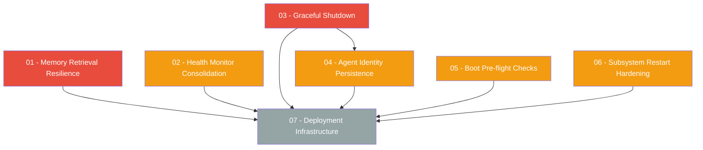

# Production Stability Fixes Plan

> Fix three critical production issues discovered through audit log analysis: memory retrieval failures on bootstrap, health monitor event spam, and kernel restart instability.

---

## Why This Matters

A 50-minute runtime audit (96 entries) revealed that the kernel cannot sustain production operation:

1. **Every event-triggered task fails** because adaptive retrieval treats empty memory stores as errors, creating a 100% failure rate for newly registered agents.
2. **Health monitor floods the audit log** with 6 DiskSpaceLow events per 30-second cycle (50+ of 96 entries), drowning actionable signals in noise.
3. **4 unclean restarts in 50 minutes** with no KernelStopped events, agent identity regenerated on each restart, and no pre-flight validation to prevent crash loops.

These are not feature gaps -- they are reliability failures that prevent the kernel from running unattended.

---

## Current State

| Area | Current Behavior | Impact |
|------|-----------------|--------|
| Memory retrieval | `Err(_) => Vec::new()` swallows errors; empty results emit `MemorySearchFailed` | 100% task failure for new agents |
| Health monitor | Per-mount DiskSpaceLow events; in-memory debounce resets on restart | 50+ noise entries per hour |
| Shutdown | `KernelShutdown` audit only on explicit `Shutdown` command; none on supervisor exit or signal | No forensic trail for crashes |
| Agent identity | `AgentID::new()` on every `cmd_connect_agent` regardless of name match | Agent UUID changes across restarts |
| Subsystem restart | Flat budget: 5 restarts in 60s, then full shutdown | No backoff, no circuit breaker |
| Boot validation | No pre-flight checks for disk space, DB integrity, or vault access | Crash loop on degraded system |

---

## Target Architecture

After these fixes, the kernel will:

- Distinguish "no data yet" from "search infrastructure broken" in memory retrieval
- Skip retrieval entirely for event-triggered bootstrap tasks where no memories can exist
- Emit a single aggregated DiskSpaceLow event per cycle with all affected mounts
- Persist debounce state to survive restarts
- Log `KernelStopped` on every shutdown path (signal, supervisor exit, panic)
- Preserve agent identity across restarts by reusing persisted AgentProfile UUIDs
- Validate system health (disk, DB, vault) before starting subsystems
- Use exponential backoff on subsystem restarts with circuit breaker protection
- Ship with a systemd unit file for production deployment

---

## Phase Overview

| Phase | Name | Effort | Dependencies | Detail Doc |
|-------|------|--------|-------------|------------|
| 01 | Memory retrieval resilience | 1.5d | None | [[01-memory-retrieval-resilience]] |
| 02 | Health monitor consolidation | 1d | None | [[02-health-monitor-consolidation]] |
| 03 | Graceful shutdown and audit trail | 1d | None | [[03-graceful-shutdown-audit-trail]] |
| 04 | Agent identity persistence | 1d | Phase 03 | [[04-agent-identity-persistence]] |
| 05 | Boot pre-flight checks | 1d | None | [[05-boot-preflight-checks]] |
| 06 | Subsystem restart hardening | 1d | None | [[06-subsystem-restart-hardening]] |
| 07 | Deployment infrastructure | 0.5d | Phases 01-06 | [[07-deployment-infrastructure]] |

---

## Phase Dependency Graph

Phases 01, 02, 03, 05, and 06 can run in parallel. Phase 04 requires Phase 03. Phase 07 is the final capstone.

---

## Key Design Decisions

1. **Empty retrieval is not an error.** A newly bootstrapped agent has no memories by definition. The retrieval executor should return a typed result that distinguishes `NoData` from `SearchError`, not silently convert errors to empty vecs.

2. **Aggregate health events, not suppress them.** Rather than silencing DiskSpaceLow entirely, consolidate all affected mount points into a single event payload. This preserves observability while eliminating noise.

3. **Persist debounce to SQLite, not a file.** The audit DB is already open at health monitor startup. A single-row table `health_debounce` is simpler and more atomic than a JSON file.

4. **Agent identity is name-keyed.** When `cmd_connect_agent` is called with a name that already exists in `agents.json`, reuse the existing `AgentID` and Ed25519 keypair rather than generating new ones. This is the minimal change that fixes the identity drift problem.

5. **Pre-flight checks run before any subsystem init.** They must not depend on the audit log, bus, or event system being up -- they write to stderr only. This prevents a cascading failure where a broken subsystem prevents reporting.

6. **Exponential backoff with jitter.** The subsystem restart delay follows `min(base * 2^attempt + jitter, max_delay)` rather than the current instant retry. This prevents thundering herd effects when multiple subsystems fail simultaneously.

7. **Systemd watchdog integration via sd_notify.** The health server already exists; we add a watchdog ping on each successful health check cycle. This lets systemd detect kernel hangs, not just crashes.

---

## Risks

| Risk | Likelihood | Impact | Mitigation |
|------|-----------|--------|------------|
| Agent identity reuse creates conflicts if two different agents share a name | Low | Medium | Check that the persisted agent profile's provider and model match before reusing; if they differ, treat it as a new agent |
| Debounce persistence adds write latency to health check cycle | Low | Low | Async write after event emission; debounce state is advisory, not critical |
| Pre-flight disk check threshold is too aggressive | Medium | Low | Make the minimum free disk configurable (default: 100 MB) |
| Systemd unit file does not match all deployment environments | Medium | Low | Provide as a template with documented overrides; Docker deployments use their own restart policies |

---

## Related

- [[24-Production Stability Fixes]] -- parent next-steps index
- [[Issues and Fixes]] -- tracked production issues
- [[Bug Fixes and Deployment Readiness Plan]] -- predecessor deployment work
