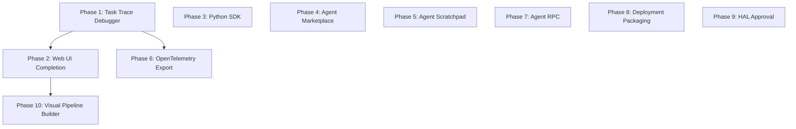

# Real World Adoption Roadmap Plan

> Transform AgentOS from a technically superior kernel into a system that real-world developers and enterprises can discover, adopt, and trust in production — informed by ecosystem research across AutoGen, CrewAI, LangGraph, and the 2025-2026 agentic AI landscape.

---

## Why This Matters

The 2025-2026 AI agent ecosystem has validated AgentOS's core thesis: the market is converging toward **OS-level infrastructure** rather than framework libraries. NotebookLM research across the agent landscape confirms:

- **Security is the #1 enterprise concern** — most frameworks bolt security on as an afterthought; AgentOS is built around it
- **Attribution Difficulty is the #1 developer pain** — when multi-step agents fail, no one can tell which step failed or why
- **Storage silos kill collaboration** — agent outputs trapped in ephemeral contexts prevent human review and iteration
- **Multi-tenancy and deployment are blockers** — technically excellent systems fail adoption if they are painful to deploy
- **Python dominates the agent developer market** — Rust-only locks out 90% of potential users

AgentOS already leads the market on security, memory, cost control, and LLM resilience. This plan closes the adoption gaps that will determine whether it reaches real users.

---

## Current State

| Capability | Status | Gap |
|-----------|--------|-----|
| Security (capability tokens, sandboxing) | Complete | None — market-leading |
| Multi-tier memory | Complete | None — ahead of competitors |
| Cost tracking + model downgrade | Complete | None — not standard in other frameworks |
| LLM fallback + circuit breaker | Complete | None |
| MCP support (client + server) | Complete | None |
| User notifications (ask-user, notify-user) | Complete | Web UI missing |
| Audit log (83+ event types) | Complete | No trace viewer, no OTel export |
| Task execution + snapshots | Complete | No time-travel debug UI |
| Web UI | Partial | Chat only; tasks/agents/notifications incomplete |
| Developer experience | Weak | No Python SDK, no quickstart, no public docs |
| Agent marketplace | Missing | Trust tier infra ready; registry layer absent |
| Multi-agent collaboration | Basic | Pub/sub only; no synchronous agent RPC |
| Deployment | Missing | No Docker, no Helm, no multi-tenancy |
| HAL device approval | Stubbed | Registry exists; access gate not wired |
| Agent scratchpad | Planned | Design docs exist; zero implementation |
| Visual workflow builder | Missing | Not designed |

---

## Target Architecture

After this roadmap, AgentOS will:

```
┌────────────────────────────────────────────────────────────────────┐
│                  AgentOS — Production Platform                     │
├────────────────────────────────────────────────────────────────────┤
│                                                                     │
│  Developer Entry Points                                            │
│  ┌──────────────┐  ┌──────────────┐  ┌──────────────────────────┐ │
│  │ CLI (Rust)   │  │ Python SDK   │  │ Visual Pipeline Builder  │ │
│  │ agentctl     │  │ agentos-py   │  │ (Web UI drag-drop)       │ │
│  └──────┬───────┘  └──────┬───────┘  └──────────┬───────────────┘ │
│         │                 │                       │                 │
│         └─────────────────┴───────────────────────┘                │
│                           │ Unix socket / HTTP                      │
│                           ▼                                         │
│  ┌──────────────────────────────────────────────────────────────┐  │
│  │ Kernel (existing — secured, cost-tracked, memory-backed)    │  │
│  └──────────────────────────────────────────────────────────────┘  │
│                           │                                         │
│  ┌──────────────────────────────────────────────────────────────┐  │
│  │ Web UI (completed)                                          │  │
│  │ - Task trace viewer with time-travel debug                  │  │
│  │ - Agent management dashboard                                │  │
│  │ - Notification inbox + ask-user response                    │  │
│  │ - Cost dashboard                                            │  │
│  │ - Visual pipeline builder                                   │  │
│  └──────────────────────────────────────────────────────────────┘  │
│                                                                     │
│  ┌──────────────────────────────────────────────────────────────┐  │
│  │ Observability Layer (new)                                   │  │
│  │ - OpenTelemetry trace export (OTLP)                         │  │
│  │ - Task execution timeline (per-iteration spans)             │  │
│  │ - Snapshot-backed time-travel replay                        │  │
│  └──────────────────────────────────────────────────────────────┘  │
│                                                                     │
│  ┌──────────────────────────────────────────────────────────────┐  │
│  │ Agent Marketplace (new)                                     │  │
│  │ - Tool/agent registry with trust tiers                      │  │
│  │ - `agentctl tool install <name>` one-command install        │  │
│  │ - Ed25519 verified community tools                          │  │
│  └──────────────────────────────────────────────────────────────┘  │
│                                                                     │
│  ┌──────────────────────────────────────────────────────────────┐  │
│  │ Multi-Agent RPC Layer (new)                                 │  │
│  │ - Synchronous agent-to-agent task delegation                │  │
│  │ - Supervisor/worker hierarchy                               │  │
│  │ - Agent handoff protocol                                    │  │
│  └──────────────────────────────────────────────────────────────┘  │
│                                                                     │
│  ┌──────────────────────────────────────────────────────────────┐  │
│  │ Deployment Packaging (new)                                  │  │
│  │ - Official Docker image (multi-arch)                        │  │
│  │ - Helm chart (Kubernetes)                                   │  │
│  │ - Multi-tenant configuration                                │  │
│  └──────────────────────────────────────────────────────────────┘  │
│                                                                     │
└────────────────────────────────────────────────────────────────────┘
```

---

## Phase Overview

| Phase | Name | Impact | Effort | Dependencies | Detail Doc | Status |
|-------|------|--------|--------|-------------|------------|--------|
| 1 | Task Trace Debugger | Critical | 4d | None | [[01-task-trace-debugger]] | planned |
| 2 | Web UI Completion | High | 6d | Phase 1 | [[02-web-ui-completion]] | planned |
| 3 | Python SDK | High | 8d | None | [[03-python-sdk]] | planned |
| 4 | Agent Marketplace | High | 5d | None | [[04-agent-marketplace]] | planned |
| 5 | Agent Scratchpad | Medium | 7d | None | [[05-agent-scratchpad-realworld]] | planned |
| 6 | OpenTelemetry Export | Medium | 3d | Phase 1 | [[06-opentelemetry-export]] | planned |
| 7 | Synchronous Agent RPC | Medium | 6d | None | [[07-agent-rpc]] | planned |
| 8 | Deployment Packaging | Medium | 3d | None | [[08-deployment-packaging]] | planned |
| 9 | HAL Device Approval | Low | 2d | None | [[09-hal-approval-workflow]] | planned |
| 10 | Visual Pipeline Builder | Low | 8d | Phase 2 | [[10-visual-pipeline-builder]] | planned |

---

## Phase Dependency Graph



Phases 3, 4, 5, 7, 8, 9 are independent and can run in parallel with each other and with Phase 1.

---

## Key Design Decisions

1. **Observability before features** — Phases 1 and 6 come first because every other feature is harder to debug without traces. Time-travel debug is the single highest-leverage investment.

2. **Python SDK without reimplementing the kernel** — The Python SDK speaks the existing Unix socket bus protocol. It is a thin client, not a new runtime. This keeps the security model intact.

3. **Marketplace uses existing trust tier infrastructure** — No new security primitives needed. The Ed25519 signing workflow already exists (`agentctl tool keygen/sign/verify`). The marketplace adds a registry index and download layer on top.

4. **Agent RPC is kernel-mediated, not direct** — Agents do not open direct TCP connections to each other. All RPC goes through the kernel bus. This preserves the security boundary and audit trail.

5. **Docker image uses release binary only** — No source or build tools in the image. The Rust binary is statically linked, making a minimal image (~15MB).

6. **Web UI uses existing Axum + HTMX stack** — No framework changes. All UI additions follow the existing Pico CSS + HTMX + Alpine.js conventions.

7. **OpenTelemetry is export-only in Phase 6** — We emit OTLP spans from existing audit log events. We do not introduce OTel SDK as a required dependency for the kernel.

---

## Real-World Problem Mapping

| Real-World Problem | Addressed By | Phase |
|-------------------|-------------|-------|
| "Why did my agent fail at step 7?" | Task trace viewer, time-travel debug | 1 |
| "I can't see what the agent is doing" | Web UI task dashboard, streaming updates | 2 |
| "I write Python, not Rust" | Python SDK | 3 |
| "I can't find good community tools" | Agent marketplace | 4 |
| "Agent loses context on long tasks" | Agent scratchpad | 5 |
| "Our Datadog/Grafana can't see agent traces" | OpenTelemetry export | 6 |
| "Agent A needs Agent B's result synchronously" | Agent RPC | 7 |
| "How do I deploy this in Kubernetes?" | Docker + Helm | 8 |
| "Hardware access needs compliance approval" | HAL device approval | 9 |
| "Our business team can't build pipelines" | Visual pipeline builder | 10 |

---

## Risks

| Risk | Likelihood | Impact | Mitigation |
|------|-----------|--------|-----------|
| Python SDK diverges from Rust type definitions | Medium | High | Generate Python types from Rust structs using pyo3 or serde-json schema at build time |
| Marketplace enables supply chain attacks on Community tools | Medium | High | Trust tier system already addresses this; marketplace adds no new trust surface |
| Agent RPC deadlocks two agents waiting on each other | Medium | Medium | Timeout + escalation on all blocking RPC calls; kernel detects circular waits |
| OTel export leaks sensitive context | Low | High | Scrub secrets from span attributes; never export raw tool inputs/outputs |
| Docker image exposes kernel socket to container network | Low | Critical | Socket is Unix domain only; bind-mount only; never TCP-exposed |

---

## Related

- [[Production Stability Fixes Plan]] — prerequisite: kernel must be stable before usability work
- [[Agent Scratchpad Plan]] — existing plan directory for scratchpad, Phase 5 builds on it
- [[User Agent Communication Plan]] — notifications + channels already complete, referenced in Phase 2
- [[LLM Adapter Redesign Plan]] — fallback/retry complete, referenced in Phase 3 Python SDK
