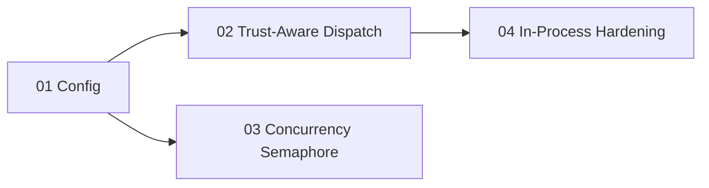

# Sandbox Execution Policy Plan

> Eliminate fork+exec overhead for trusted Core tools by introducing a trust-tier-aware execution policy that routes Core tools in-process and sandboxes only untrusted Community/Verified tools, with concurrency control to prevent thread pool exhaustion.

---

## Why This Matters

AgentOS agentic workflows fire 5-6 tool calls per LLM iteration. Currently every built-in Core tool forks a child process with seccomp sandboxing, even though these tools ship with the binary and are distribution-trusted. This creates three production-breaking problems:

1. **Fork+exec overhead**: Each sandbox child serializes a request, forks the 700MB binary, bootstraps Rust runtime, applies seccomp, builds the tool, executes, and writes JSON. Simple tools take 30-40ms, memory tools 350-430ms.
2. **Thread pool exhaustion**: 5+ parallel memory tools each init rayon's thread pool (default = num_cpus threads), exhausting OS thread limits and causing `EAGAIN` panics.
3. **ONNX model re-init**: Each sandbox child loads the 23MB AllMiniLML6V2 ONNX model from scratch, even though the kernel's `ToolRunner` already has a shared `Arc<Embedder>`.

## Current State

| Component | Current Behavior |
|-----------|-----------------|
| `sandbox_plan_for_tool()` in `task_executor.rs` | Returns `Some(SandboxConfig)` for all Inline tools with a known `ToolCategory` -- no trust tier check |
| `SandboxExecutor` in `agentos-sandbox` | No concurrency limit; spawns unlimited children via `JoinSet` |
| `SandboxExecutor::spawn()` | No `RAYON_NUM_THREADS` env var set; child inherits host default |
| `KernelConfig` | No `sandbox_policy` or `max_concurrent_sandbox_children` fields |
| In-process execution path | Has timeout and permission checks but no audit event for execution mode |

## Target Architecture

```mermaid
flowchart TD
    TC[Tool Call] --> SP{sandbox_plan_for_tool}
    SP --> |"SandboxPolicy::Always"| SB[Sandbox Child]
    SP --> |"SandboxPolicy::TrustAware + Core"| IP[In-Process via ToolRunner]
    SP --> |"SandboxPolicy::TrustAware + Community/Verified"| SB
    SP --> |"SandboxPolicy::Never"| IP
    SP --> |"Kernel-context tool (agent-list, etc.)"| IP
    SB --> SEM{Semaphore Permit}
    SEM --> |acquired| SPAWN[spawn() with RAYON_NUM_THREADS=1]
    SEM --> |backpressure| WAIT[Wait for permit]
    IP --> TIMEOUT[tokio::time::timeout]
    SPAWN --> RESULT[SandboxResult]
    TIMEOUT --> RESULT2[ToolRunner Result]
    RESULT --> AUDIT[Audit Event]
    RESULT2 --> AUDIT
```

## Phase Overview

| # | Phase | Effort | Dependencies | Detail |
|---|-------|--------|--------------|--------|
| 01 | [[01-execution-policy-config]] | 3h | None | Add `SandboxPolicy` enum to config, `max_concurrent_sandbox_children`, update `default.toml` |
| 02 | [[02-trust-aware-dispatch]] | 4h | Phase 01 | Modify `sandbox_plan_for_tool()` to check trust tier against sandbox policy |
| 03 | [[03-sandbox-concurrency-semaphore]] | 4h | Phase 01 | Add `Semaphore` to `SandboxExecutor`, set `RAYON_NUM_THREADS=1` in child env |
| 04 | [[04-in-process-safety-hardening]] | 3h | Phase 02 | Audit logging for execution mode, tracing spans, cancellation propagation verification |

## Phase Dependency Graph



Phases 02 and 03 can execute in parallel after Phase 01.

## Key Design Decisions

1. **Core tools run in-process by default** -- `TrustTier::Core` tools are compiled into the binary, already validated at build time, and the kernel's `ToolRunner` already has defense-in-depth permission checks. The security benefit of sandboxing them is minimal compared to the 10-30x performance cost.

2. **Configurable via `sandbox_policy`** -- Three modes: `trust_aware` (default, Core=in-process), `always` (current behavior, for paranoid deployments), `never` (dev mode, no sandboxing at all). This avoids a hard behavioral change for users who rely on the current always-sandbox model.

3. **Concurrency semaphore on SandboxExecutor, not on kernel** -- The semaphore lives inside `SandboxExecutor::spawn()` so that every call site (task executor, pipeline executor, background pool) gets protection automatically. Default limit: `num_cpus::get()`.

4. **RAYON_NUM_THREADS=1 in sandbox children** -- Prevents each child from spawning num_cpus threads. Since sandbox children execute a single tool, one rayon thread suffices. This eliminates the thread exhaustion root cause even without the semaphore.

5. **No changes to tool manifests** -- All existing `tools/core/*.toml` continue to work unchanged. The trust tier field already exists in every manifest and is checked by the kernel at registration time.

## Risks

| Risk | Likelihood | Impact | Mitigation |
|------|-----------|--------|------------|
| In-process Core tool crash takes down kernel | Low | High | Core tools are our code with no unsafe; ToolRunner has timeout + cancellation |
| User expects sandbox isolation for Core tools | Medium | Low | `sandbox_policy = "always"` restores current behavior; documented in config |
| Semaphore starvation under burst load | Low | Medium | Semaphore permit has a timeout; excess calls queue rather than fail |
| Config migration for existing deployments | Low | Low | All new fields have `#[serde(default)]`; zero-change upgrade path |

## Related

- [[Sandbox Lightweight Execution Plan]] -- predecessor plan (factory, lazy init, rlimit, weight classification)
- [[33-Sandbox Lightweight Execution]] -- next-steps entry for the predecessor
- [[34-Sandbox Execution Policy]] -- next-steps entry for this plan
