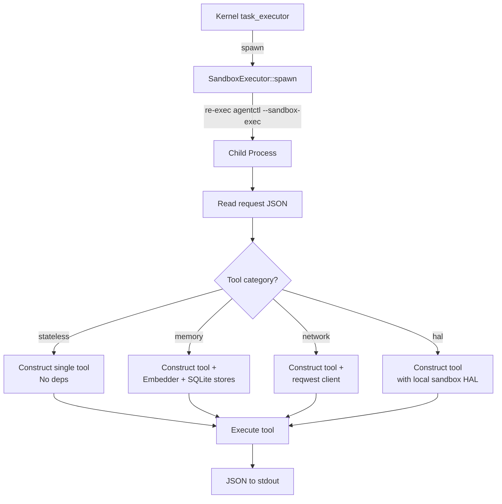
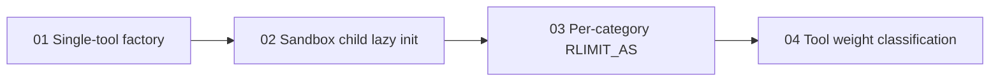

# Sandbox Lightweight Execution Plan

> Eliminate the ~1.85 GB virtual memory overhead and multi-hundred-millisecond bootstrap cost of sandbox child processes by replacing the full ToolRunner construction with single-tool lazy initialization.

---

## Why This Matters

Every sandboxed tool call currently re-execs the full `agentctl` binary, which constructs a complete `ToolRunner`. This eagerly initializes:

1. **fastembed ML model** (~23 MB download, ONNX runtime init) via `Embedder::new()` / `Embedder::with_cache_dir()`
2. **3 SQLite databases**: `SemanticStore::open_with_embedder()`, `EpisodicStore::open()`, `ProceduralStore::open_with_embedder()`
3. **35+ tool instances** (most unused -- only one tool runs per sandbox invocation)
4. **reqwest HTTP clients** (TLS handshake overhead for `HttpClientTool::new()` and `WebFetch::new()`)

The manifest for `datetime` declares `max_memory_mb = 4` and `max_cpu_ms = 100`, yet the child process needs >1 GiB just for runtime initialization. The current RLIMIT_AS formula (`process_baseline / 2` with 1 GiB floor) masks this by granting far more memory than the manifest declares, making tool resource declarations meaningless.

The crash that exposed this: `fatal runtime error: assertion failed: output.write(&bytes).is_ok(), aborting` -- sandbox children were OOM-killed because RLIMIT_AS budgeting was disconnected from the child process's real startup footprint.

---

## Current State

| Aspect | Current Behavior |
|--------|-----------------|
| Child binary | Re-execs `agentctl` (717 MB debug / ~30-50 MB release) |
| Entry point | `run_sandbox_exec()` in `crates/agentos-cli/src/main.rs:364` |
| Tool init | `ToolRunner::new(&data_dir)` -- constructs ALL 35+ tools |
| Embedder | Always loaded (~23 MB model, ONNX runtime) |
| SQLite DBs | 3 databases always opened (semantic, episodic, procedural) |
| RLIMIT_AS | `(parent_vmsize / 2).max(1 GiB) + manifest.max_memory_bytes` |
| RLIMIT_AS floor | 1 GiB (constant `SANDBOX_AS_MINIMUM`) |
| Effective memory | `datetime` (4 MB declared) gets ~1 GiB+ actual |
| Security | seccomp-BPF + RLIMIT_AS/CPU/FSIZE/NOFILE + env sanitization + FD closure |

### Tool Categories by Dependency Weight

**Stateless / zero-dep tools (15 tools):** `datetime`, `think`, `file-reader`, `file-writer`, `file-editor`, `file-glob`, `file-grep`, `file-delete`, `file-move`, `file-diff`, `data-parser`, `memory-block-write`, `memory-block-read`, `memory-block-list`, `memory-block-delete`

**Kernel-context tools (8 tools, need runtime kernel data):** `agent-message`, `task-delegate`, `agent-list`, `task-status`, `task-list`, `shell-exec`, `agent-self`, `agent-manual`

**Memory tools (12 tools, need Embedder and/or SQLite):** `memory-search`, `memory-write`, `memory-read`, `memory-delete`, `memory-stats`, `archival-insert`, `archival-search`, `episodic-list`, `procedure-create`, `procedure-delete`, `procedure-list`, `procedure-search`

**Network tools (2 tools, need reqwest client):** `http-client`, `web-fetch`

**HAL tools (5 tools):** `hardware-info`, `sys-monitor`, `process-manager`, `log-reader`, `network-monitor`

---

## Target Architecture

After this change:

| Aspect | Target Behavior |
|--------|----------------|
| Child init | Constructs ONLY the single requested tool |
| Embedder | Loaded only for memory-category tools |
| SQLite DBs | Opened only for memory-category tools |
| RLIMIT_AS | `tool_base_overhead + manifest.max_memory_bytes` where overhead is per-category |
| Lightweight tools | ~50-100 MB VM, <50 ms init |
| Manifest declarations | Actually meaningful and enforced |
| Security | Identical: seccomp-BPF + RLIMIT_AS/CPU/FSIZE/NOFILE + env sanitization + FD closure |

---

## Architecture Options Evaluated

### Option A: Lazy ToolRunner with single-tool factory (RECOMMENDED)

Split `ToolRunner` so sandbox children construct only the one tool they need. Add a `build_single_tool(name, data_dir)` factory function that returns `Box<dyn AgentTool>` with only the dependencies that specific tool requires.

| Dimension | Assessment |
|-----------|-----------|
| Effort | ~3d |
| Security impact | None -- same binary, same seccomp/rlimit, same env sanitization |
| Memory savings | 90%+ for stateless tools (datetime: 4 MB vs ~1 GiB) |
| Build complexity | None -- same binary, no new crates |
| Risk | Low -- ToolRunner in-process path unchanged; only sandbox child path changes |

### Option B: Tool weight classification with in-process lightweight path

Run stateless tools in-process (skip fork+exec) with just seccomp applied to a child thread.

| Dimension | Assessment |
|-----------|-----------|
| Effort | ~5d |
| Security impact | **Reduced isolation** -- shared address space means a compromised tool can access kernel memory |
| Memory savings | 100% for stateless tools (no child process at all) |
| Risk | **High** -- seccomp is per-thread but shared memory defeats process isolation |

**Rejected**: The security regression is unacceptable. AgentOS security model requires process isolation.

### Option C: Minimal sandbox stub binary

Build a separate `agentctl-sandbox` binary that only links `agentos-tools` (not the full CLI/kernel).

| Dimension | Assessment |
|-----------|-----------|
| Effort | ~5d |
| Memory savings | Significant -- smaller binary = smaller VM footprint |
| Build complexity | **High** -- new binary target, CI changes, binary discovery at runtime |
| Risk | Medium -- deployment must ship two binaries; binary path resolution adds failure modes |

**Deferred**: The lazy factory (Option A) gets 90% of the benefit with 60% of the effort. Option C can be pursued later if needed.

### Option D: Pre-forked sandbox pool

Fork children at kernel startup; they wait for work on a pipe. Seccomp applied after fork.

| Dimension | Assessment |
|-----------|-----------|
| Effort | ~8d |
| Memory savings | Moderate (avoids re-exec but still loads full binary) |
| Complexity | **Very high** -- fork safety with async runtime, pipe protocol, pool sizing |
| Risk | **High** -- Tokio runtime is not fork-safe; would need `fork()` before runtime init |

**Rejected**: Tokio's multi-threaded runtime cannot be forked safely. The child uses `current_thread` but the parent's threads are still a problem.

### Option E: In-process thread sandboxing

Apply seccomp to a spawned thread in the kernel process.

| Dimension | Assessment |
|-----------|-----------|
| Effort | ~2d |
| Security impact | **Catastrophic** -- seccomp is process-wide on Linux; applying it to one thread affects ALL threads |
| Risk | **Fatal** -- would cripple the kernel |

**Rejected**: seccomp filters apply to the entire process, not individual threads.

---

## Recommended Approach

**Option A (Lazy single-tool factory)** is the clear winner. It:

1. Keeps all security properties intact (process isolation, seccomp, rlimits)
2. Eliminates 90%+ of unnecessary initialization
3. Makes manifest resource declarations meaningful
4. Has the lowest implementation risk (no new binaries, no protocol changes)
5. Is incrementally deliverable in 4 phases

Combined with a revised RLIMIT_AS formula that uses per-category overhead baselines instead of the parent process's VmSize, this restores the original design intent where tool manifests declare actual resource needs.

---

## Phase Overview

| # | Phase | Effort | Dependencies | Link |
|---|-------|--------|-------------|------|
| 01 | Single-tool factory function | 1d | None | [[01-single-tool-factory]] |
| 02 | Wire sandbox child to use factory | 4h | Phase 01 | [[02-sandbox-child-lazy-init]] |
| 03 | Per-category RLIMIT_AS formula | 4h | Phase 02 | [[03-per-category-rlimit]] |
| 04 | Tool weight classification in manifests | 4h | Phase 03 | [[04-tool-weight-classification]] |

---

## Phase Dependency Graph

All phases are sequential -- each builds on the previous.

---

## Key Design Decisions

1. **Single factory function, not a registry refactor.** The `ToolRunner` struct and its `HashMap<String, Box<dyn AgentTool>>` stay unchanged for in-process execution. The factory is a standalone function used only by `run_sandbox_exec()`. This minimizes blast radius.

2. **Tool categories are determined by constructor signature.** A tool that takes `Arc<SemanticStore>` is a memory tool. A tool whose `new()` takes no args is stateless. This avoids adding metadata -- the type system already encodes it.

3. **The factory function lives in `agentos-tools`**, not in the CLI or kernel. This keeps the sandbox child's dependency on `agentos-tools` clean and allows unit testing.

4. **RLIMIT_AS uses per-category baselines** instead of `parent_vmsize / 2`. Stateless and HAL tools get a 192 MB baseline, memory tools get 768 MB, and network tools get 256 MB. These are tuned empirically and documented in code.

5. **No manifest schema changes in Phase 01-03.** Phase 04 optionally adds a `weight` field to `ToolSandbox` for explicit classification, but the factory auto-detects based on tool name for backward compatibility.

6. **Kernel-context tools (agent-message, task-delegate, etc.) are NOT sandboxed.** They need `Arc` references to kernel state that cannot be serialized across process boundaries. They already run in-process via the `else` branch in `task_executor.rs`. This plan does not change that.

---

## Risks

| Risk | Impact | Mitigation |
|------|--------|-----------|
| Tool name mismatch between factory and ToolRunner | Tool fails in sandbox but works in-process | Factory function includes a `debug_assert!` that all tool names it can build match `ToolRunner.list_tools()`. Integration test verifies. |
| Category baseline drifts below real startup footprint | Tool fails early with loader or allocator errors | Keep the stateless/HAL baselines empirically tuned and cover them with a real `SandboxExecutor` smoke test. |
| Embedder model not cached in sandbox child's data_dir | Child downloads model on first run, may exceed RLIMIT_AS/CPU | Embedder cache dir passed in request JSON; kernel ensures model is pre-cached at boot. |
| Future tools added to ToolRunner but not to factory | New tools silently fail in sandbox | CI test: compare `ToolRunner::list_tools()` with factory's supported names. |

---

## Related

- [[33-Sandbox Lightweight Execution]] (next-steps index entry)
- [[Sandbox Lightweight Execution Research]] (this directory)
