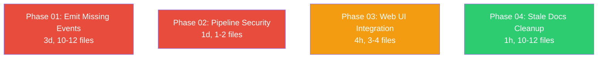

# Unwired Features Plan

> Close four critical gaps between defined types/subsystems and their actual runtime integration: 31 never-emitted EventType variants, pipeline executor security bypass, disconnected web UI crate, and stale plan doc statuses.

---

## Why This Matters

AgentOS defines a rich event type system (47 variants) and a full web UI crate, but a code review reveals that 31 event types are never emitted from any code path, the pipeline executor bypasses every security check in the kernel, the web UI is an orphaned crate with no entry point, and 9+ plan documents have stale `status: planned` frontmatter for work that was already implemented. These gaps mean:

1. Agents cannot react to ~66% of OS state changes (security breaches, hardware events, memory failures)
2. Pipeline-executed tools run with empty permissions -- any tool can do anything
3. The web UI is dead code that will bitrot
4. Plan docs mislead contributors about what is done vs pending

---

## Current State

| Component | Status | Gap |
|-----------|--------|-----|
| EventType enum (47 variants) | Defined | 31 variants never reach `emit_event()` |
| `KernelPipelineExecutor::run_tool()` | Functional | Creates `PermissionSet::new()` (empty) -- no capability tokens |
| `OwnedPipelineExecutor::run_agent_task()` | Functional | No injection scanning, intent validation, risk classification, or event emission |
| `agentos-web` crate | Compiles | Not imported by kernel or CLI; no binary target; no CLI command |
| Event trigger plan docs (10 phases) | Mixed | Phases 01-10 have `status: planned` but phases 01, 02, 03, 04, 06, 09, 10 code IS implemented |

---

## Target Architecture

After this work:

```
┌──────────────────────────────────────────────────────────────┐
│  All 47 EventType variants emitted from concrete code paths  │
│                                                              │
│  ┌─────────────┐  ┌─────────────┐  ┌─────────────┐          │
│  │ Task Exec   │  │ Security    │  │ HAL/Health   │          │
│  │ 3 new emits │  │ 5 new emits │  │ 9 new emits  │          │
│  └─────────────┘  └─────────────┘  └─────────────┘          │
│  ┌─────────────┐  ┌─────────────┐  ┌─────────────┐          │
│  │ Memory      │  │ Tools       │  │ Comms/Sched  │          │
│  │ 3 new emits │  │ 4 new emits │  │ 3 new emits  │          │
│  └─────────────┘  └─────────────┘  └─────────────┘          │
│  ┌─────────────────────────────────┐                         │
│  │ External events (4) — deferred  │                         │
│  │ Needs webhook/filewatcher infra │                         │
│  └─────────────────────────────────┘                         │
│                                                              │
│  Pipeline executor: full security pipeline applied           │
│  Web UI: `agentctl web serve` command OR standalone binary   │
│  Plan docs: all frontmatter statuses accurate                │
└──────────────────────────────────────────────────────────────┘
```

---

## Phase Overview

| Phase | Name | Effort | Files Changed | Dependencies | Detail Doc |
|-------|------|--------|---------------|--------------|------------|
| 01 | Emit Missing Event Types | 3d | 10-12 | None | [[01-emit-missing-event-types]] |
| 02 | Pipeline Security Hardening | 1d | 1-2 | None | [[02-pipeline-security-hardening]] |
| 03 | Web UI Integration | 4h | 3-4 | None | [[03-web-ui-integration]] |
| 04 | Stale Docs Cleanup | 1h | 10-12 | None | [[04-stale-docs-cleanup]] |

---

## Phase Dependency Graph



All four phases are **independent** and can be executed in parallel. Phase 01 is the largest and can be further parallelized internally by subsystem (task, security, memory, tools, HAL, comms).

---

## Key Design Decisions

1. **External events (4 types) are deferred.** `WebhookReceived`, `ExternalFileChanged`, `ExternalAPIEvent`, `ExternalAlertReceived` require new subsystems (HTTP webhook server, filesystem watcher, API bridge) that do not exist yet. These are documented but not wired in Phase 01. A future plan should create the external bridge subsystem.

2. **Pipeline security uses the agent's own permissions.** Rather than inventing a new "pipeline permission" concept, the pipeline executor will look up the agent's `CapabilityToken` and `PermissionSet` from the registry and pass them through. If the agent has no permissions, the pipeline fails with a clear error.

3. **Web UI gets a CLI command, not a standalone binary.** Adding `agentctl web serve [--port PORT]` is simpler than creating a new binary crate and keeps deployment to a single artifact. The command boots the kernel internally (or connects via bus) and starts the Axum server.

4. **Stale docs are updated in-place, not rewritten.** Only the `status:` frontmatter field changes. No content modifications -- the implementation details in the phase files are still accurate reference material.

5. **Emission points follow existing patterns.** Every new `emit_event()` call uses the same `emit_event()` / `emit_event_with_trace()` / `emit_signed_event()` functions already used throughout the kernel. No new emission infrastructure.

---

## Risks

| Risk | Impact | Mitigation |
|------|--------|------------|
| Event flood from new high-frequency emission points (deadlock detection, memory eviction) | Event bus saturation, scheduler overload | Use existing `should_emit()` debounce pattern from `health_monitor.rs`; emit at most once per task for memory events |
| Pipeline security hardening breaks existing pipeline tests | CI failure | Run `cargo test -p agentos-pipeline -p agentos-kernel` after changes; add targeted tests for permission enforcement |
| Web UI depends on `Arc<Kernel>` but CLI only has bus client | Architecture mismatch | Use in-process kernel boot (same as `agentctl kernel boot`) rather than bus connection |
| Some emission points require structural changes (vault, sandbox) | Larger scope than expected | For subsystems without easy hook points, emit from the nearest kernel-level wrapper instead of deep in the subsystem |

---

## Emitted vs Missing Event Types (Audit)

### Already emitted (27 types)

| Category | EventType | Emission Point |
|----------|-----------|---------------|
| AgentLifecycle | AgentAdded | `commands/agent.rs` |
| AgentLifecycle | AgentRemoved | `commands/agent.rs` |
| AgentLifecycle | AgentPermissionGranted | `commands/permission.rs` |
| AgentLifecycle | AgentPermissionRevoked | `commands/permission.rs` |
| TaskLifecycle | TaskStarted | `task_executor.rs` |
| TaskLifecycle | TaskCompleted | `task_completion.rs` |
| TaskLifecycle | TaskFailed | `task_completion.rs` |
| TaskLifecycle | TaskTimedOut | `run_loop.rs` |
| TaskLifecycle | TaskDelegated | `commands/task.rs` |
| SecurityEvents | PromptInjectionAttempt | `task_executor.rs`, `context_injector.rs` |
| SecurityEvents | CapabilityViolation | `task_executor.rs` |
| SecurityEvents | UnauthorizedToolAccess | `task_executor.rs` |
| MemoryEvents | ContextWindowNearLimit | `task_executor.rs` |
| MemoryEvents | EpisodicMemoryWritten | `task_completion.rs` |
| MemoryEvents | SemanticMemoryConflict | `task_executor.rs` |
| SystemHealth | CPUSpikeDetected | `health_monitor.rs` |
| SystemHealth | MemoryPressure | `health_monitor.rs` |
| SystemHealth | DiskSpaceLow | `health_monitor.rs` |
| SystemHealth | DiskSpaceCritical | `health_monitor.rs` |
| SystemHealth | GPUMemoryPressure | `health_monitor.rs` |
| ToolEvents | ToolInstalled | `event_dispatch.rs` (via lifecycle listener) |
| ToolEvents | ToolRemoved | `event_dispatch.rs` (via lifecycle listener) |
| ToolEvents | ToolExecutionFailed | `task_executor.rs` |
| AgentCommunication | DirectMessageReceived | `agent_message_bus.rs` |
| AgentCommunication | BroadcastReceived | `agent_message_bus.rs` |
| AgentCommunication | MessageDeliveryFailed | `agent_message_bus.rs` |
| AgentCommunication | DelegationReceived | `commands/task.rs` |
| ScheduleEvents | CronJobFired | `schedule_manager.rs` |
| ScheduleEvents | ScheduledTaskMissed | `schedule_manager.rs` |
| ScheduleEvents | ScheduledTaskFailed | `schedule_manager.rs` |

### Never emitted (31 types -- to be wired in Phase 01)

| Category | EventType | Target Emission Point |
|----------|-----------|----------------------|
| TaskLifecycle | TaskRetrying | `task_executor.rs` retry loop |
| TaskLifecycle | TaskPreempted | `resource_arbiter.rs` preemption path |
| TaskLifecycle | TaskDeadlockDetected | `resource_arbiter.rs` `would_deadlock()` |
| SecurityEvents | SecretsAccessAttempt | `commands/secret.rs` vault access |
| SecurityEvents | SandboxEscapeAttempt | `task_executor.rs` sandbox violation |
| SecurityEvents | AuditLogTamperAttempt | Deferred (no tamper detection exists) |
| SecurityEvents | AgentImpersonationAttempt | `run_loop.rs` agent ID mismatch |
| SecurityEvents | UnverifiedToolInstalled | `tool_registry.rs` when trust tier check fires |
| MemoryEvents | ContextWindowExhausted | `context.rs` when token budget hits 100% |
| MemoryEvents | MemorySearchFailed | `retrieval_gate.rs` on search failure |
| MemoryEvents | WorkingMemoryEviction | `context.rs` on semantic eviction |
| SystemHealth | ProcessCrashed | `run_loop.rs` when JoinError is panic |
| SystemHealth | NetworkInterfaceDown | `health_monitor.rs` new network check |
| SystemHealth | ContainerResourceQuotaExceeded | `health_monitor.rs` new cgroup check |
| SystemHealth | KernelSubsystemError | `run_loop.rs` when task exceeds restart budget |
| HardwareEvents | GPUAvailable | `health_monitor.rs` or `commands/hal.rs` |
| HardwareEvents | SensorReadingThresholdExceeded | `health_monitor.rs` new sensor check |
| HardwareEvents | DeviceConnected | `commands/hal.rs` on device registration |
| HardwareEvents | DeviceDisconnected | `commands/hal.rs` on device removal |
| HardwareEvents | HardwareAccessGranted | `commands/hal.rs` on device approval |
| ToolEvents | ToolSandboxViolation | `task_executor.rs` sandbox violation path |
| ToolEvents | ToolResourceQuotaExceeded | `task_executor.rs` resource limit path |
| ToolEvents | ToolChecksumMismatch | `tool_registry.rs` checksum validation |
| ToolEvents | ToolRegistryUpdated | `tool_registry.rs` after install/remove |
| AgentCommunication | DelegationResponseReceived | `commands/task.rs` delegation completion |
| AgentCommunication | AgentUnreachable | `agent_message_bus.rs` delivery failure |
| ScheduleEvents | ScheduledTaskCompleted | `run_loop.rs` agentd loop completion |
| ExternalEvents | WebhookReceived | Deferred -- needs webhook server |
| ExternalEvents | ExternalFileChanged | Deferred -- needs file watcher |
| ExternalEvents | ExternalAPIEvent | Deferred -- needs API bridge |
| ExternalEvents | ExternalAlertReceived | Deferred -- needs alert receiver |

---

## Related

- [[Event Trigger Completion Plan]] -- Original 10-phase plan (many phases now implemented)
- [[Event Trigger Completion Data Flow]] -- Emission flow diagram
- [[22-Unwired Features]] -- Parent next-steps index
