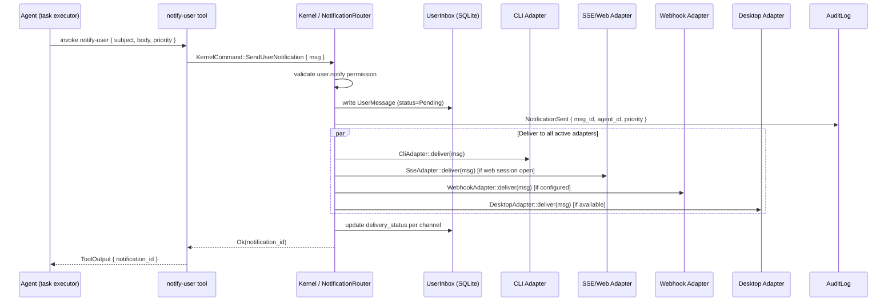
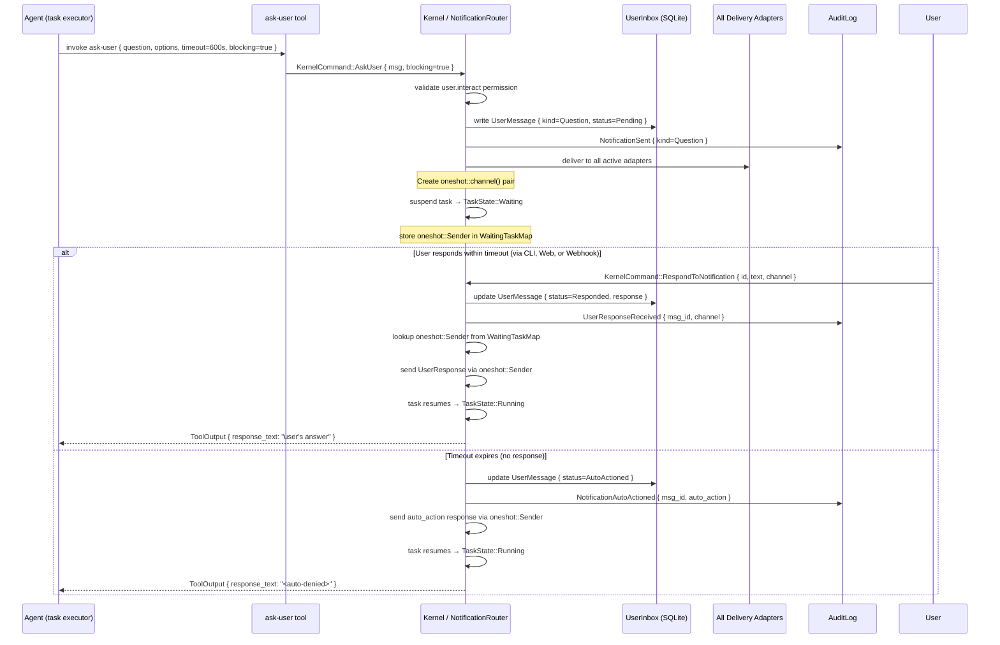
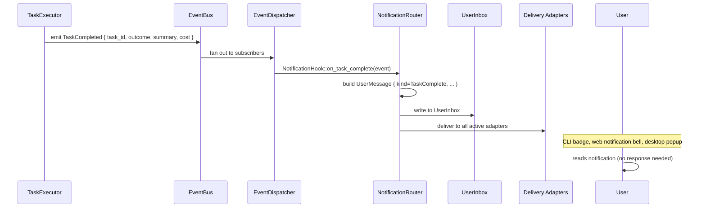
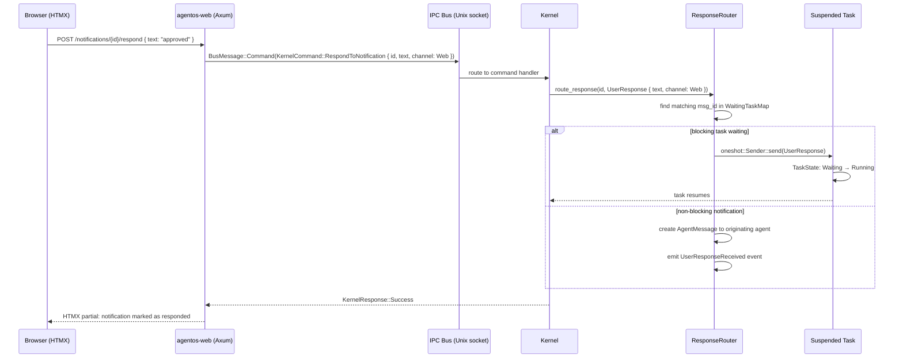
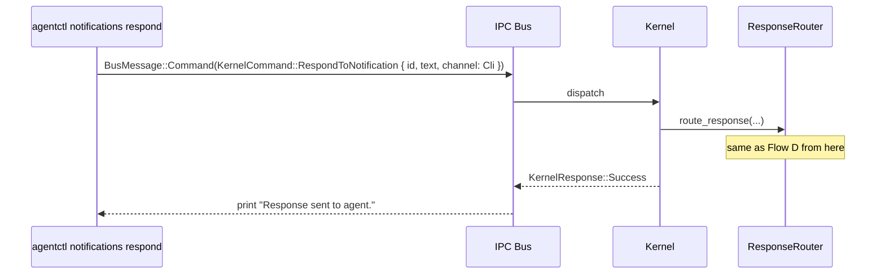

# User-Agent Communication Data Flow

> Visual and narrative walkthrough of the two core flows: agent→user notification delivery, and user→agent response routing.

---

## Flow A: Agent Sends Notification (Fire-and-Forget)



---

## Flow B: Agent Asks User a Question (Blocking)



---

## Flow C: Task Completion Auto-Notification



---

## Flow D: User Responds via Web UI



---

## Flow E: User Responds via CLI



---

## Internal Kernel Component Relationships

```
┌─────────────────────────────────────────────────────────────┐
│                         KERNEL                               │
│                                                             │
│  TaskExecutor ──ask-user──► NotificationRouter              │
│       │                           │                         │
│       │ TaskState::Waiting         ├── CliDeliveryAdapter   │
│       │ (oneshot::Receiver)        ├── SseDeliveryAdapter   │
│       │                           ├── WebhookAdapter        │
│       │                           └── DesktopAdapter        │
│       │                                    │                │
│       │                               UserInbox (SQLite)    │
│       │                                    │                │
│  ResponseRouter ◄── KernelCommand::Respond ┘                │
│       │                                                     │
│       └──► oneshot::Sender ──► TaskExecutor (resume)        │
│                                                             │
│  EventDispatcher ──► NotificationRouter (task complete hook)│
│                                                             │
│  AuditLog (receives all notification events)                │
└─────────────────────────────────────────────────────────────┘
        ▲                        ▲
        │                        │
   CLI / Bus               Web (Axum SSE)
```

---

## Data Model: UserMessage

```rust
// agentos-types/src/notification.rs (new file)

pub struct UserMessage {
    pub id: NotificationID,
    pub from: NotificationSource,       // Agent(AgentID) | Kernel | System
    pub task_id: Option<TaskID>,        // originating task (for drill-down)
    pub trace_id: TraceID,
    pub kind: UserMessageKind,
    pub priority: NotificationPriority,
    pub subject: String,                // ≤80 chars — fits CLI one-liner, email subject
    pub body: String,                   // Full markdown body
    pub interaction: Option<InteractionRequest>,
    pub delivery_status: HashMap<DeliveryChannel, DeliveryStatus>,
    pub response: Option<UserResponse>,
    pub created_at: DateTime<Utc>,
    pub expires_at: Option<DateTime<Utc>>,
    pub read: bool,
}

pub enum UserMessageKind {
    Notification,
    Question {
        question: String,
        options: Option<Vec<String>>,  // None = free text; Some = multiple choice
        free_text_allowed: bool,
    },
    TaskComplete {
        task_id: TaskID,
        outcome: TaskOutcome,       // Success | Failed | Cancelled | TimedOut
        summary: String,
        duration_ms: u64,
        iterations: u32,
        cost: Option<InferenceCost>,
        tool_calls: u32,
    },
    StatusUpdate {
        task_id: TaskID,
        old_state: TaskState,
        new_state: TaskState,
        detail: Option<String>,
    },
}

pub enum NotificationPriority {
    Info,       // Informational, no action needed
    Warning,    // Something to be aware of
    Urgent,     // Needs attention soon
    Critical,   // Needs immediate attention (blocks agent)
}

pub struct InteractionRequest {
    pub timeout: Duration,          // How long to wait for response
    pub auto_action: String,        // Text to use if timeout expires (e.g. "<auto-denied>")
    pub blocking: bool,             // true = park task in TaskState::Waiting
    pub max_active: u8,             // Max concurrent blocking questions from this agent (default 3)
}

pub struct UserResponse {
    pub text: String,
    pub responded_at: DateTime<Utc>,
    pub channel: DeliveryChannel,
}

pub enum DeliveryChannel {
    Cli,
    Web,
    Webhook,
    Desktop,
    Slack,
}

pub enum DeliveryStatus {
    Pending,
    Delivered { at: DateTime<Utc> },
    Failed { reason: String },
    Skipped,   // adapter not active/available
}

pub enum TaskOutcome {
    Success,
    Failed,
    Cancelled,
    TimedOut,
}
```

---

## Permission Model

```
user.notify  (write)   — send fire-and-forget UserMessage
user.interact (execute) — send blocking Question (ask_user)
user.status  (write)   — send StatusUpdate (auto-granted to all agents)
```

Default agent `PermissionSet` includes `user.status`. `user.notify` requires explicit grant. `user.interact` requires explicit grant and is rate-limited.

---

## Related

- [[User-Agent Communication Plan]] — master plan
- [[User-Agent Communication Research]] — research synthesis
- [[01-user-message-type-and-router]] — Phase 1 implementation
- [[03-ask-user-tool]] — Phase 3 — blocking ask pattern
