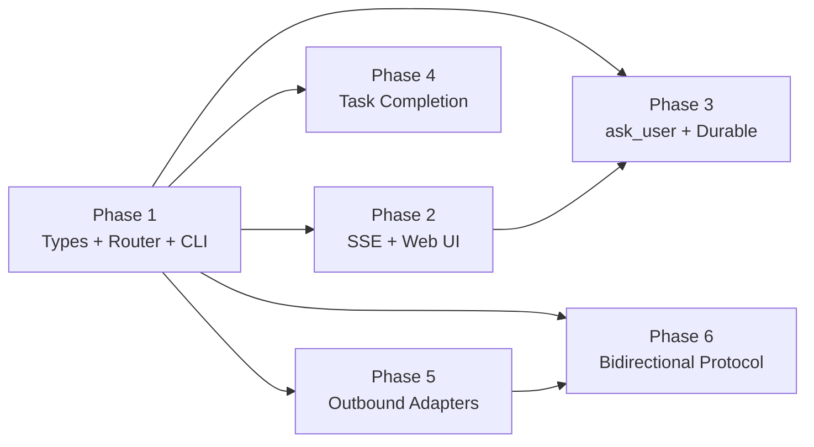

# User-Agent Communication Plan

> A unified, channel-agnostic notification and interaction system that lets agents send messages to users — and users reply — across any delivery channel (CLI, web UI, webhook, desktop, Slack).

---

## Why This Matters

AgentOS agents currently have no efficient path to communicate with the user who assigned them work. The only mechanism is the **escalation system**, which is security-focused (approve/deny only), coarse-grained, and requires the user to poll `agentctl escalation list`. There is:

- **No `ask_user` tool** — agents cannot request clarification or choices mid-task
- **No task completion notification** — user must poll `agentctl task list`
- **No status push** — `StatusUpdate` type exists in the bus but is not wired
- **No channel routing** — even if a notification were generated, it has nowhere to go

This plan builds a **Unified Notification and Interaction System (UNIS)** on top of the existing event bus, escalation infrastructure, and SSE streaming already present in the codebase.

---

## Current State

| Component | Status | Gap |
|-----------|--------|-----|
| `PendingEscalation` + CLI resolve | ✅ Implemented | Too coarse (approve/deny only), security-scoped |
| `StatusUpdate` in BusMessage | ⚠️ Type only | Not sent from kernel to CLI subscribers |
| Agent message bus | ✅ Implemented | Agent→agent only; no user-facing channel |
| SSE streaming (web chat) | ✅ Implemented | Chat-only; not wired to kernel notifications |
| Event bus (pub/sub) | ✅ Implemented | Agent/kernel consumers only; no user delivery |
| `ask_user` tool | ❌ Missing | Agents cannot request user input mid-task |
| Task completion notification | ❌ Missing | No automatic user alert on task finish |
| Delivery adapters | ❌ Missing | No webhook, desktop, Slack, email adapters |

---

## Target Architecture

```
Agent / Kernel
     │
     ▼ UserMessage
┌─────────────────────────────────┐
│       NotificationRouter        │  ← kernel subsystem
│  (routes + tracks delivery)     │
└────────┬───────────┬────────────┘
         │           │
    ┌────▼───┐  ┌────▼────────────────────────────────┐
    │  User  │  │          DeliveryAdapters             │
    │ Inbox  │  │  CLI │ SSE/Web │ Webhook │ Desktop   │
    │(SQLite)│  │      │ (Axum)  │ (HTTPS) │ (notify)  │
    └────────┘  └─────────────────────────────────────-┘
         │
         ▼ UserResponse (for Questions)
┌─────────────────────────────────┐
│    ResponseRouter (kernel)      │
│  → wakes blocked task OR        │
│  → delivers to agent inbox      │
└─────────────────────────────────┘
```

---

## Phase Overview

| Phase | Name | Effort | Dependencies | Detail Doc | Status |
|-------|------|--------|-------------|------------|--------|
| 1 | UserMessage types + NotificationRouter + CLI adapter | 2.5d | None | [[01-user-message-type-and-router]] | complete |
| 2 | SSE delivery + Web notification center | 2d | Phase 1 | [[02-sse-delivery-and-web-inbox]] | complete |
| 3 | ask_user tool + durable task blocking | 3d | Phase 1, 2 | [[03-ask-user-tool]] | complete |
| 4 | Task completion auto-notifications | 1d | Phase 1 | [[04-task-completion-notifications]] | complete |
| 5 | Pluggable external adapters (outbound: webhook, desktop, Slack) | 2.5d | Phase 1 | [[05-pluggable-delivery-adapters]] | complete |
| 6 | Bidirectional Channel Protocol (Telegram, ntfy, email + InboundRouter) | 4d | Phase 1, 5 | [[06-bidirectional-channel-protocol]] | complete |

---

## Phase Dependency Graph



Phase 1 is the unblocking foundation. Phases 2–5 can proceed in parallel after Phase 1 completes. Phase 3 depends on both Phase 1 and Phase 2. Phase 6 (the true bidirectional channel) depends on Phase 1 and Phase 5 (adapters must exist before adding listen capability).

---

## Key Design Decisions

1. **New `UserMessage` type, not extension of `PendingEscalation`.**
   Escalations are security-scoped (risk events, capability violations). `UserMessage` is communication-scoped (notifications, questions, status). They share no semantic overlap. Escalation approval remains a separate escalation-level operation; `ask_user` creates a `UserMessage` of kind `Question` and may optionally create a backing escalation for the audit trail.

2. **`NotificationRouter` lives in the kernel**, not in CLI or web layer.
   It is the single authoritative dispatcher. CLI and web are delivery adapters, not routers. This allows the kernel to route to whichever channels are active without any of the adapters knowing about each other.

3. **Blocking questions use `TaskState::Waiting` + `oneshot::channel`.**
   When an agent invokes `ask-user` with `blocking: true`, the task transitions to `Waiting` (already in the TaskState enum), and the executor holds a `oneshot::Receiver<UserResponse>`. The kernel routes any matching user reply through `oneshot::Sender`. This avoids polling and requires zero new state in the task struct.

4. **DeliveryAdapter is a pluggable trait** with a standard async `deliver(&UserMessage)` method.
   Adapters are registered at kernel startup from config. New channels are added without kernel code changes. Each adapter reports `is_available()` so the router skips unavailable channels gracefully.

5. **User Inbox is persisted to SQLite** (same `KernelStateStore` used by escalations).
   Notifications survive kernel restarts. The inbox is bounded (max 1000 unread messages per user, oldest purged on overflow).

6. **New permissions: `user.notify` and `user.interact`.**
   Sending a fire-and-forget notification requires `user.notify` (write). Sending a blocking question (ask_user) requires `user.interact` (execute). Default agent permission sets do NOT include `user.interact` — it must be explicitly granted, preventing agents from holding the user hostage.

7. **Auto-action on unanswered questions.**
   Every interactive `UserMessage` has a `timeout` and `auto_action` (Deny, Approve, or a default free-text string). Default: 10 minutes → auto-deny. This mirrors the escalation system's behavior and prevents hung tasks.

8. **All notifications are audited** via the existing `AuditLog`.
   New events: `NotificationSent`, `NotificationDelivered`, `NotificationRead`, `UserResponseReceived`.

---

## Risks

| Risk | Mitigation |
|------|-----------|
| Agents flooding user with notifications | `user.notify` permission required; rate limiting per agent (max 10/min) in NotificationRouter |
| Blocking ask_user starves task slots | TaskState::Waiting tasks don't consume executor threads; they're parked |
| Channel delivery failure loses message | Inbox is always written first (SQLite); channel delivery is best-effort on top |
| SSRF via webhook adapter | Same SSRF protection as escalation webhooks (reject loopback, RFC-1918, metadata IPs) |
| User misses interactive question | Configurable escalation fallback after 2 minutes: auto-create escalation for urgent Questions |
| Multi-user support (future) | `UserID` newtype added now but single-user assumed; router is parameterized by UserID for future expansion |
| **Kernel restart loses blocked ask_user** | **(High)** Serialize `(TaskID, NotificationID)` pair to KernelStateStore on Waiting; on restart, fail tasks explicitly with clear error message |
| **WaitingTaskMap entry leak** | **(Medium)** TimeoutChecker sweeps expired entries every 10min and fires auto-action |
| **`Mutex<Connection>` blocks async threads** | **(High)** Use `sqlx` with `SqlitePool` instead of `rusqlite` + `std::sync::Mutex` |
| **External channel Telegram/ntfy not in Phases 1–5** | **(Critical)** Phase 6 adds full bidirectional adapters with ChannelListener and InboundRouter |

---

## Related

- [[User-Agent Communication Research]] — research synthesis from NotebookLM + codebase analysis
- [[User-Agent Communication Data Flow]] — detailed flow diagrams
- [[Architecture Review]] — production-grade analysis: 12 gaps identified, fixes scoped
- [[01-user-message-type-and-router]] — Phase 1 subtasks
- [[02-sse-delivery-and-web-inbox]] — Phase 2 subtasks
- [[03-ask-user-tool]] — Phase 3 subtasks
- [[04-task-completion-notifications]] — Phase 4 subtasks
- [[05-pluggable-delivery-adapters]] — Phase 5 subtasks
- [[06-bidirectional-channel-protocol]] — Phase 6: UserChannelRegistry + ChannelListener + InboundRouter
