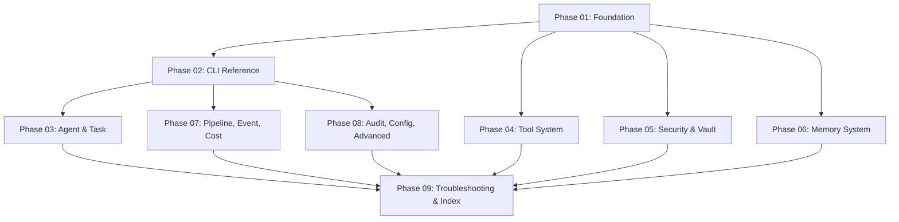

# User Handbook Plan

> Create a comprehensive, self-contained user handbook for AgentOS so that any user can understand, install, configure, and operate the system without reading source code.

---

## Why This Matters

AgentOS has 17 crates, 18 CLI command groups with 80+ subcommands, and a rich security/memory/pipeline architecture. The existing `docs/guide/` covers only 7 topics at a surface level and was written during V1/V2. Many V3 features -- cost tracking, escalation handling, event subscriptions, resource arbitration, identity management, snapshots/rollback, and trust tiers -- have no user-facing documentation at all. A user encountering this project for the first time has no single source of truth.

The handbook will be written as Obsidian markdown files in `obsidian-vault/reference/handbook/` to keep the vault as the canonical documentation home.

---

## Current State

| Area | Existing Documentation | Gap |
|------|----------------------|-----|
| Introduction / Philosophy | `docs/guide/01-introduction.md` | Adequate but outdated (mentions V1/V2 only) |
| Getting Started | `docs/guide/02-getting-started.md` | Missing production setup, Docker, env vars |
| Architecture | `docs/guide/03-architecture.md` | Missing V3 subsystems (cost, escalation, events, memory tiers) |
| CLI Reference | `docs/guide/04-cli-reference.md` | Covers only 8 of 18 command groups; missing event, cost, escalation, resource, snapshot, identity, pipeline details |
| Tools Guide | `docs/guide/05-tools-guide.md` | Missing trust tiers, signing workflow, SDK macros, 6+ new tools |
| Security Model | `docs/guide/06-security.md` | Missing injection scanner, risk classifier, escalation flow, identity system |
| Configuration | `docs/guide/07-configuration.md` | Missing `[memory.extraction]`, `[memory.consolidation]`, `[context_budget]` sections |
| Agent Management | Partial in CLI reference | Missing message bus, groups, broadcast, lifecycle details |
| Task System | Partial in CLI reference | Missing task lifecycle states, routing strategies, paused/escalated flow |
| Memory System | `obsidian-vault/reference/Memory System.md` | Internal reference, not user-facing handbook |
| Pipeline System | `obsidian-vault/reference/Pipeline System.md` | Internal reference, not user-facing; missing YAML format examples |
| Event System | None | Entirely undocumented for users |
| Cost Tracking | None | Entirely undocumented for users |
| Audit System | 2 lines in CLI ref | Missing event types, chain verification, export, snapshots |
| Escalation System | None | Entirely undocumented for users |
| Resource Arbitration | None | Entirely undocumented for users |
| Identity System | None | Entirely undocumented for users |
| Snapshot/Rollback | None | Entirely undocumented for users |
| WASM Tools | Brief in tools guide | Missing Wasmtime details, full development workflow |
| HAL | None | Entirely undocumented for users |
| Web UI | None | Under development, stub only |
| Troubleshooting | None | No FAQ or common error reference |

---

## Target Architecture

The handbook will be a collection of 19 chapters written as individual Obsidian markdown files in `obsidian-vault/reference/handbook/`, plus an index file. Each chapter is self-contained and cross-linked.

```
obsidian-vault/reference/handbook/
  AgentOS Handbook Index.md         # Table of contents with wikilinks
  01-Introduction and Philosophy.md
  02-Installation and First Run.md
  03-Architecture Overview.md
  04-CLI Reference Complete.md
  05-Agent Management.md
  06-Task System.md
  07-Tool System.md
  08-Security Model.md
  09-Secrets and Vault.md
  10-Memory System.md
  11-Pipeline and Workflows.md
  12-Event System.md
  13-Cost Tracking.md
  14-Audit Log.md
  15-LLM Configuration.md
  16-Configuration Reference.md
  17-WASM Tools Development.md
  18-Advanced Operations.md         # HAL, Resource Arbitration, Snapshots, Identity, Escalation
  19-Troubleshooting and FAQ.md
```

---

## Phase Overview

| Phase | Name | Effort | Depends On | Detail File |
|-------|------|--------|------------|-------------|
| 01 | Foundation chapters (Intro, Install, Architecture) | 4h | None | [[01-foundation-chapters]] |
| 02 | CLI Reference (all 18 command groups, all flags) | 6h | Phase 01 | [[02-cli-reference]] |
| 03 | Agent and Task chapters | 3h | Phase 02 | [[03-agent-and-task-system]] |
| 04 | Tool System and WASM Development chapters | 4h | Phase 01 | [[04-tool-system]] |
| 05 | Security, Vault, and Identity chapters | 4h | Phase 01 | [[05-security-and-vault]] |
| 06 | Memory System chapter | 3h | Phase 01 | [[06-memory-system]] |
| 07 | Pipeline, Event, and Cost chapters | 4h | Phase 02 | [[07-pipeline-event-cost]] |
| 08 | Audit, Configuration, Advanced Ops chapters | 4h | Phase 02 | [[08-audit-config-advanced]] |
| 09 | Troubleshooting, FAQ, and Index | 3h | Phases 01-08 | [[09-troubleshooting-and-index]] |

---

## Phase Dependency Graph



---

## Key Design Decisions

1. **Handbook in `reference/handbook/` not `docs/guide/`** -- The `docs/guide/` files are V1/V2-era and will remain as-is. The handbook is the canonical V3 user documentation, co-located with the obsidian vault for cross-linking with plans and flows.

2. **One file per chapter** -- Each chapter is a standalone Obsidian file that can be read independently. Cross-references use `[[wikilinks]]` but the content is self-contained. This allows the handbook to work both as a linear read and as a reference lookup.

3. **CLI reference is exhaustive** -- Every subcommand, every flag, every option, with usage examples. This is the single authoritative source for CLI usage.

4. **Source files as ground truth** -- Every CLI flag, config key, and type definition is extracted directly from source code, not from memory or existing docs. The subtask files specify exactly which source files to read.

5. **Chapters ordered by user journey** -- Introduction, installation, first run, then task-centric chapters (agent, task, tools), then operational chapters (security, memory, pipeline), then advanced topics (audit, config, troubleshooting).

---

## Risks

| Risk | Mitigation |
|------|-----------|
| CLI commands may change before handbook is complete | Each chapter specifies exact source files; re-read before writing |
| Some systems are under active development (Web UI, HAL) | Mark these as "under development" in the handbook with feature status |
| Handbook may duplicate existing reference docs | Handbook is user-facing prose; reference docs are internal architecture notes. Different audiences. |
| Large total effort (~35h) | Phases are independent after Phase 01; can be parallelized |

---

## Related

- [[19-User Handbook]] (parent next-steps file)
- [[CLI Reference]] (existing internal reference)
- [[Security Model]] (existing internal reference)
- [[Memory System]] (existing internal reference)
