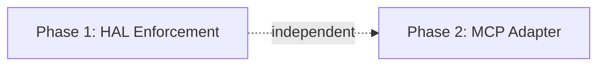

# V3 Completion Plan

> Close the two remaining production gaps in AgentOS V3: HAL device-quarantine enforcement at the execution boundary, and MCP protocol compatibility for tool ecosystem interoperability.

---

## Correction of Prior Assessment

The initial gap assessment (from the external codebase exploration) significantly overstated what was missing. The following were reported as gaps but are **already fully implemented**:

| Reported Gap | Actual Status |
|---|---|
| Episodic auto-write on task completion | ✅ Done — `task_completion.rs:complete_task_success()` writes to episodic store |
| Semantic memory persistence (Tier 2) | ✅ Done — SQLite + BLOB embeddings + FTS5 + hybrid cosine/RRF in `semantic.rs` |
| Procedural memory (Tier 3) | ✅ Done — `ProceduralStore` with SQLite, FTS5, embeddings, auto-consolidation engine |
| Procedural auto-learning | ✅ Done — `ConsolidationEngine` clusters episodes → procedures (every 100 tasks or 24h) |
| Secret proxy at tool boundary | ✅ Done — `ProxyVault::new(vault)` wired in `task_executor.rs` lines 1026 and 3001 |
| WASM executor wiring | ✅ Done — `WasmToolExecutor` loaded at boot, `WasmTool` registered in `ToolRunner` |
| HAL CLI commands | ✅ Done — `hal list/register/approve/deny/revoke` exist in CLI + bus + kernel |
| HAL approval workflow (bus + kernel) | ✅ Done — `HalListDevices`, `HalApproveDevice`, `HalDenyDevice` bus messages + `run_loop.rs` handlers |
| Attribution / observability | ✅ Done — 83+ audit event types, TraceID correlation, append-only SQLite |
| Cost tracking + budget enforcement | ✅ Done — hard/soft caps, model downgrade, persistent micro-USD snapshots |

---

## Remaining Gaps (Real)

### Gap 1 — HAL: `HardwareAbstractionLayer::query()` does not consult `HardwareRegistry`

`HardwareAbstractionLayer::query()` in `crates/agentos-hal/src/hal.rs` checks `PermissionSet` but never calls `HardwareRegistry::check_access(device_id, agent_id)`. The registry (quarantine/approve/deny) is stored separately in `Kernel::hardware_registry` and is not connected to the HAL dispatcher.

This means:
- GPU, storage, sensor, and network drivers execute regardless of device quarantine status
- Newly seen hardware is never auto-quarantined at the dispatch boundary
- `HardwareRegistry` is write-only from an enforcement standpoint (only the CLI commands use it)

**Root cause:** `HardwareAbstractionLayer` has no reference to `HardwareRegistry`, and `query()` receives no `AgentID` to pass to `check_access()`.

### Gap 2 — MCP: No Model Context Protocol implementation

AgentOS uses a proprietary `AgentTool` trait + TOML manifest + Ed25519 trust tier system. The broader ecosystem is converging on MCP (Model Context Protocol, JSON-RPC 2.0 over stdio/HTTP). Without an MCP adapter:
- AgentOS cannot consume tools from MCP-compliant tool servers
- External systems cannot invoke AgentOS tools via standard protocol
- Operator teams are locked into the AgentOS proprietary format for all tool development

---

## Target Architecture

```
┌─────────────────────────────────────────────────────────┐
│                   AgentOS Kernel                        │
│                                                         │
│  ┌─────────────┐    ┌─────────────────────────────┐    │
│  │ HardwareAbs │    │     MCP Adapter Layer        │    │
│  │ traction    │───▶│  ┌───────────┐ ┌──────────┐  │    │
│  │ Layer       │    │  │McpClient  │ │McpServer │  │    │
│  │             │    │  │(import)   │ │(export)  │  │    │
│  │ + registry  │    │  └───────────┘ └──────────┘  │    │
│  │ + agent_id  │    └─────────────────────────────┘    │
│  └──────┬──────┘                                        │
│         │ check_access(device_id, agent_id)             │
│         ▼                                               │
│  ┌─────────────┐                                        │
│  │ Hardware    │  quarantine_device() on first contact  │
│  │ Registry    │  approve/deny via CLI                  │
│  └─────────────┘                                        │
└─────────────────────────────────────────────────────────┘
```

---

## Phase Overview

| Phase | Name | Effort | Dependencies | Detail Doc | Status |
|-------|------|--------|-------------|------------|--------|
| 1 | HAL Device Registry Enforcement | 1.5d | None | [[01-hal-registry-enforcement]] | planned |
| 2 | MCP Adapter Crate | 3d | None | [[02-mcp-adapter]] | planned |

### Phase Dependency Graph



Both phases are independent and can be executed in parallel.

---

## Key Design Decisions

1. **HAL registry check via optional field, not constructor requirement** — `HardwareRegistry` is added as `Option<Arc<HardwareRegistry>>` to `HardwareAbstractionLayer`, set via a builder method. This avoids breaking existing test constructors that don't need registry enforcement.

2. **Agent ID threaded into `query()` signature** — `HardwareAbstractionLayer::query()` gains an `agent_id: Option<&AgentID>` parameter. This is a breaking change but is the cleanest approach; the alternative (storing agent ID in the HAL struct) is not thread-safe.

3. **Device-key convention for drivers** — Each driver that maps to physical hardware declares a `device_key(params: &Value) -> Option<String>` method returning e.g. `"gpu:0"`, `"storage:/dev/sda"`. The HAL uses this to call `quarantine_device()` on first contact and `check_access()` on subsequent calls. System/process/log_reader/network drivers return `None` (no per-device quarantine needed).

4. **MCP as a client-mode adapter only in Phase 2** — Server mode (exposing AgentOS tools via MCP) is secondary. Phase 2 focuses on MCP client mode (importing external tool servers as `AgentTool` impls with `TrustTier::Community`). Server mode is a follow-up.

5. **MCP tools use capability-token validation** — Imported MCP tools still go through AgentOS capability enforcement. The `McpToolAdapter::execute()` validates the capability token before forwarding the call to the MCP server process. AgentOS security applies end-to-end.

6. **MCP connection model: subprocess per-tool-server** — Each MCP server is a child process connected via stdio JSON-RPC. The `McpClient` spawns the server process, performs `initialize` handshake, and keeps the connection alive for the kernel's lifetime.

---

## Risks

| Risk | Likelihood | Mitigation |
|------|-----------|------------|
| Breaking existing HAL tests when adding `agent_id` to `query()` | High | Pass `None` as `agent_id` in all test callsites; registry check is skipped when `agent_id` is `None` |
| MCP server process lifecycle management (orphan processes) | Medium | Use `tokio::process::Child` with `kill_on_drop(true)` and `CancellationToken`-triggered cleanup |
| MCP tool input schema mismatch with AgentOS `IntentSchema` | Medium | Use passthrough JSON validation; don't try to convert MCP `inputSchema` to `IntentSchema` — validate against MCP schema at call time |
| GPU/storage device IDs being ephemeral (USB reconnect changes ID) | Low | Quarantine is keyed by device path/ID; re-plug creates a new quarantine entry. Operator must re-approve. This is intentional behavior. |

---

## Related

- [[01-hal-registry-enforcement]] — Phase 1 detail
- [[02-mcp-adapter]] — Phase 2 detail
- [[Issues and Fixes]] — V3 known issues tracker
